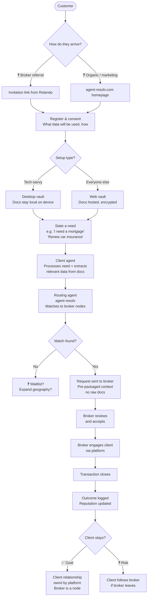
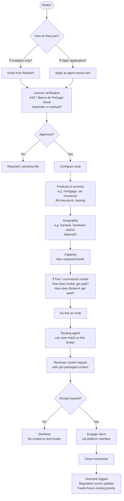
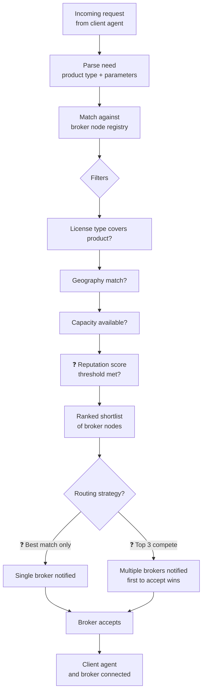

# agent-resolv.com — User & Node Flows

> Persistent artifact. Iterate here. Last updated: 2026-02-22.
> Open questions are marked ❓. Decisions are marked ✅.

---

## Flow 1 — Customer Journey

---

## Flow 2 — Broker Onboarding (Joining as a Node)

---

## Flow 3 — Routing Logic (agent-resolv core)

---

## Open Questions (surface for Feb 25 meeting)

| # | Question | Why it matters |
|---|----------|----------------|
| 1 | How does the first customer arrive? Broker referral or organic? | Defines the GTM motion entirely |
| 2 | Who owns the client relationship? Platform or broker? | Core defensibility question |
| 3 | What happens when a broker leaves — does the client stay? | Determines if you're building a platform or a tool |
| 4 | Invitation-only or open broker application? | Supply growth strategy |
| 5 | How does ReisierX make money? Per transaction? SaaS? | Revenue model not yet defined |
| 6 | How does the routing agent know which provider accepts which credential format? | Knowledge base build/maintenance problem |
| 7 | Best match vs. competing brokers — routing strategy? | UX + broker incentives |
| 8 | How does license verification work? Manual check or API? | Ops complexity |

---

## Iteration Log

| Date | What changed |
|------|-------------|
| 2026-02-22 | First draft — three flows, 8 open questions |
