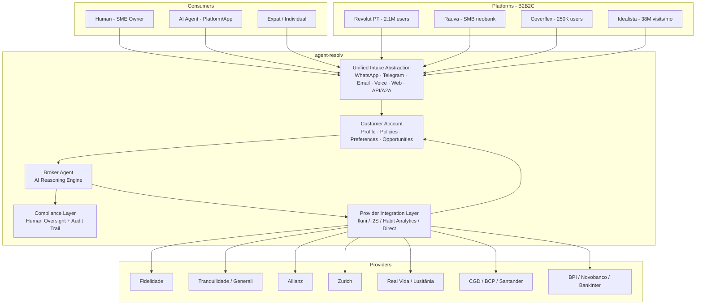
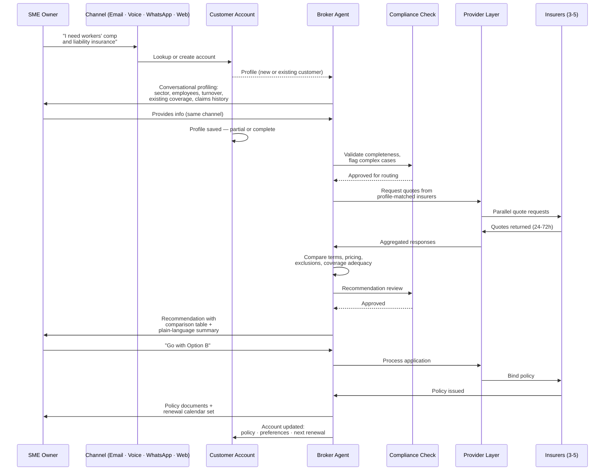
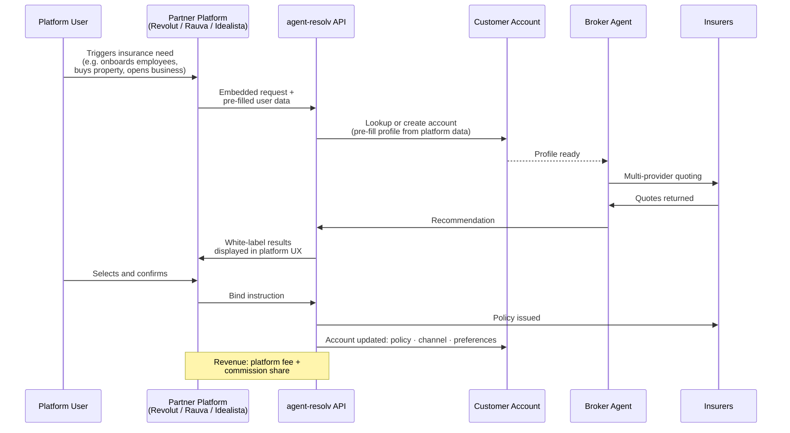

# Investment Memorandum — agent-resolv

**Prepared:** 26 February 2026
**Company:** agent-resolv (a ReisierX venture)
**Founder:** Gonçalo Reis
**Audience:** BuildUp Labs (BuL) — Lisbon accelerator
**Classification:** Confidential

---

## 0. Executive Summary

**The opportunity.** Portugal's insurance market reached €14.3 billion in gross written premiums in 2024, yet fewer than 1% of premiums are sold online. The country has just 68 licensed independent brokers serving 1.1 million SMEs — 74% of which are underinsured. Credit intermediation, meanwhile, exploded from 9% to 57% of all mortgage volume in five years, proving Portuguese consumers adopt intermediary-led financial services rapidly when they perceive value. No AI-native insurance or credit intermediary exists in Portugal. The market is consolidating (intermediary headcount down 37% since 2019), incumbents are barely digitized, and the regulatory environment is tightening — 93.9% of credit intermediaries were found irregular in Banco de Portugal inspections.

**The solution.** agent-resolv is an AI-native broker agent for credit and insurance intermediation. It sits between the consumer — human or AI agent — and the provider (insurer or bank). It ingests requests via any channel (WhatsApp, Telegram, email, voice, or API), compiles information, routes to providers, analyses responses, and returns recommendations. It is not a chatbot or a comparison site; it is the broker — a complete agentification of brokerage as software. The entity will hold dual ASF corretor de seguros and BdP independent credit intermediary licenses, enabling fully independent, client-first advice across both insurance and lending. Every customer gets a **persistent account** from first contact — the customer's financial memory: policies, preferences, coverage gaps, renewal calendar. This is the compounding asset that drives recurrence: each renewal, each cross-sell, each new life event handled from the same account, without starting over.

**The go-to-market.** Phase 1 targets SMEs with mandatory insurance (workers' compensation, professional liability) bundled with voluntary coverage, via omni-channel intake — the customer chooses their channel. Credit intermediation — specifically mortgage referrals — serves as the customer acquisition wedge, leveraging proven demand. Phase 2 scales through B2B2C embedded distribution into platforms like Revolut (2.1M Portuguese users), Rauva, Coverflex (250K+ users), and Idealista (38M monthly visitors). Phase 3 positions agent-resolv for the emerging agent economy via A2A and AP2 protocols, where AI agents transact directly with other AI agents.

**The ask.** A pre-seed round of €250–500K to fund licensing (~€50K year-1), a lean founding team, provider integration, and a stealth pilot proving the model with live SME customers. BuildUp Labs' involvement provides structured acceleration, Lisbon-based fintech network access, and credibility with Portuguese regulators and providers that capital alone cannot deliver.

---

## 1. Market & Opportunity

### 1.1 Structural Dynamics

Three converging forces create the opportunity:

**Agentic AI permeation.** Deterministic human workflows — gathering quotes from multiple insurers, comparing terms, compiling applications, following up — are being absorbed by AI agents. Credit and insurance intermediation is 80–90% operational drudgery and 10–20% judgment, relationships, and compliance. AI compresses the operational layer; the human layer (licensing, accountability, trust) remains essential but scarce.

**On-chain asset layer.** Every financial asset class is being tokenised and settled on-chain. On-chain reinsurance is already live: OnRe (Bermuda-regulated, Solana) and Re Protocol ($14M seed, Avalanche) have pooled $130M+ in capital. Google's Agent Payments Protocol (AP2), backed by Mastercard, American Express, PayPal, Revolut, Adyen, and Coinbase, creates payment rails for AI-to-AI transactions. Insurance intermediation is directly in the path of this convergence.

**Compliance as durable moat.** EU insurance distribution requires licensed natural persons with professional qualifications. The EU AI Act classifies credit scoring and life/health insurance as high-risk AI (compliance deadline: August 2026). EIOPA's AI governance framework (August 2025) mandates fairness, transparency, and human oversight. These requirements are manageable for AI-native operators who build compliance from day one — and prohibitively expensive for traditional operators who must retrofit. The 93.9% irregularity rate among Portuguese credit intermediaries confirms that most incumbents are not prepared.

### 1.2 Market Sizing — Portugal

**Insurance (addressable via broker channel):**

| Segment | Annual Premiums | Broker Relevance |
|---|---|---|
| Non-life total | €7.4B (+10.4% YoY) | Brokers control 20–25% |
| Auto (mandatory) | €2.1B | High volume, competitive |
| Health | €1.56B (+17.5%) | Fastest-growing; 4M covered |
| Workers' comp (mandatory) | €1.1B | >95% via mediation |
| Multi-peril / property | ~€1.1B (+11%) | SME core product |
| Life (risk) | ~€0.8B | Independent advice valued |

Total broker-addressable non-life premiums: approximately **€3–4 billion**. Total mediation commissions across the market: **€1.3 billion** (2024, +17% YoY). Broker average commission rate: **18.1%**.

**Credit intermediation:**

| Segment | 2024 Volume | Intermediary Share |
|---|---|---|
| Mortgages | €17.9B new origination | 57% via intermediaries (~€10.2B) |
| Consumer credit | ~€8.4B new origination | 49.9% via intermediaries |
| Auto credit | — | 83.1% via intermediaries |

Mortgage referral commissions: estimated 0.3–1.5% of financed amount, scaling with production volume. At 1% on €10.2B intermediated: ~€100M in total market commissions.

**Combined addressable market:** A licensed corretor intermediating insurance and credit across SME and personal lines in Portugal is addressing a market generating over **€1.4 billion in annual commissions**.

### 1.3 Customer Segments

**Primary: SMEs (1.1 million enterprises, 95.5% micro)**

Portugal's SME sector is enormous, underinsured, and digitally underserved. The Hiscox Protection Gap Report 2025 found 74% of Portuguese SMEs carry inadequate coverage, 55% lack basic general liability or property insurance, and 88% cannot explain what their professional liability insurance covers — the highest rate in Europe. One in three SME owners has not reviewed their policies in over three years.

Mandatory insurance creates a baseline demand floor: every employer needs workers' compensation (~€1.1B market), every vehicle needs motor insurance (~€2.1B), and most commercial premises need fire coverage. Beyond mandatories, 54% of SMEs suffered a cyberattack in the past year yet fewer than 15% carry cyber insurance. Health insurance — growing at 17.5% annually — is increasingly used as an employee retention tool.

The traditional intermediary network serving these businesses is contracting rapidly: registered intermediaries fell 37% from 16,783 (2019) to 10,489 (2023). Surviving individual agents average just €11,717 per year in commissions — below the national minimum wage. The structural gap between SME demand and intermediary supply is widening.

**Secondary: Personal lines**

Portugal's insurance density is €1,350 per capita (5.2% of GDP), below the EU average of ~7.5%. Online insurance sales account for under 1% of premiums. Only 4% of Portuguese consumers have purchased insurance through a comparison site (vs. 11% EU-wide). No insurer has achieved significant end-to-end digital sales. Customer satisfaction is poor: no Portuguese insurer has achieved a "high satisfaction" rating in DECO PROteste surveys, and the insurance sector ranks 14th of 25 sectors in the Marktest Reputation Index. ASF received 28,939 formal complaints in 2024.

**Tertiary: Expat / foreign resident segment (1.54 million)**

Portugal's foreign resident population has nearly quadrupled since 2017 to 1.54 million (14.4% of total population), growing at ~18% annually. This population is concentrated in four coastal districts (71.3% in Lisbon, Faro, Setúbal, and Porto) and has acute, underserved insurance and credit needs: visa-stage health insurance, property insurance for purchases, motor insurance, life insurance for mortgages, and mortgage intermediation itself (non-resident LTV typically 60–75%). Only a handful of specialized brokers offer English-language services. No provider offers a unified expat insurance journey. Expats over 65 face health premiums exceeding €900/month with limited options. The 2,600+ digital nomad visas issued since October 2022 add a tech-savvy, digitally native subsegment.

### 1.4 Ideal Customer Profile — Phase 1

The initial target is a **Portuguese micro-enterprise (1–9 employees) in a regulated profession** — accountants, architects, engineers, lawyers, medical practitioners, real estate agents — where professional liability insurance is mandatory and workers' compensation is required. These businesses cluster in Lisbon and Porto (57% of all SMEs), their owners are 35–54 (peak digital engagement demographic), and they are currently served by an aging, under-resourced agent network. The mandatory insurance requirement creates a non-negotiable purchase trigger; the AI broker's value proposition is speed, coverage adequacy, and cost optimization.

### 1.5 Competition

**Direct competitors in Portugal: effectively none.** No AI-native insurance or credit broker exists. The closest analogue is MUDEY, Portugal's first digital insurance mediator — but MUDEY holds only an agent license (not a broker license), has raised just €720K, employs 10–15 people, and has ~30,000 registered users against a target of 60,000. MUDEY's pivot to MudeyPRO (B2B tooling for micro-mediators) signals difficulty in D2C acquisition.

**Doutor Finanças** dominates credit intermediation (€21M revenue, €918M in intermediated mortgages, 100+ franchise stores) but treats insurance as an afterthought — just 6,500 policies and ~€1.8M in insurance premiums in 2023.

**International analogues validating the thesis:**

| Company | Market | Model | Traction |
|---|---|---|---|
| Harper (YC W25) | US | AI-native commercial broker | $6M+ annualized premiums since Oct 2024 |
| Flow Specialty ($15.6M Series A) | US | AI wholesale specialty broker | 260% growth in 2024 |
| Meshed (£950K pre-seed) | UK | FCA-regulated SME AI broker | 51 insurer agreements |
| Wopta (€8M raised) | Italy | AI agent "Anna", 200K+ customers | 4,000+ intermediaries |
| Upstart (NASDAQ: UPST) | US | AI lending marketplace | >$1B expected revenue 2025 |

**Adjacent platforms in Portugal:** Coverflex (250K users, agent license only, not independent broker), Weecover (embedded insurance tech, no ASF license, potential partner), ComparaJá (comparison site, no AI advisory).

### 1.6 Structural Gaps

Six specific gaps define the opportunity:

1. **No AI-native insurance broker** in Portugal (or Iberia). First mover owns the position.
2. **No cross-product integration** — no single platform combines AI-powered insurance and credit advisory despite life events triggering simultaneous needs (home purchase = mortgage + life insurance + fire insurance + home insurance).
3. **SME insurance is digitally unaddressed** — online share under 1%, traditional agents earning below minimum wage, 74% of SMEs underinsured.
4. **Expat segment has no unified journey** — 1.54M foreign residents, growing 18%/year, served by a handful of manual English-language brokers.
5. **Bancassurance dominance is a structural weakness** — 72.8% of life premiums flow through banks, creating captive distribution with limited carrier choice and conflicted advice. An independent AI broker is structurally differentiated.
6. **Open insurance data (FiDA, PSD3) will commoditize access** — first movers with established client relationships and provider integrations win when APIs are standardized in 2027–28.

### 1.7 The Opportunity — Why Now

The timing argument rests on five converging factors: (1) IDD consolidation is eliminating weak intermediaries — 37% headcount reduction since 2019, predicted to halve again — creating a vacuum in SME advisory; (2) FiDA regulation (2027–28) will force standardized API access to insurance data, rewarding early movers who already have client relationships; (3) the mortgage boom (€23.3B in 2025 new lending, highest since 2014) is generating cross-sell demand for insurance products; (4) digital channel infrastructure is mature — WhatsApp Cloud API, voice AI (ElevenLabs / Vapi), email automation, and A2A protocols are all production-ready; omni-channel intake is buildable today at a fraction of the cost it would have been three years ago; (5) AI capability has crossed the threshold where an autonomous broker agent can handle 80–90% of the intermediation workflow — information gathering, multi-provider quoting, comparison, recommendation generation — with human oversight for compliance and edge cases.

---

## 2. Solution & Product

### 2.1 What agent-resolv Is

agent-resolv is the broker agent. It is a fully licensed insurance brokerage and credit intermediary that uses AI to execute the operational core of intermediation — the 80–90% of the workflow that is deterministic: gathering client information, requesting quotes from multiple providers, comparing terms and pricing, compiling recommendations, processing applications, and managing ongoing policies.

The human layer — licensing, regulatory accountability, judgment on complex cases, and relationship management — is retained through qualified human directors. The result is a service, not a product: agent-resolv does what a broker does, end-to-end, but at AI speed and scale.

**Key actors:**
- **Consumer** — an SME owner, individual, expat, or another AI agent needing insurance or credit products.
- **Broker agent** — agent-resolv's AI system, operating under human-supervised licenses.
- **Provider** — an insurer (Fidelidade, Tranquilidade, Allianz, Zurich, Real Vida) or bank (CGD, BCP, Santander, BPI, Novobanco) offering products.

**Key channels:**
- **Omni-channel ingestion** — the customer chooses how they come in; agent-resolv meets them there. Every channel normalises to the same structured request before reaching the broker agent. The broker agent never knows which channel it came from.
- **WhatsApp** — primary async channel for consumers and tech-savvy SMEs. 90% PT penetration, 98% open rates.
- **Telegram** — primary channel for AI agents and tech-savvy users. The agent economy runs on Telegram.
- **Email** — permanent channel for traditional SME professionals (accountants, lawyers, architects). Not a fallback — a first-class front door for a significant segment.
- **Voice** (ElevenLabs / Vapi) — qualifying call handled by a voice agent; structured intake handed off to the broker agent. Core infrastructure for traditional SMEs and older demographics. Not a Phase 2 add-on.
- **API / A2A protocol** — for B2B2C embedded distribution and agent-to-agent transactions.
- **Web** — agent-resolv.com; inbound and long-form intake.

### 2.2 System Architecture

### 2.3 Primary User Journey — SME Insurance

### 2.4 B2B2C Embedded Flow

### 2.5 Product Components

**Ingestion layer (omni-channel).** The channel is not a distribution decision — it is a product principle. The customer chooses their front door; agent-resolv meets them there. WhatsApp, Telegram, email, voice, web, and API/A2A all converge into a unified intake abstraction: every channel normalises to the same structured request format before touching the broker agent. The broker agent never knows which channel it came from. Different customer segments have permanent channel preferences — traditional SME professionals will always prefer email and phone; tech-savvy users and expats default to WhatsApp or Telegram; platform users arrive via embedded API; AI agents use A2A protocol. Voice intake (ElevenLabs / Vapi) is core infrastructure, not a Phase 2 add-on: a qualifying voice call is handled autonomously, structured, and handed off to the broker agent.

**Customer profiling (first-class step, not plumbing).** Before the broker agent routes to any provider, it builds a structured customer profile through conversational intake: business type, sector, employee count, turnover, existing coverage, claims history, budget. Profiling is channel-adaptive — spoken on a voice call, message-by-message on WhatsApp, async on email. Critically: partial profiles are saved to the customer account and intake resumes exactly where it left off on the next contact. Returning customers are never re-profiled from scratch. The profile is the foundation on which every recommendation is built.

**Customer account (persistent, channel-agnostic).** Every customer gets an account on first contact — regardless of which channel they arrived through. The account holds: structured customer profile, current insurance policies and credit facilities, ongoing processes and open requests, preference settings, and identified opportunities (coverage gaps, renewal dates, cross-sell moments). This is the compounding asset: the broker agent gets better per customer over time; LTV multiplies with each renewal and cross-sell. No comparison site has this. No traditional broker has it structured and accessible to an AI system. The account is also what makes omni-channel coherent — a customer who first contacts by email and calls six months later is recognised immediately, with no re-profiling required.

**Broker agent (AI reasoning engine).** The core intelligence: provider matching based on the structured customer profile, parallel multi-provider quoting, comparative analysis (pricing, terms, exclusions, claims reputation), recommendation generation with plain-language explanations. Built on frontier language models with domain-specific fine-tuning for Portuguese insurance and credit products.

**Compliance layer.** Human oversight for all binding recommendations. Full audit trail. IDD-compliant product information documents. EU AI Act high-risk compliance (transparency, explainability, human-in-the-loop). AML/KYC integration.

**Provider integration layer.** Phase 1: Habit Analytics API or lluni/i2S middleware for insurance quoting. eGO CRM / CrediDesk for credit bank connections. Phase 2: Direct SOAP/XML webservice integrations with priority insurers (Fidelidade, Tranquilidade, Allianz, Zurich). Phase 3: FiDA-mandated standardized APIs (2027–28).

**Advisory output.** Comparison tables, plain-language recommendation summaries, risk gap analysis, ongoing policy management, proactive renewal alerts, coverage adequacy reviews.

### 2.6 User Journeys

**Journey 1: SME getting workers' comp + liability bundle.** A Porto-based architectural firm (6 employees) contacts agent-resolv — via email, phone, or WhatsApp depending on their preference. An account is created immediately. The broker agent conducts conversational profiling: sector, employee count, annual turnover, existing coverage, claims history — channel-adaptive, no form. The profile is saved to the account; if the conversation is interrupted, it resumes exactly where it left off. It identifies that the firm needs mandatory workers' compensation (€1.1B market), mandatory professional liability (architects are a regulated profession), and recommends voluntary cyber insurance given the firm handles sensitive client data. It routes to Fidelidade, Allianz, and Zurich in parallel. Within 48 hours, the SME owner receives a comparison table with three options, each explained in plain language — coverage scope, exclusions, pricing, claims reputation. The owner selects via their preferred channel. Policy binding is initiated. Account updated: policies recorded, renewal dates set, coverage gap analysis stored for future cross-sell. Total elapsed time: 3–5 days vs. the typical 2–4 weeks through a traditional broker.

**Journey 2: Individual getting mortgage + life insurance.** A young couple (ages 30 and 32) buying their first home in Lisbon encounters agent-resolv embedded in their Idealista property search. An account is created pre-populated with Idealista listing data. The broker agent completes the profile conversationally: income, employment type, deposit available, target property value. For the mortgage, it routes to CGD, BCP, Santander, BPI, and Novobanco. Simultaneously, it identifies that bank mortgage approval will effectively require life insurance and recommends bundling with home insurance (mandatory fire coverage under propriedade horizontal). The couple receives a unified view: mortgage terms from five banks alongside matched life and home insurance quotes. Account updated with the full financial picture. One conversation, three products, one account.

**Journey 3: Embedded flow via neobank.** Rauva (Portuguese SMB neobank, acquiring Banco Empresas Montepio) integrates agent-resolv's API. When a new business account holder completes onboarding, Rauva's interface prompts: "Your business needs mandatory insurance — workers' comp, professional liability, and vehicle insurance. Want a quote?" The user taps yes. Pre-filled data (business type, employee count, registered vehicles) flows to agent-resolv. The broker agent processes, quotes, and returns results — all within the Rauva app experience. Revenue is split: agent-resolv earns commission, Rauva earns a platform referral fee.

### 2.7 Unique Value Proposition

**Independent corretor license.** Only 68 entities in Portugal hold the corretor de seguros license, which carries the legal duty to act in the client's interest. MUDEY, Coverflex, and most digital players hold the lower-tier agent license, which legally represents the insurer. agent-resolv's independence is a regulatory and commercial differentiator — particularly for SMEs navigating complex multi-insurer decisions.

**AI-native, not AI-augmented.** Incumbents are retrofitting AI onto manual workflows. agent-resolv is built AI-first: every process — intake, quoting, comparison, recommendation, compliance — is designed for autonomous execution with human oversight. This is the difference between a horse-drawn carriage with a motor bolted on and a car.

**Insurance + credit combined.** No Portuguese intermediary offers AI-powered advisory across both insurance and credit. Life events that trigger simultaneous needs — buying a home (mortgage + life + fire + home insurance), starting a business (credit + workers' comp + liability + health) — currently require engaging multiple disconnected intermediaries. agent-resolv handles the full bundle.

**Omni-channel by design.** The channel is not a distribution decision — it is a product principle. The customer chooses how they come in; agent-resolv meets them there. WhatsApp (90% PT penetration, 98% open rate), Telegram, email, voice, web, and API/A2A all converge into a unified intake abstraction. Traditional SME professionals prefer email and phone — those are permanent segment characteristics, not transitional ones. Tech-savvy users and expats default to WhatsApp or Telegram. AI agents use structured A2A protocol. Every channel delivers the same broker agent. MUDEY and ComparaJá rely on web forms with human callback. Traditional brokers are channel-specific. agent-resolv is channel-agnostic — and that is a structural advantage no single-channel competitor can replicate.

**Persistent customer account.** Profile built on first contact — regardless of channel — enriched with every interaction. Policies, preferences, coverage gaps, renewal calendar, all in one persistent account. Omni-channel coherent: returning customers are never re-profiled. The compounding asset that multiplies LTV over time. No comparison site has this. No traditional broker has it structured and accessible to an AI system.

**Compliance-ready from day one.** EU AI Act high-risk classification compliance (August 2026 deadline), IDD product governance, AML/KYC, full audit trail. Built for regulators, not retrofitted. In a market where 93.9% of credit intermediaries were found irregular by Banco de Portugal, audit-readiness is itself a competitive advantage.

---

## 3. Regulatory & Licensing

### 3.1 The Only Viable EU Model

No precedent exists in any EU jurisdiction for AI as a licensed entity. IDD fit-and-proper requirements are anthropocentric: they require natural persons with professional qualifications, clean criminal records, and demonstrated competence. The only viable compliance structure is a **licensed entity with AI tools** — a properly licensed brokerage with qualified human directors, deploying AI as operational tooling under human oversight. This is how Harper, Meshed, Flow Specialty, and every other AI-native broker globally is structured.

### 3.2 ASF Corretor de Seguros (Insurance Broker)

**Requirements:**

- Professional indemnity insurance (PII): minimum **€1,302,000** per claim / €1,924,560 aggregate, or
- Surety bond / guarantee: minimum **€19,510** (alternative to PII)
- Professional qualification: **120 hours** of certified training (IFB or ISEG)
- Qualified director: person with **5+ years** of professional experience in insurance mediation
- Clean criminal record (no fraud, financial crime convictions)
- Registration with ASF (granted within **90 days**)

**Timeline:** 3–6 months from application to active license, depending on qualification completion and ASF processing.

**Year-1 cost estimate:** ~**€50,000** including PII/surety bond, training, registration fees, compliance infrastructure.

**The qualified director solution:** Rolando, Gonçalo's father-in-law, is a licensed insurance agent with 20+ years of professional experience. He satisfies the 5-year experienced person requirement and can serve as the qualified director during the initial licensing phase. This is the designated short-term path.

### 3.3 BdP Independent Credit Intermediary

**Requirements:**

- Professional certification (IFB or ESAI)
- Professional liability insurance
- Registration with Banco de Portugal
- Digital-only operation is **explicitly permitted** under DL 81-C/2017

The independent (não vinculado) credit intermediary category is virtually empty — just 0.1% of all 5,893 registered credit intermediaries. This represents an enormous white space. Independent status allows recommending products from multiple lenders without being tied to any single bank — the credit equivalent of the corretor license's independence.

### 3.4 EU AI Act Compliance

The EU AI Act classifies as **high-risk** (Annex III, Section 5): AI systems used to evaluate creditworthiness, AI systems that influence insurance pricing for life and health products, and AI systems used for risk assessment in financial services. Compliance deadline: **August 2, 2026.**

Even a broker's AI may trigger high-risk classification if it influences product presentation or evaluates coverage adequacy. agent-resolv's compliance strategy:

- Full technical documentation of AI system design and behavior
- Human oversight for all binding recommendations (the compliance layer)
- Bias testing and fairness monitoring across protected characteristics
- Data governance framework with transparency obligations
- Conformity assessment and CE marking
- Post-market monitoring system

For an AI-native operator designing compliance from inception, these requirements are architectural decisions, not retrofits. For traditional brokers attempting to add AI, they represent significant new cost and complexity — **reinforcing the compliance moat**.

### 3.5 Portugal FinLab

Portugal FinLab is a communication channel co-managed by ASF, BdP, and CMVM that provides regulatory guidance to financial innovators. It is not a formal sandbox (unlike Spain's AESIA), but it enables structured dialogue with all three financial regulators simultaneously. agent-resolv should engage FinLab pre-launch to align on the AI-as-tool-within-licensed-entity model and establish a constructive regulatory relationship.

### 3.6 Why Compliance = Moat

The compliance moat operates on three levels:

**Licensing scarcity.** Only 68 corretores de seguros exist in Portugal. The qualification requirements (120 hours training, 5-year experienced person, PII, criminal record check) are meaningful barriers. Adding BdP credit intermediary status creates a dual-licensed entity rarer still.

**Regulatory enforcement is escalating.** ASF conducted 249 suspensions and 783 cancellations of mediator registrations in 2024. BdP found 93.9% irregularity rate among credit intermediaries and revoked 136 authorizations. The regulatory direction is toward fewer, better-quality intermediaries — favoring audit-ready operators.

**EU AI Act creates a second barrier.** Compliance with high-risk AI requirements by August 2026 is expensive and complex for incumbents. For a purpose-built AI broker, it is a design constraint that becomes a competitive advantage — traditional brokers who want to add AI face compliance costs that digital-native operators have already absorbed.

---

## 4. Go-to-Market

### 4.1 Distribution Strategy

agent-resolv pursues a dual distribution model: direct (omni-channel — email, voice, WhatsApp, web) and B2B2C embedded (platform partnerships). The two models serve different purposes and timelines:

**Direct omni-channel** is the Phase 1 model: fastest to market, lowest infrastructure cost, highest control over the customer relationship, and best positioned to gather data and refine the broker agent. The channel is not a distribution decision — the customer chooses their front door. Traditional SME professionals will always prefer email and phone; tech-savvy users default to WhatsApp or Telegram.

**B2B2C embedded** is the Phase 2–3 scaling mechanism: platforms like Revolut, Rauva, Coverflex, and Idealista have massive user bases that need licensed brokerage capability but lack it. Embedded distribution delivers 60–80% gross margins (per bolttech and Cover Genius benchmarks), compounds with each platform partnership, and builds network effects. The challenge is that platform partnerships require a demonstrated product and license — hence the phasing.

### 4.2 Phase 1 — Stealth Pilot (Months 0–6)

**Target:** 20–50 SMEs in regulated professions (accountants, architects, engineers, lawyers) in the Lisbon-Porto corridor.

**Products:** Mandatory workers' compensation + professional liability bundle, with voluntary health and cyber insurance as upsell.

**Channel:** Omni-channel (email, voice, WhatsApp), with Gonçalo's personal network and Rolando's existing client relationships as the initial pipeline.

**Licensed anchor:** Rolando serves as qualified director under the ASF corretor license. Dual licensing (ASF + BdP) pursued in parallel.

**Integration:** Habit Analytics API or lluni middleware for multi-insurer quoting. Manual fallback for non-integrated insurers.

**Success metrics:**
- Time-to-quote: target <48 hours (vs. traditional 1–4 weeks)
- Conversion rate: >30% from quote to bind
- Customer NPS: >50
- Policies per client: >1.5 (proving bundling value)
- Revenue per client: validate against commission assumptions

**What is being proved:** That an AI broker agent can complete the full intermediation cycle — intake, multi-provider quoting, comparison, recommendation, binding — faster and more comprehensively than a traditional broker, with compliance intact.

### 4.3 Phase 2 — Market Entry (Months 6–18)

**Trigger:** Phase 1 metrics validated, license operational, 3+ insurer integrations live.

**Segment expansion:** Broader SME market beyond regulated professions. Personal lines cross-sell to SME owners (home, auto, life). Credit intermediation launched (mortgage referrals as wedge).

**Channel expansion:** Omni-channel direct continues. Web presence for inbound. First B2B2C partnership — likely Rauva (SMB neobank, natural fit for SME insurance) or Weecover (tech partner, structural complement).

**Provider expansion:** Direct webservice integrations with Fidelidade, Tranquilidade, Allianz, Zurich. Bank partnerships for credit intermediation (CGD, BCP, Santander, BPI, Novobanco).

**Metrics that signal readiness for Phase 3:**
- 500+ active clients
- 3+ product lines live (insurance + credit)
- 1+ B2B2C partnership generating revenue
- Unit economics validated (LTV > 3x CAC)
- Compliance track record with ASF and BdP

### 4.4 Phase 3 — Scale (Months 18–36)

**B2B2C embedded layer at scale.** Revolut PT (2.1M users, currently no insurance beyond travel), Coverflex (250K users, agent license only — needs independent brokerage for complex products), Idealista (38M monthly visitors, just launched landlord insurance). Each partnership unlocks a large captive audience.

**Agent economy readiness.** Google A2A protocol (v0.3, Linux Foundation, 150+ organizations) and AP2 (payment rails for agent transactions) create infrastructure for AI agents to transact with agent-resolv directly. When a Revolut user's AI financial assistant identifies an insurance need, it routes to agent-resolv via A2A protocol, receives quotes, and presents recommendations — no human intermediary in the loop except for compliance oversight.

**Scale velocity:** With 5+ platform partnerships each contributing 1,000+ customers annually, and direct channel continuing to grow, agent-resolv reaches 10,000+ active clients within 36 months.

### 4.5 Channel + Segment Matrix — What Proves the Model First

The optimal first proof: **SME workers' compensation + professional liability via omni-channel intake, sourced through Rolando's existing network and Gonçalo's professional contacts**. This combination has mandatory purchase demand (no discretionary risk), high commission rates (15–25%), manageable complexity (fewer coverage permutations than commercial property or health), and a warm pipeline that doesn't require paid acquisition. If the AI broker can quote, compare, and bind faster and more comprehensively than the traditional process — with compliant documentation — the model is proved.

---

## 5. Financial Projections

*Note: All projections are pre-revenue model estimates. Assumptions are labeled and sensitivities identified.*

### 5.1 Revenue Drivers

**Insurance commissions (direct):**

| Product | Avg. Commission | Avg. Annual Premium | Revenue per Policy |
|---|---|---|---|
| Workers' comp | 17.5% | €800–2,500 | €140–438 |
| Professional liability | 20% | €500–3,000 | €100–600 |
| SME multi-peril | 20% | €1,000–5,000 | €200–1,000 |
| Health (group, <50 lives) | 12% | €400/person | €48/person |
| Auto | 18% | €450 | €81 |
| Home | 17% | €250 | €43 |

**Credit intermediation commissions:**

| Product | Commission | Avg. Deal Size | Revenue per Deal |
|---|---|---|---|
| Mortgage referral | 0.5–1.0% | €142,800 | €714–1,428 |
| Consumer credit | 1.0–2.0% | €10,000 | €100–200 |

**B2B2C platform fees (Phase 2+):**
- Base platform integration fee: €2,000–10,000/month
- Revenue share on embedded policies: 20–30% of commission
- Per-API-call fee for high-volume integrations

### 5.2 Three-Year P&L Model

**Key assumptions:**

| Assumption | Conservative | Base | Upside |
|---|---|---|---|
| SME clients (Year 1) | 30 | 75 | 150 |
| SME clients (Year 2) | 150 | 400 | 800 |
| SME clients (Year 3) | 500 | 1,500 | 3,000 |
| Avg. policies per SME client | 2.0 | 2.5 | 3.0 |
| Avg. insurance commission/policy | €200 | €275 | €350 |
| Mortgage deals (Year 2+) | 20 | 50 | 100 |
| Avg. mortgage commission | €750 | €1,000 | €1,250 |
| B2B2C partnerships (Year 3) | 1 | 3 | 5 |
| B2B2C revenue per partnership/yr | €50K | €100K | €200K |
| Renewal rate | 80% | 85% | 90% |

**Revenue projections (€K):**

| Revenue Line | Year 1 | Year 2 | Year 3 |
|---|---|---|---|
| Insurance commissions (direct) | 25–50 | 150–400 | 500–1,500 |
| Credit commissions | — | 15–50 | 75–250 |
| B2B2C platform revenue | — | — | 50–1,000 |
| **Total revenue** | **25–50** | **165–450** | **625–2,750** |

*Base case revenue trajectory: €41K (Y1) → €290K (Y2) → €1,213K (Y3)*

### 5.3 Cost Structure

**Fixed costs (Year 1):**

| Item | Annual Cost |
|---|---|
| Licensing (ASF + BdP): PII, surety, training, registration | €50,000 |
| Founding team (2 FTEs: founder + technical co-founder) | €60,000–80,000 |
| AI infrastructure (API costs, hosting) | €12,000–24,000 |
| Legal and compliance | €15,000 |
| Office / co-working | €6,000–12,000 |
| **Total fixed Year 1** | **€143,000–181,000** |

**Variable costs:**

| Item | Unit Cost |
|---|---|
| AI per-transaction cost (API calls, processing) | €2–5 per quote cycle |
| Provider integration maintenance | €500–1,000/month per integration |
| Stamp duty on commissions (2%) | 2% of revenue |

**Year 2–3 scaling costs:** Additional hires (insurance specialist: €35–45K, developer: €40–55K, compliance officer: €35–45K). Provider integration expansion. Marketing (Phase 2). B2B2C partnership development.

### 5.4 Unit Economics

**Base case, Year 2 steady-state (per SME client):**

| Metric | Value |
|---|---|
| Revenue per client (year 1) | €688 (2.5 policies × €275 avg. commission) |
| Revenue per client (renewal years) | €585 (85% renewal × €688) |
| Client lifetime value (5-year, 10% discount) | **€2,500** |
| Customer acquisition cost (Phase 1, warm leads) | €50–100 |
| Customer acquisition cost (Phase 2, direct channel marketing) | €150–300 |
| LTV:CAC ratio | **8–50x (Phase 1), 8–17x (Phase 2)** |
| Payback period | **1–3 months** |

The unit economics are strongly favorable because: (a) insurance commissions recur annually on renewal, (b) AI dramatically reduces cost-to-serve per transaction versus human brokers, and (c) bundling multiple products per client multiplies revenue without proportional acquisition cost.

### 5.5 Scenario Analysis

**Conservative (€625K Year 3 revenue):** Slower licensing timeline, limited provider integration, direct channel only, no B2B2C partnerships. Business is viable but subscale. Requires patience.

**Base (€1.2M Year 3 revenue):** License operational by month 4, 3+ insurer integrations by month 9, first B2B2C partnership by month 18. Breakeven in Year 2, profitable in Year 3. This is the target case.

**Upside (€2.75M Year 3 revenue):** Rapid platform partnership traction (Revolut, Rauva, or Coverflex sign early), credit intermediation scales faster than assumed, expat segment proves highly profitable. Significant additional capital may be raised in Year 2.

**Key sensitivities:** (1) Licensing timeline — every month of delay shifts revenue; (2) Provider integration speed — portal-based manual quoting limits throughput; (3) B2B2C partnership timing — platform deals take 6–12 months to close; (4) Renewal rates — the business model depends on recurring commission; below 75%, unit economics weaken significantly.

### 5.6 De-risking Milestones

| Milestone | What It Proves | Timeline |
|---|---|---|
| ASF + BdP licenses granted | Regulatory viability | Month 3–6 |
| First 10 SME policies bound | Product works, customers convert | Month 4–8 |
| First multi-insurer comparison delivered <48h | AI speed advantage is real | Month 5–9 |
| 50 active clients, >1.5 policies each | Bundling thesis validated | Month 9–15 |
| First B2B2C partnership signed | Embedded distribution viable | Month 12–18 |
| Breakeven on direct channel | Sustainable unit economics confirmed | Month 18–24 |

---

## 6. Resourcing & The Ask

### 6.1 Team Required

**Phase 1 (Months 0–12):**
- **Gonçalo Reis (Founder/CEO)** — strategy, fundraising, regulatory engagement, BuL relationship, initial sales.
- **Technical co-founder / CTO** — AI broker agent development, provider integration, infrastructure. *Currently missing — critical hire.*
- **Rolando (Qualified Director, part-time)** — ASF compliance, industry relationships, pilot oversight.

**Phase 2 (Months 12–24):**
- Insurance domain specialist — product structuring, insurer relationship management.
- Full-stack developer — platform scaling, B2B2C API development.
- Compliance officer — EU AI Act, IDD ongoing compliance, regulatory reporting.

### 6.2 Capital Required

**Pre-seed ask: €250,000–500,000**

| Use of Funds | Amount | Purpose |
|---|---|---|
| Licensing and compliance setup | €50,000–65,000 | ASF corretor + BdP credit intermediary, legal, PII |
| Technical co-founder (12-month runway) | €50,000–70,000 | First critical hire |
| AI infrastructure and development | €40,000–60,000 | API costs, model development, testing |
| Provider integration | €20,000–40,000 | Middleware licensing, direct integration development |
| Operations and overhead | €30,000–50,000 | Office, tools, insurance, admin |
| Working capital and contingency | €60,000–215,000 | Buffer for timeline variance |

This capital funds agent-resolv to the first meaningful milestone: ASF + BdP licenses granted, 50+ active SME clients, proven unit economics, and readiness for a seed round or B2B2C partnership.

### 6.3 Pre-seed Terms

For a regulated fintech at pre-seed in Portugal/Europe, reasonable structures include:

- **SAFE (Simple Agreement for Future Equity):** Most founder-friendly, defers valuation to the seed round. Typical cap: €2–4M post-money for a pre-revenue, pre-license regulated fintech. 20% discount standard.
- **Convertible note:** Similar economics with interest (5–8% annual) and maturity (18–24 months). Less common in European pre-seed.
- **Priced equity round:** If required, post-money valuations of €1.5–3M are consistent with European regulated fintech pre-seeds.

Recommended: **SAFE at €3M cap with 20% discount**, allowing flexibility while reflecting the genuine scarcity of the dual-licensed position and the validated market opportunity.

### 6.4 Ideal Investors

**Strategic:**
- Portuguese insurers with innovation mandates (Fidelidade's Center for AI & Analytics, Generali's innovation arm)
- Fintech platforms that could become B2B2C partners (Revolut's venture arm, Coverflex)
- Existing insurtech investors active in Iberia (Nauta Capital, Swanlaab — both backed Weecover)

**Financial:**
- Portuguese/Iberian seed VCs (Indico Capital, Bynd VC, Shilling Capital)
- European insurtech-focused funds (Munich Re Ventures — backed Flow Specialty, Mundi Ventures)
- Angel investors in regulated fintech

**BuildUp Labs' role:** Acceleration structure, Lisbon fintech network access, office space, operational support. But more importantly: credibility signal with Portuguese insurers and regulators, warm introductions to potential B2B2C platform partners, and structured mentorship on go-to-market execution in the Portuguese market.

### 6.5 What BuL Enables Beyond Capital

Capital is necessary but insufficient for a regulated fintech in Portugal. BuL provides three things money cannot buy quickly:

1. **Regulatory credibility.** A BuL-incubated company approaching ASF and BdP carries weight that a solo founder does not. BuL's existing portfolio and relationships in the Lisbon fintech ecosystem create a trust layer.

2. **Provider introductions.** Insurer and bank partnerships are relationship-driven in Portugal. BuL's network accelerates the months-long process of establishing formal broker-insurer agreements.

3. **Platform partnership access.** B2B2C partnerships with Revolut, Rauva, Coverflex, and others require credibility and structured business development. BuL's portfolio companies and alumni network create warm paths that cold outreach cannot replicate.

---

## 7. Risks & Mitigants

| # | Risk | Probability | Severity | Mitigation |
|---|---|---|---|---|
| 1 | **Licensing delay** — ASF/BdP process takes longer than 6 months, delaying revenue | Medium | High | Engage Portugal FinLab pre-application. Rolando's existing relationships with ASF. Prepare documentation comprehensively before submission. Begin pilot preparation in parallel. |
| 2 | **Provider integration complexity** — no standardized APIs, portal-based manual quoting limits throughput | High | Medium | Phase 1 uses middleware (Habit Analytics, lluni/i2S) rather than building direct integrations. Manual fallback for initial policies. Scale integrations as volume justifies investment. |
| 3 | **D2C customer acquisition cost** — insurance is "sold, not bought," inbound-only omni-channel may not convert at assumed rates without active outreach | Medium | Medium | Phase 1 uses warm leads (Rolando's network, Gonçalo's professional contacts). Phase 2 adds B2B2C embedded channel to diversify acquisition. Avoid dependency on paid D2C acquisition. |
| 4 | **Well-funded entrant** — Coverfy (€16M raised, Barcelona), Weecover, or an international player enters Portugal first | Low-Medium | High | Speed to license is the primary defense. The corretor license + BdP dual authorization creates a regulatory moat that takes 6+ months to replicate. Weecover lacks a license (potential partner, not competitor). First-mover in the licensed AI broker position. |
| 5 | **Team / execution risk** — solo founder without a technical co-founder | Medium | High | Technical co-founder hire is the #1 priority post-funding. BuL's network and credibility help attract talent. Gonçalo's existing technical infrastructure (ReisierX/Fred operational AI system) demonstrates technical literacy. |
| 6 | **Regulatory risk** — EU AI Act interpretation stricter than anticipated, ASF/BdP impose unexpected constraints on AI-driven intermediation | Low | High | Structure as licensed entity with AI tools (the only model that works). Engage FinLab proactively. Build compliance from inception. The risk is higher for incumbents adding AI than for AI-native operators building compliance natively. |
| 7 | **Renewal / retention risk** — SME clients churn at renewal, undermining LTV assumptions | Medium | Medium | Proactive renewal management (AI-driven alerts 60 days before expiry). Annual coverage review as value-add. Bundle multiple products to increase switching cost. Target >85% renewal rate. |

---

## 8. Why Us

### 8.1 Founder-Market Fit

Gonçalo Reis brings a rare combination: Master's in Management with VC/PE fluency, philosophy-trained analytical rigor, and a network that spans the exact intersection this business requires. Key relationships include Rolando (20-year licensed insurance agent, qualified director path), Luís Cervantes (CEO, Caravela Seguros — direct insurer-side access), Rui Bento (building Pollen Energy, DePIN-adjacent infrastructure), and Luís Santos (Alpac Capital, strategic thinking partner).

### 8.2 What Is Already Built

**ReisierX operational infrastructure:**
- OpenClaw-based AI agent runtime with full Google Workspace integration (Gmail, Calendar, Drive)
- Persistent memory system with compression architecture, audit framework, and archive
- Three-part audit system (security, housekeeping, landscape intelligence scanning)
- Agent identity: friedr.eth (ENS), dedicated Mac mini, Telegram integration
- GitHub repository with structured workspace, documentation, and version control

**agent-resolv domain assets:**
- agent-resolv.com — a domain with triple meaning: AI agent, resolve technically, and *a gente resolve* (Portuguese: "we'll sort it out")
- Comprehensive competitive landscape research (50+ companies profiled)
- Portuguese market research across all three stakeholder profiles (brokers, providers, consumers)
- Thesis defined, decisions locked, regulatory pathway mapped

**Research infrastructure:**
- Four complete research tracks with primary source citations
- Ongoing landscape intelligence scanning (weekly automated cycle)
- Structured decision-making framework with audit trail

### 8.3 The Vision — Five Years Out

In five years, agent-resolv is the licensed AI broker infrastructure for Iberia and beyond:

**Year 1–2:** Licensed AI broker in Portugal, direct + first B2B2C partnerships, proving the model with SMEs and personal lines. Breakeven on direct channel.

**Year 2–3:** Dual-market (Portugal + Spain, leveraging Spain's AI regulatory sandbox). 5+ platform partnerships. B2B2C embedded layer generating majority of new revenue. Seed round raised.

**Year 3–5:** Agent-to-agent transactions live via A2A/AP2 protocols. agent-resolv is the licensed intermediary that other AI agents route through when Portuguese (and Spanish) consumers or businesses need insurance or credit. The broker agent handles not just human requests but requests from financial AI assistants, neobank agents, and platform agents. The human layer — licensing, compliance oversight, complex case judgment — remains essential and defensible. The operational layer is entirely AI-driven.

The endgame is not a better broker. It is the broker infrastructure layer for the agent economy — licensed, compliant, and positioned at the intersection of AI intermediation, regulatory moats, and tokenized finance.

---

*This memorandum was prepared using ReisierX's operational AI infrastructure. All data is sourced from the research files cited in the project workspace and verified against primary sources including ASF, Banco de Portugal, APS, EIOPA, and company disclosures.*
