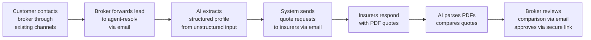

# Executive Summary

> **Version:** 1.0
> **Last updated:** March 2, 2026
> **Status:** Draft -- internal review

> **TL;DR:** agent-resolv is an AI co-pilot for Portuguese insurance brokers. It automates the back-office grind — extracting structured data from leads, requesting quotes from insurers via email, parsing PDF responses, and generating comparisons — so brokers can serve more customers without hiring more people. Brokers keep their existing customer channels; agent-resolv slots into their workflow. Pre-seed stage, targeting launch Q3-early Q4 2026.

> **MVP Scope Note:** The specific insurance product type(s) for MVP launch will be selected after Rolando shadow sessions (end of March 2026). The architecture is product-type-agnostic — schemas cover auto, home, life, and health — but implementation and validation start with the selected MVP types based on Rolando's real workflow volume, PDF availability, and competitive landscape.

**A day in the broker's life (today):** Rolando receives a call from a customer who needs auto insurance. He takes notes on paper, opens his email, and sends separate quote requests to 5 insurers — each with slightly different formatting requirements. Over the next 3-5 days, PDFs trickle back. He opens each one, manually extracts pricing and coverage details into a spreadsheet, builds a comparison, writes a recommendation email to the customer, and waits for approval before binding the policy. With agent-resolv, Rolando forwards the customer's email (or pastes his phone notes) to the system. The AI extracts a structured profile, sends quote requests to all 5 insurers simultaneously, parses the PDF responses as they arrive, generates a comparison with reasoning, and emails it to Rolando for review. He clicks an approval link, and the recommendation goes to the customer. What took 3-5 days of back-and-forth now takes hours of elapsed time with minutes of Rolando's attention.

## What Is agent-resolv?

agent-resolv is an AI-powered back-office for licensed insurance brokers (mediadores de seguros). It processes incoming customer leads from whatever channel the broker already uses (website contact form, email, phone, WhatsApp), automates quote collection from insurers, parses responses, and generates structured comparisons for the broker to review and deliver.

The operating entity for agent-resolv is TBD. Build Up Labs is technical co-founder. No ASF/BdP licenses are held yet -- the MVP (broker co-pilot tooling) does not require its own license since it operates as software used by already-licensed brokers. Own licensing becomes necessary if/when agent-resolv operates as a broker directly (D2C channels, Phase 4+). See [04-compliance-and-risk.md](./04-compliance-and-risk.md).

## Why It Exists

Portugal's insurance brokerage market is manual. Brokers collect customer data over phone/email, request quotes by emailing each insurer individually, wait days for responses, manually compare PDFs, and email recommendations back. A single customer journey takes 3-7 days of elapsed time across dozens of emails.

There are no standardized APIs. Every insurer integration is bilateral. Existing digital players (MUDEY, ComparaJa) took years to build integrations and still don't cover post-purchase or claims. MUDEY's pivot to MudeyPRO (B2B2C tooling for small mediators) confirms: the market needs broker infrastructure, not just another consumer brand.

agent-resolv skips the integration queue by starting with the same channel brokers use today — email — but automates every step with AI. Brokers keep their existing customer relationships and channels. agent-resolv handles the back-office.

**Why broker-first, not consumer-first?** MUDEY spent 3+ years building a D2C brand, then pivoted to B2B2C tooling for small mediators. Customer acquisition is the hardest, most capital-intensive part — the technology is easier. We start where MUDEY ended up: broker tooling. Once the AI pipeline is proven on real broker workflows, we expand to direct customer channels (embeddable widget, WhatsApp) and eventually a full platform. [Full rationale: 05-implementation-roadmap.md](./05-implementation-roadmap.md#why-broker-first-not-consumer-first)

## What the MVP Does

The MVP handles insurance back-office end-to-end for the selected MVP product types (see MVP Scope Note above): a broker receives a lead through their existing channels, feeds it into agent-resolv (forwarded email, contact form webhook, pasted phone notes), the system extracts a structured profile, requests quotes from multiple insurers via email, parses the PDF responses, generates a comparison, and the broker reviews and delivers the recommendation to the customer.

The primary broker interface is **email** — brokers forward customer leads to agent-resolv, receive extracted profiles and comparisons via email, and approve recommendations via a secure link. Low onboarding friction: forward leads and click approval links. A web dashboard and MCP server follow in Phase 3.

## Key Research Findings

**PDF Parsing (95%+ accuracy on tested products):** Claude reliably extracts structured data from Portuguese insurance quote PDFs across multiple insurers and formats. No per-insurer template needed. Tested on 5 real PDFs from 4 insurers (vida credito and multirriscos). PDF parsing for the selected MVP product types remains untested pending sample PDFs from Rolando shadow sessions — this is the top execution risk. [Details: 02-ai-feasibility.md](./02-ai-feasibility.md)

**Email Thread Parsing (90-93% accuracy on 3 threads):** Full workflow state can be inferred from email threads — participant identification, document tracking, action items, and insurance cross-sell moments. Tested on 3 real multi-party mortgage/insurance threads (56 messages). Insurer-to-broker email format is untested — critical gap to be resolved during Rolando sessions. [Details: 02-ai-feasibility.md](./02-ai-feasibility.md)

**Conversational Intake (viable for auto, challenging for health):** Conversational profiling works well for auto insurance (10-14 turns). Home insurance is blocked by rebuild cost estimation. Health insurance is high-complexity with regulatory constraints (GDPR Art. 9, EU AI Act). This research validates a future embeddable widget for broker websites. [Details: 02-ai-feasibility.md](./02-ai-feasibility.md)

**Integration Landscape (no APIs, email is the path):** No standardized PT insurance APIs. Email/portal automation is how every broker works today. Fidelidade has the best API story (20+ REST endpoints) for future direct integration. [Details: 01-market-and-integrations.md](./01-market-and-integrations.md)

**What's Risky:**
- PDF parsing untested for some product types — pending sample PDFs from Rolando shadow sessions
- Health insurance QIS (questionnaire) errors create legal exposure
- Home insurance rebuild cost estimation is unreliable without lookup tables
- EU AI Act likely classifies insurance AI recommendation as high-risk (Aug 2026 deadline) — formal classification pending legal counsel
- Mastra framework has a fast-moving API surface with frequent breaking changes -- version pinning, decoupled schemas, and `@mastra/inngest` for durable workflows mitigate this

## Timeline

| Phase                    | Weeks | Focus                                                                                                              |
| ------------------------ | ----- | ------------------------------------------------------------------------------------------------------------------ |
| Foundation               | 1-3   | Monorepo setup (Turborepo + Drizzle + Postgres), Mastra agents, schemas, auth + RBAC, compliance tools             |
| Email Brokerage Pipeline | 4-7   | Durable workflow (`@mastra/inngest`), email integration, comparison, **email broker interface**                    |
| Production Hardening     | 8-12  | Broker dashboard, MCP server (demos + AI-native consumers), PDF parsing improvements, observability, intake widget |

Timeline assumes Phase 2 legal blockers are complete before customer PII flows: legal basis confirmation, DPA + sub-processor register, and retention policy.

Post-MVP: Embeddable customer-facing intake widget, WhatsApp, credit intermediary (BdP license), B2B2C platform.

[Full roadmap: 05-implementation-roadmap.md](./05-implementation-roadmap.md)

## AI-First Development Approach

The codebase is designed to be generated and maintained by AI coding tools (Claude Code). Architectural choices prioritize type safety, explicit contracts, and strict boundaries over developer ergonomics — because the primary "developer" is an LLM that benefits from well-defined interfaces. This approach enables a 1-person technical team to build and maintain a system that would traditionally require 3-5 engineers. Framework choices like Effect-TS (typed errors, composable programs) and the monorepo package structure (enforced dependency boundaries) serve as guardrails for AI-generated code, not as productivity tools for human developers.

## Unit Economics -- LLM Cost Model

> **Status: Envelope estimate.** The calculation below uses current API pricing and estimated token counts per pipeline step. Exact costs require validation against real-world PDFs and insurer email formats from Rolando shadow sessions. The directional economics are clear; the precise per-journey cost will tighten during Phase 2.

### Envelope Calculation (auto insurance, 5 providers)

Pricing basis: Claude Sonnet 4.5 ($3/$15 per MTok input/output), Claude Haiku 4.5 ($1/$5 per MTok input/output). March 2026.

| Pipeline Step              | Model  | Input Tokens | Output Tokens | Est. Cost |
| -------------------------- | ------ | ------------ | ------------- | --------- |
| Lead extraction (x1)       | Sonnet | 2,000        | 800           | $0.02     |
| Quote email generation (x5)| Haiku  | 7,500        | 2,500         | $0.02     |
| PDF parsing (x5)           | Sonnet | 50,000       | 7,500         | $0.26     |
| Comparison + reasoning (x1)| Sonnet | 5,000        | 2,000         | $0.05     |
| Validations/formatting (x3)| Haiku  | 3,000        | 1,500         | $0.01     |
| **Total per journey**      |        | **67,500**   | **14,300**    | **~$0.36**|

**Estimated range: EUR 0.30-1.50 per journey** depending on number of providers (3-7), PDF complexity, and retry loops. The low end assumes model routing (Haiku for simple tasks) and prompt caching (up to 90% reduction on cached system prompts). The high end assumes all-Sonnet, complex multi-page PDFs, and correction loops.

**Against commission revenue:** Auto insurance commissions range EUR 80-150 per policy. At EUR 0.30-1.50 LLM cost per journey, AI costs represent **<1-2% of commission revenue** — even at worst case. Home (EUR 50-120) and life (EUR 100-200+) commissions show similar margins.

**Structural tailwind:** LLM API pricing has declined ~50% YoY consistently. The cost per journey halves roughly every year while the commission revenue stays constant. The margin improves automatically.

**Validation spike (pre-launch):** Run the full pipeline on 10 real customer journeys with cost tracking per LLM call. Validate token count assumptions against real insurer PDFs. Compare Sonnet vs. Haiku vs. GPT-4o-mini for each step. Define cost ceiling per journey.

## Competitive Moat

The moat is not any single component — it's the accumulation of four stacking layers:

1. **Regulatory license** (table stakes) — ASF + BdP licensing creates a barrier to entry, but is replicable by any well-funded competitor willing to invest the time.

2. **Broker relationships** (medium defensibility) — Trusted relationships with brokers and insurers take time to build. First-mover advantage in a market with no AI broker tooling.

3. **Operational data flywheel** (high defensibility) — Every quote request processed generates structured insurer response data: PDF formats, email patterns, response times, pricing patterns per insurer per product type per customer profile. This corpus grows with each transaction and cannot be replicated without processing equivalent volume.

4. **Normalized insurer data corpus** (highest defensibility) — The schema layer (CustomerProfile, NormalizedQuote, ComparisonResult) normalizes chaotic, insurer-specific data into consistent structures. Over time, this becomes the most comprehensive structured dataset of Portuguese insurance pricing and coverage across providers — enabling predictive quoting, provider recommendations, and market intelligence that no competitor can match without years of equivalent data accumulation. This operational data advantage compounds with every transaction processed through the system.

## Team

| Person             | Role                                                                         |
| ------------------ | ---------------------------------------------------------------------------- |
| Goncalo Reis       | CEO — business, domain expertise, regulatory, insurer relationships          |
| Rolando            | Qualified Director (ASF) — reviews all AI recommendations, domain validation |
| Build Up Labs / JP | Technical co-founder — architecture, implementation, AI feasibility          |

## PRD Navigation

| Document                                                                          | Audience  | What's Inside                                                      |
| --------------------------------------------------------------------------------- | --------- | ------------------------------------------------------------------ |
| [01 — Market & Integrations](./01-market-and-integrations.md)                     | All       | PT insurance landscape, competitors, integration strategy          |
| [02 — AI Feasibility](./02-ai-feasibility.md)                                     | All       | What AI can/can't do — PDF parsing, email parsing, WhatsApp intake |
| [03 — Technical Architecture](./03-technical-architecture.md)                     | Technical | System design, schemas, Mastra framework, database                 |
| [04 — Compliance & Risk](./04-compliance-and-risk.md)                             | All       | ASF, GDPR, EU AI Act, risk matrix                                  |
| [05 — Implementation Roadmap](./05-implementation-roadmap.md)                     | All       | Phased plan, deliverables, open questions                          |
| [06 — Claude Code Implementation Guide](./06-claude-code-implementation-guide.md) | Technical | Step-by-step build instructions                                    |
| [Glossary — Portuguese Insurance Terms](../research/onboarding/glossary.md) | All       | Insurance terminology reference for all audiences                  |
