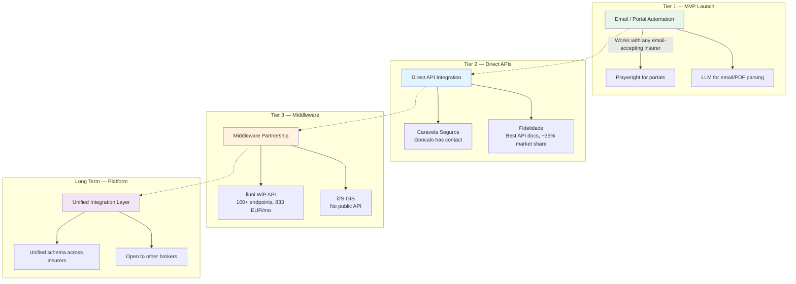

# Market & Integrations

> **Version:** 1.0
> **Last updated:** March 2, 2026
> **Status:** Draft -- internal review

> **TL;DR:** Portugal's insurance market has zero standardized APIs. Every integration is bilateral. Day-1 strategy: email automation (works with any insurer that accepts email quote requests — no commercial dependency). MVP targets minimum 3 validated providers. Progression: email -> direct API (Fidelidade first) -> middleware (lluni/i2S). Long-term play: build a unified integration layer for Portuguese insurance data.

## PT Insurance Market Landscape

The Portuguese insurance market is dominated by a handful of large insurers, none of which offer standardized broker APIs. Integration is always bilateral and negotiated per-insurer.

Two middleware platforms — **lluni** and **i2S Brokers** — dominate the broker software layer, each serving 380-400+ broker installations. They provide some insurer connectivity, but access requires commercial agreements and platform lock-in.

There is no Portuguese equivalent of an Open Insurance standard. EIOPA's Open Insurance initiative is exploratory and not imminent. DORA (Digital Operational Resilience Act) applied January 17, 2025, adding ICT risk management requirements.

## Competitor Analysis

| Player              | Model                      | Strengths                                    | Weaknesses                                                                             | Relevance                                                                |
| ------------------- | -------------------------- | -------------------------------------------- | -------------------------------------------------------------------------------------- | ------------------------------------------------------------------------ |
| **MUDEY**           | Digital insurance mediator | 20K users, 18+ insurer partners, first-mover | 3+ years to build integrations, pivoted to B2B2C (MudeyPRO) — signals D2C is expensive | Direct competitor. Their pivot to B2B2C validates our long-term strategy |
| **ComparaJa**       | Lead-gen / affiliate       | 21M USD raised, SEO-dominant                 | No AI advisory, no post-purchase, pure comparison                                      | Not a tech competitor — different model                                  |
| **Doutor Financas** | Human-assisted comparison  | Strong brand, credit + insurance             | Manual processes, not tech-driven                                                      | Not a tech competitor                                                    |
| **DECO Proteste**   | Consumer rights org        | High trust                                   | Not a commercial competitor                                                            | Don't compete on trustworthiness                                         |

**Key gap agent-resolv fills:** No Portuguese player combines AI-powered intake, automated multi-insurer quoting, structured comparison with reasoning, and human-reviewed recommendations. MUDEY's B2B2C pivot (MudeyPRO for small mediators) confirms the market opportunity for broker tooling. Post-purchase/claims experience is a consistent gap across all players.

## Integration Ladder Strategy

**Tier 1 is not a fallback — it's how every PT broker works today.** Email-based quoting can work with any insurer that accepts email quote requests, with zero commercial dependencies. MVP targets minimum 3 providers with validated email templates and quote email addresses (from Rolando shadow sessions).

## Provider Assessment

| Insurer                      | Market Share | API Access                              | Integration Notes                                                                                         | Priority                   |
| ---------------------------- | ------------ | --------------------------------------- | --------------------------------------------------------------------------------------------------------- | -------------------------- |
| **Fidelidade**               | ~35%         | 20+ REST APIs on MuleSoft portal, OAuth | Best API story in PT. Requires Nr ASF + ClientID/Secret. Not self-serve but well-documented.              | #1 for API pilot           |
| **Caravela Seguros**         | Small        | Unknown                                 | Goncalo has contact with Luis Cervantes. Evaluate tech stack and appetite.                                | #1 for relationship-based  |
| **Tranquilidade / Generali** | Large        | OAuth 2.0 webservice                    | Endpoints: customers, policies, receipts, claims. No public dev portal — docs only for certified vendors. | Medium                     |
| **Ageas**                    | Large        | Webservice live                         | Activation via insurer commercial structure. Insure startup program closed Feb 2026.                      | Medium                     |
| **Allianz**                  | Large        | Webservice exists                       | No public developer portal or documentation.                                                              | Low                        |
| **Lusitania**                | Medium       | Via middleware                          | Available through lluni/i2S.                                                                              | Low (middleware-dependent) |

## Middleware Analysis

### lluni

- B2B insurance management ERP. 380+ mediators, 500M+ EUR portfolio under management.
- Products: lluni Seg (ERP), Portal do Cliente, Portal do Agente, **WiP** (multi-insurer quote aggregation).
- WiP integrates with ~13 insurers: Ageas, Allianz, Fidelidade, Generali, Zurich, Lusitania, Caravela, MetLife, MGEN, Ocidental, Una, ASISA, Prevoir, Liberty, Victoria.
- WiP REST API at `wip.lluni.com/Help` — 100+ endpoints.
- **API access only on Premium plan (833 EUR/mo).** Tatico: 125 EUR/mo, Estrategico: 166 EUR/mo.
- **Risk:** Platform dependency. Unknown if API is available to third-party integrators outside their ERP.

### i2S Brokers

- GIS Mediadores — modular broker management software. 400+ installations.
- Products: GIS CORE (mandatory base) + GIS+ modules (claims, CRM, insurer webservices) + GIS APPs.
- Integrates with: Ageas, Allianz, Asisa, Caravela, Fidelidade, Liberty, Lusitania, Seguradoras Unidas, Victoria, Zurich.
- **No public API or developer portal.** Integration requires direct commercial agreement.
- **Risk:** Black box. No way to evaluate without commercial engagement.

**Middleware verdict:** Evaluate after direct insurer integrations prove value. Avoid platform dependency in MVP. The 833 EUR/mo lluni Premium plan may be justified if WiP API access is reliable and available to third-party integrators.

## Strategic Positioning

agent-resolv's competitive advantage is not in any single integration — it's in the **normalization layer**. By building standardized schemas (CustomerProfile, NormalizedQuote, ComparisonResult) that work across all insurers regardless of integration method (email, API, middleware), agent-resolv creates a unified integration layer for Portuguese insurance data.

This positions agent-resolv for a future B2B2C play: other brokers can use our infrastructure (like MUDEY's MudeyPRO pivot, but API-first rather than white-label).

> **Near-term vs long-term:** The near-term product is a broker co-pilot that helps mediators handle more customers without hiring more people. The long-term vision (3-5 years) is a data normalization layer for Portuguese insurance — but that vision is a byproduct of the broker co-pilot generating real transaction data at scale, not a standalone goal. The schema layer (CustomerProfile, NormalizedQuote, ComparisonResult) is built from day one because it serves the co-pilot; it becomes a Plaid-like platform asset only if transaction volume justifies it.

### Market Timing

FiDA (Financial Data Access) regulation is expected to force open APIs in financial services, including insurance, around 2027-2028. agent-resolv's email-first approach is a deliberate bridge strategy: build the normalization layer now using the same channel brokers already use, so that when APIs arrive, the schema standard is already established and battle-tested. First-mover advantage on the normalized data layer means agent-resolv sets the de facto schema standard that later entrants will need to conform to or compete against.

> **Rolando session questions:** See [05-implementation-roadmap.md — Consolidated Open Questions](./05-implementation-roadmap.md#consolidated-open-questions-for-rolando-shadow-sessions) and the separate [Rolando Session Prep Kit](../research/stakeholder-docs/d-rolando-session-prep-kit.md).

---

*Full integration research: [../research/integrations.md](../research/integrations.md)*
