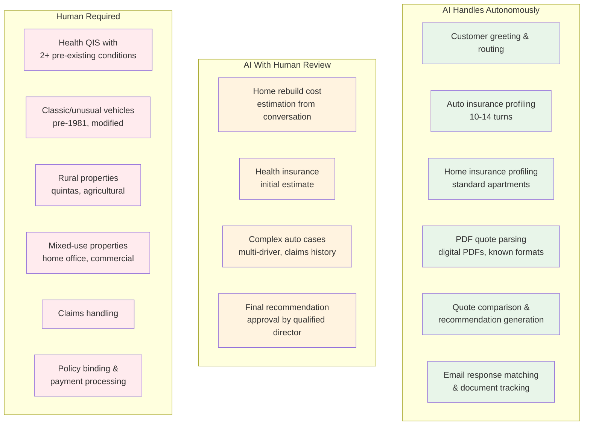

# AI Feasibility

> **Version:** 1.0
> **Last updated:** March 2, 2026
> **Status:** Draft -- internal review

> **TL;DR:** AI can reliably parse PT insurance PDFs (95%+ on vida credito and multirriscos — 5 PDFs tested), reconstruct workflow state from email threads (90-93% on 3 threads), and handle conversational intake for auto insurance (10-14 turns). Health insurance is high-risk due to legal exposure and regulatory constraints. MVP product types pending Rolando shadow session validation (see [Executive Summary — MVP Scope Note](./00-executive-summary.md)). Expected overall human handoff rate: ~25-30%.

> **Model pricing context:** LLM API costs have dropped approximately 50% year-over-year across major providers. Current cost estimates (once validated) should be treated as conservative upper bounds. Model routing — using cheaper models (Haiku) for simple tasks and reserving Sonnet for complex extraction — further reduces per-journey costs.

## Feasibility Matrix

| Capability               | Product                 | Confidence  | Notes                                  |
| ------------------------ | ----------------------- | ----------- | -------------------------------------- |
| PDF quote extraction     | Vida Credito            | 95-98%      | Tested on 4 APRIL + Real Vida PDFs     |
| PDF quote extraction     | Multirriscos            | 93%         | Tested on 1 Tranquilidade PDF          |
| PDF quote extraction     | Auto                    | Untested    | No sample PDFs yet                     |
| PDF quote extraction     | Health                  | Untested    | No sample PDFs yet                     |
| Email thread parsing     | Mortgage/insurance      | 90-93%      | Tested on 3 real multi-party threads   |
| Email workflow inference | Brokerage state machine | 90%         | State transitions reliably detected    |
| Conversational intake    | Auto                    | High        | 10-14 turns, best automation candidate |
| Conversational intake    | Home                    | Medium-high | Blocked by rebuild cost estimation     |
| Conversational intake    | Health (estimate)       | Medium      | 2-4 turns for estimate only            |
| Conversational intake    | Health (full QIS)       | Low-medium  | 8-15 turns/person, legal exposure risk |

## AI vs Human Intervention



## PDF Quote Parsing

### What Works

LLM extraction from digital Portuguese insurance quote PDFs is production-viable. No per-insurer template is needed — the model handles format variability across insurers natively.

**Test results across 5 PDFs from 4 insurers:**

| PDF               | Insurer       | Product                            | Accuracy | Key Challenge                                                            |
| ----------------- | ------------- | ---------------------------------- | -------- | ------------------------------------------------------------------------ |
| april.pdf         | APRIL         | Vida Credito (consumer)            | 98%      | Second insured has DOB but no name                                       |
| april2.pdf        | APRIL         | Vida Credito (distributor ITP 60%) | 97%      | Completely different layout from consumer version                        |
| april3.pdf        | APRIL         | Vida Credito (distributor IAD)     | 97%      | Coverage table structure changes by selected option                      |
| realvida.pdf      | Real Vida     | Vida Habitacao                     | 95%      | Unique "Idade Actuarial Comum" concept, Euribor-linked declining capital |
| tranquilidade.pdf | Tranquilidade | Multirrisco Casa                   | 93%      | Dual imovel/recheio capital structure, mixed franchise types             |

**Key findings:**
- No two insurers use the same format. Even within APRIL, consumer vs distributor layouts differ completely.
- A template-based parser would need N templates per insurer per layout variant. LLM extraction avoids this entirely.
- European numeric formatting (1.234,56), Portuguese abbreviations, and irregular table structures are handled reliably.
- "Oferta" (free/promotional) coverages, declining capital projections, and coverage termination mid-projection are all parsed correctly.

### What's Untested

- Scanned/image-based PDFs (OCR pathway)
- Password-protected PDFs
- Auto insurance quote PDFs
- Health insurance quote PDFs
- Multi-product bundle PDFs
- Renewal/amendment PDFs (vs new business quotes)

### Production Pipeline Design

```
PDF -> Text extraction -> LLM structured extraction -> Zod validation -> Confidence scoring -> Human review (if low confidence)
```

> **Cost per operation:** TBD — needs validation spike with real-world data across Sonnet, Haiku, and GPT-4o-mini. Key variables: input token count (PDF length), output token count (structured extraction size), and model selection per pipeline step.

Two schema targets validated so far: `VidaCreditoQuote` and `MultirriscoQuote`. Schemas for other product types (auto, health) to be defined after obtaining sample PDFs during Rolando shadow sessions. The selected MVP product types will be driven by Rolando's real workflow volume and PDF availability — the architecture is product-type-agnostic (see [Executive Summary — MVP Scope Note](./00-executive-summary.md)).

*Full PDF parsing research: [../research/ai-spikes/pdf-parsing.md](../research/ai-spikes/pdf-parsing.md)*

## Email Thread Parsing

### What Works

Claude can extract structured workflow data from multi-party Portuguese mortgage/insurance email threads and reconstruct the brokerage state machine.

**Test results across 3 real email threads (56 messages total):**

| Thread                      | Messages | Parties | Accuracy | Key Capability Demonstrated                                                               |
| --------------------------- | -------- | ------- | -------- | ----------------------------------------------------------------------------------------- |
| PHB-391-2024                | 14       | 5       | 93%      | Insurance cross-sell detection, bank requirement extraction, document validation tracking |
| RE_ 1033499                 | 24       | 3       | 91%      | Full mortgage lifecycle reconstruction, out-of-band action inference (SMS signing)        |
| Solicitacao de documentacao | 18       | 3       | 92%      | Credit broker workflow, 28-attachment categorization, customer error detection            |

**Key findings:**
- The three test threads tell one complete story — same mortgage transaction across different parties. LLM reconstructs the full timeline from fragmented threads.
- Insurance cross-sell moments are reliably detected (when insurance enters a non-insurance thread).
- Document request/fulfillment tracking works across messages: who requested what, when it was provided, validation status.
- Participant disambiguation works despite name/case/accent variations across messages.
- 74 total attachments across 3 threads — categorization (insurance quote, bank proposal, identity doc, etc.) is reliable.

### Inferred Workflow State Machine

```
DOCUMENT_COLLECTION -> BANK_SUBMISSION -> INSURANCE_QUOTING -> MORTGAGE_APPROVAL -> ESCRITURA_PREPARATION -> COMPLETED
```

This maps directly to agent-resolv's response tracking in the email-first broker flow (Phase 2) and later dashboard views (Phase 3).

### Accuracy Challenges

- Sentiment detection: ~80% — urgency signals in Portuguese formal email are subtle
- Out-of-band action inference: ~85% — some actions happen via SMS/phone and are only referenced in email
- Insurer-to-broker email threads: **not tested** — critical gap for the quote collection workflow

### Email Matching Strategy

For matching inbound insurer responses to pending quote requests, a deterministic-first approach with probabilistic fallback:

**Primary signal (deterministic):**
0. **Correlation token** — every outbound quote request email includes a unique reference number (e.g., `REF-AR-XXXX`) in the subject line and body. Inbound responses containing this token are matched deterministically with 100% confidence.

**Fallback signals (probabilistic, when token is absent):**
1. **Subject line fuzzy match** — match against sent request subject
2. **Sender domain lookup** — map sender domain to provider registry
3. **LLM body extraction** — extract customer name, product type, reference numbers from email body
4. **Timestamp window** — responses expected within provider's typical responseTime from registry

Insurer email behavior (whether they preserve subject lines, strip reference numbers, use auto-replies vs human responses) is **untested** — this is a critical gap to be resolved during Rolando shadow sessions. The correlation token approach mitigates the risk but must be validated against real insurer email patterns.

> **Cost per operation:** TBD — needs validation spike with real-world data across Sonnet, Haiku, and GPT-4o-mini. Key variables: input token count (email thread length), output token count (structured extraction size), and model selection per pipeline step.

*Full email parsing research: [../research/ai-spikes/email-parsing.md](../research/ai-spikes/email-parsing.md)*

## WhatsApp Conversational Intake

### Product Viability by Insurance Type

**Auto Insurance — Best MVP Candidate**
- Optimal flow: 10-14 conversational turns
- Matricula (license plate) auto-fills ~6 fields via VIS/DUA database lookup
- Clearest field structure, lowest regulatory risk
- Expected handoff rate: 5-10% standard, 15-20% multi-driver/complex claims

**Home Insurance — Viable with Caveats**
- Optimal flow: 14-18 turns
- **Blocked by rebuild cost estimation:** capital do edificio (rebuild cost) != market value, can differ 3-5x in Lisbon. Customers don't know this number.
- MVP approach: INE construction cost lookup table (~1,200-1,500 EUR/m2 standard construction) as proxy, flagged for human review.
- Expected handoff rate: 15-20% standard apartment, 40-50% moradia/quinta/unusual

**Health Insurance — High Complexity**
- Two-phase flow: initial estimate (2-4 turns) + full QIS (8-15 turns per insured person)
- Family of 4 with conditions: 28-55 messages total
- QIS responses are legal declarations — false declarations can void contract
- GDPR Article 9 (special category health data) requires explicit consent
- EU AI Act classifies AI for health insurance risk assessment as high-risk (Annex III, 5(b))
- Expected handoff rate: 10-15% individual no conditions, 50-70% individual 2+ conditions

> **Scope note:** Health insurance feasibility is documented here for completeness and to inform long-term product decisions. MVP scope will be determined post-Rolando sessions and may exclude health entirely in initial phases. The regulatory complexity (GDPR Art. 9, EU AI Act Annex III 5(b)), high handoff rates (50-70% for complex cases), and QIS legal exposure make health insurance a candidate for a dedicated post-MVP phase with its own legal review.

> **Cost per operation:** TBD — needs validation spike with real-world data across Sonnet, Haiku, and GPT-4o-mini. Key variables: number of conversational turns, input token count per turn, output token count (structured extraction), and model selection.

### PT Portuguese Language Design

The intake agent must use colloquial Portuguese, not insurance jargon:

| Insurance Term         | What Customers Say                               |
| ---------------------- | ------------------------------------------------ |
| Seguro automovel       | "seguro do carro"                                |
| Responsabilidade civil | "RC" / "o seguro basico"                         |
| Contra todos os riscos | "seguro completo" / "danos proprios"             |
| Apolice                | "o contrato" / "o papel do seguro"               |
| Premio                 | "o que pago por mes"                             |
| Franquia               | "participacao" / "o que pago se houver sinistro" |
| Sinistro               | "acidente" / "problema"                          |

~300,000+ Brazilian residents in Portugal. Agent must detect PT-BR patterns ("placa" -> matricula, CNH/CPF -> explain NIF requirement).

### Human Handoff Rates

| Scenario                         | Handoff Rate |
| -------------------------------- | ------------ |
| Auto standard                    | 5-10%        |
| Auto multi-driver/claims         | 15-20%       |
| Home standard apartment          | 15-20%       |
| Home moradia/quinta/unusual      | 40-50%       |
| Health individual, no conditions | 10-15%       |
| Health individual, 2+ conditions | 50-70%       |
| Health family 4+                 | 30-45%       |
| **Overall weighted average**     | **~25-30%**  |

*Full WhatsApp intake research: [../research/ai-spikes/whatsapp-intake.md](../research/ai-spikes/whatsapp-intake.md)*

## Cross-Spike Insights

1. **Email threads reference the same PDFs** tested in the PDF spike — the credit broker (P.M. Pedrosa, ASF licence 1324) distributed APRIL and Tranquilidade quotes that appear in both the email and PDF test sets. This validates end-to-end data flow.

2. **Insurance cross-sell moments in email threads** create opportunities for conversational intake — when a bank requires insurance for mortgage approval, agent-resolv can proactively initiate the intake flow.

3. **Coverage naming varies across insurers:** "IDPAC60" (Tranquilidade) vs "ITP 60%" (APRIL) = same concept. The normalization schema must map insurer-specific names to canonical coverage types.

4. **Document dependency is the biggest flow-breaker** across all products — ~30% of fields require documents the customer doesn't have at hand. The "send a photo, I'll extract the data" pattern is critical for reducing drop-off.

## Gap Analysis — What Still Needs Testing

| Gap                                       | Impact                                                                               | When to Test            |
| ----------------------------------------- | ------------------------------------------------------------------------------------ | ----------------------- |
| Insurer-to-broker email format            | Critical for email matching in brokerage workflow                                    | Rolando shadow sessions |
| Quote PDFs for selected MVP product types | Needed for MVP — see [Executive Summary — MVP Scope Note](./00-executive-summary.md) | Rolando shadow sessions |
| Health insurance quote PDFs               | Needed for health product launch                                                     | Post-MVP                |
| Scanned/image-based PDFs                  | Determines if OCR pathway is needed                                                  | Rolando shadow sessions |
| Insurer automated email responses         | May differ from human-written emails                                                 | Phase 2 testing         |
| Claims email thread structure             | Needed for claims feature                                                            | Post-MVP                |

> **Rolando session questions:** See [05-implementation-roadmap.md — Consolidated Open Questions](./05-implementation-roadmap.md#consolidated-open-questions-for-rolando-shadow-sessions) and the separate [Rolando Session Prep Kit](../research/stakeholder-docs/d-rolando-session-prep-kit.md).

---

*Source research:*
- *[../research/ai-spikes/pdf-parsing.md](../research/ai-spikes/pdf-parsing.md)*
- *[../research/ai-spikes/email-parsing.md](../research/ai-spikes/email-parsing.md)*
- *[../research/ai-spikes/whatsapp-intake.md](../research/ai-spikes/whatsapp-intake.md)*
