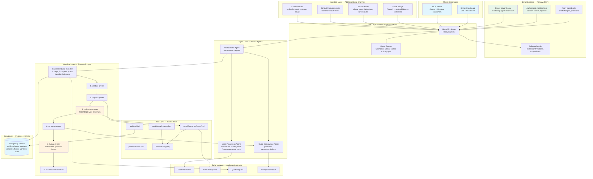
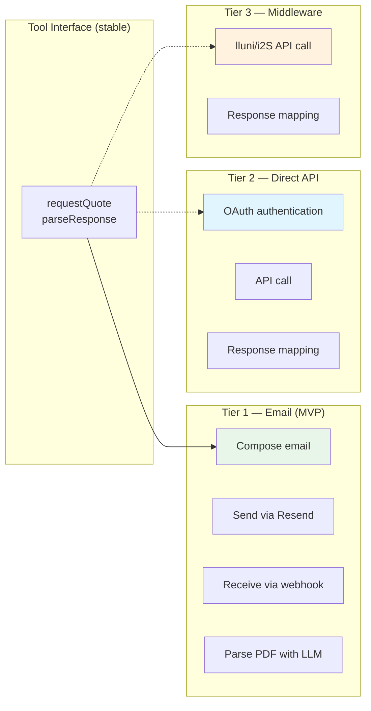
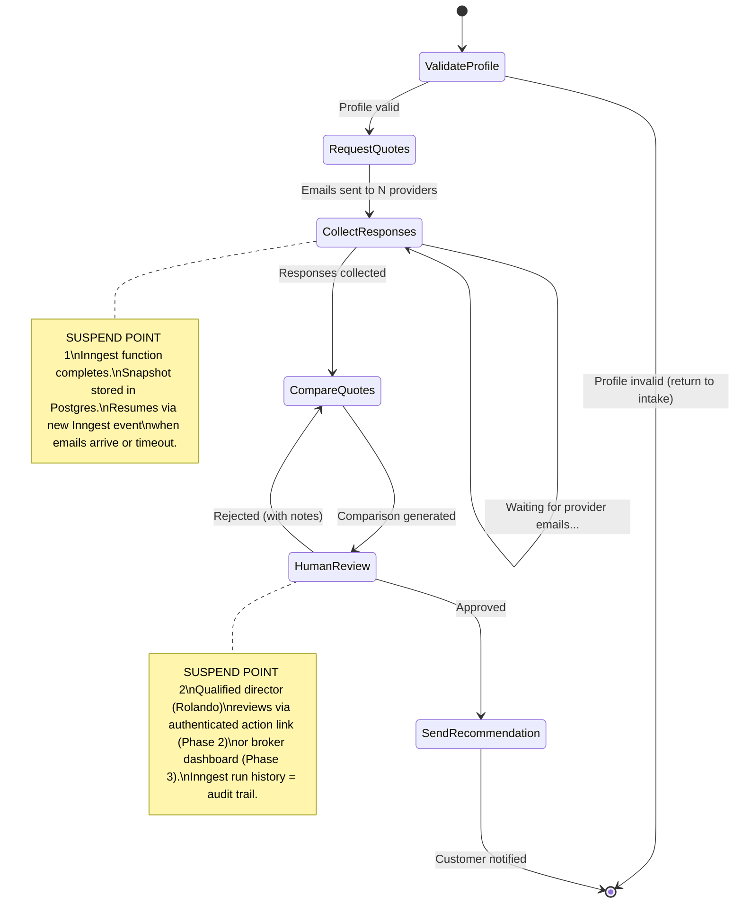

# Technical Architecture

> **Version:** 1.0
> **Last updated:** March 2, 2026
> **Status:** Draft -- internal review

> **TL;DR:** Turborepo monorepo following the BuL template. Mastra agents in `packages/agents/`, Zod schemas in `packages/contracts/`, business logic in `packages/core/` with Effect-TS. API via Hono + Node.js with `@mastra/hono` adapter. Durable workflow orchestration via `@mastra/inngest` (crash-safe steps, suspend/resume, retries, observability). Postgres + Drizzle ORM (Neon in production). Mastra stores workflow snapshots in a separate `mastra` Postgres schema. Brokers interact via email interface; dashboard and MCP server follow in Phase 3.

## Architecture Decision Records

Technical decisions were validated against existing BuL template (canonical monorepo reference). Each ADR documents the decision, rationale, alternatives considered, and trade-offs.

### ADR-001: Monorepo Package Structure

**Decision:** Follow the template monorepo layout with `apps/`, `packages/`, and `tooling/` directories. Enforce dependency boundaries with dependency-cruiser.

**Context:** The initial plan placed all code under a flat `src/mastra/` directory. Every production BuL project uses a structured monorepo with isolated packages.

**Rationale:**
- **Enforced dependency boundaries** -- packages never import from apps, frontends never import DB types. dependency-cruiser catches violations at lint time.
- **Independent testing** -- each package has its own test suite. `packages/contracts/` can be tested without spinning up agents or databases.
- **Reusability** -- `packages/contracts/` is consumed by the API, dashboard, MCP server, and agents independently. A flat layout would create circular dependencies.

**Alternatives considered:**
- *Flat `src/mastra/` layout:* Simpler to start, but creates tight coupling between schemas, agents, and tools. No boundary enforcement. Becomes painful to refactor once multiple consumers exist.
- *Nx instead of Turborepo:* More features (affected commands, project graph) but heavier setup. Turborepo is the BuL standard and sufficient for our needs.

**Trade-offs:**
- (+) Clean separation, testable in isolation, scales to multiple apps
- (+) Code generation via plop scaffolds new packages consistently
- (-) More boilerplate for initial setup (mitigated by template)
- (-) Cross-package TypeScript imports need build ordering in Turborepo pipeline

### ADR-002: Database -- Postgres + Drizzle ORM

**Decision:** Use PostgreSQL (Neon in production) with Drizzle ORM for application data. Mastra stores workflow state in a separate `mastra` Postgres schema via `@mastra/pg` PostgresStore.

**Context:** The initial plan used LibSQLStore (SQLite-compatible, Mastra-native) for MVP with a planned migration to Postgres later. Every BuL project uses Postgres.

**Rationale:**
- **No migration tax** -- starting with Postgres means no SQLite-to-Postgres migration during production hardening. LibSQLStore would work for development but requires a database migration before any real deployment.
- **Proven Mastra pattern** -- foresight runs Mastra with `PostgresStore` using `schemaName: "mastra"` alongside the application schema. Zero conflicts between Mastra internals and application tables.
- **Drizzle is the BuL standard** -- schema-as-code, type inference from schema (`$inferSelect`, `$inferInsert`), push-based dev workflow (`drizzle-kit push`), migration-based production workflow (`drizzle-kit generate` + `drizzle-kit migrate`).
- **Neon branching** -- database branches for testing migrations, previewing schema changes, and development isolation. Aligns with Vercel preview deployments.

**Alternatives considered:**
- *LibSQLStore (SQLite):* Zero-config for local dev, Mastra-native. But requires migration to Postgres for production (multi-connection, concurrent writes, JSONB queries). The migration cost outweighs the setup convenience.
- *Prisma instead of Drizzle:* Foresight uses Prisma. More mature migration system, but requires a separate `.prisma` schema file and a codegen step. Drizzle's schema-as-TypeScript is more ergonomic for a contracts-first architecture where types flow from Zod schemas.

**Trade-offs:**
- (+) Production-ready from day one, no migration needed
- (+) Neon branching for development, preview, and testing
- (+) Single database for app data + Mastra state (separate schemas)
- (-) Requires a Postgres instance for local dev (Docker or Neon dev branch)
- (-) Slightly more setup than LibSQLStore's `:memory:` default

### ADR-003: Workflow Engine -- @mastra/inngest

**Decision:** Use `@mastra/inngest` (official Mastra package, v1.1.1) as the single workflow orchestration layer. Replace Mastra's native execution engine with Inngest's durable runtime.

**Context:** The initial plan used Mastra's native workflows (in-memory execution with suspend/resume via database snapshots). agent-resolv's 6-step pipeline has 2 suspend points that may persist for days (waiting for insurer email responses, human director review).

**Rationale:**
- **Crash-safe durability** -- Mastra's native engine executes steps in-memory. If the server crashes mid-step, work is lost. `@mastra/inngest` wraps every step in `step.run()`, which is memoized and retriable. A crash at step 4 replays from step 4, not step 1.
- **Days-long suspend points** -- When the workflow suspends waiting for provider emails (step 3), Mastra stores the snapshot to Postgres, and the Inngest function run completes. When the email callback arrives, `run.resume()` fires a new Inngest event, starting a fresh durable execution from the suspended step. No long-running connections, survives server restarts and cold starts.
- **Production observability** -- Inngest Cloud dashboard provides a complete, tamper-evident run history with inputs, outputs, timing, retry history, and step-level granularity. This directly satisfies ASF audit trail requirements and EU AI Act Art. 12 record-keeping. Mastra Studio is local-only.
- **Built-in flow control** -- concurrency limits, rate limiting, throttle, debounce, and priority queuing on workflows. Critical for managing provider email rate limits and preventing duplicate quote requests.
- **Cron scheduling** -- Native cron triggers on `InngestWorkflow` for email polling, audit log cleanup, and monitoring jobs.
- **Official integration** -- `@mastra/inngest` is built by the Mastra team, not a third-party adapter. It maps Mastra primitives cleanly: `suspend()` -> DB snapshot + new Inngest event on resume, `step.run()` -> memoized durable operation, nested workflows -> `step.invoke()`.

**Alternatives considered:**
- *Mastra native workflows:* Simpler setup, no Inngest dependency. But no crash safety, no production observability dashboard, no cron, no cancellation. The 2 suspend points (one potentially lasting days) make durability non-negotiable.
- *Pure Inngest (no Mastra workflows):* Foresight uses this pattern -- raw Inngest functions calling Mastra agents inside `step.run()`. Works, but loses Mastra's typed step graph, workflow visualization in Studio, and the clean `suspend()/resume()` API. Also requires manual state management that `@mastra/inngest` handles automatically.
- *Temporal/Durable Functions:* Over-engineered for a 6-step pipeline. Inngest's serverless model (HTTP endpoint, no worker infrastructure) is a better fit for early-stage.

**Trade-offs:**
- (+) Crash-safe, durable, observable, retriable
- (+) Suspend/resume survives server restarts (critical for days-long email waits)
- (+) Inngest Cloud dashboard = production audit trail
- (+) Single orchestration layer (not "simple flows in Mastra, complex in Inngest")
- (-) `@mastra/inngest` is young (v1.1.1, published recently). Pin version, test suspend/resume thoroughly.
- (-) Adds Inngest as an infrastructure dependency (Inngest Cloud in production, dev server locally)
- (-) Slightly more complex local dev setup (Inngest dev server alongside API)

**Flexibility and scaling:**
- Inngest scales horizontally -- function runs are stateless, parallel execution is native
- Adding new workflows (e.g., credit brokerage in Phase 5) is adding new `InngestWorkflow` definitions
- If Inngest becomes a bottleneck or cost concern, the Mastra workflow abstraction means swapping the execution engine is a configuration change, not a rewrite

### ADR-004: API Runtime -- Hono + Node.js

**Decision:** Use Hono as the HTTP framework running on Node.js, with `@mastra/hono` as the server adapter. Not Elysia + Bun (the BuL default).

**Context:** The BuL template prescribes Elysia + Bun as the API runtime. However, Mastra's ecosystem is built around Node.js, and the only official Elysia adapter does not exist.

**Rationale:**
- **Official Mastra adapter** -- `@mastra/hono` auto-exposes agents, workflows, and tools as HTTP endpoints. Without an adapter, every route must be wired manually. No `@mastra/elysia` exists.
- **Foresight precedent** -- The only BuL project running Mastra in production chose Hono + Node.js over Elysia + Bun for exactly this reason. Their Dockerfile runs `node:22-alpine`.
- **Bun friction with Mastra** -- Multiple resolved GitHub issues: HTTPParser crash (#4264), Turborepo CLI failures (#9993), dependency resolution failures (#9844). Node.js is Mastra's primary target runtime.
- **Hono is Mastra's internal engine** -- Mastra uses Hono internally for its server. The adapter is the most natural integration.

**Alternatives considered:**
- *Elysia + Bun (BuL standard):* Better developer experience (automatic end-to-end type inference without Zod). But no Mastra adapter exists, and Bun is not Mastra's primary target. Building a custom adapter is non-trivial maintenance for an early-stage project.
- *Next.js API routes:* The initial PRD implied this. Tight coupling between frontend and API, no independent scaling, serverless execution model conflicts with Mastra's state management. Separate API app is better.
- *Express + @mastra/express:* Works, but Express is legacy. Hono has better TypeScript support, middleware composition, and performance.

**Trade-offs:**
- (+) Official Mastra adapter, zero custom glue code
- (+) Proven in production (foresight)
- (+) Node.js is Mastra's primary target -- fewest surprises
- (-) Departure from BuL standard (Elysia + Bun)
- (-) Slightly less ergonomic than Elysia's auto type inference (mitigated by contracts-first Zod schemas)

**Flexibility and scaling:**
- If Mastra ships an Elysia adapter in the future, migration is straightforward -- the adapter is a thin layer over the Mastra instance
- Hono runs on Node.js, Bun, Deno, and Cloudflare Workers -- runtime portability if needed
- The `packages/` structure means the API framework is isolated to `apps/api/` -- swapping it doesn't touch business logic

### ADR-005: Mastra as Standalone Package

**Decision:** Place Mastra agents, tools, memory, and the Mastra instance in `packages/agents/` as a standalone workspace package.

**Context:** Mastra's default scaffold puts everything under `src/mastra/`. The BuL monorepo pattern isolates concerns into packages.

**Rationale:**
- **Clean import boundary** -- `apps/api/`, `apps/mcp/`, and `apps/engine/` all import from `@agent-resolv/agents` without reaching into each other.
- **Independent playground** -- `mastra dev --dir src/` runs from within the package. Turborepo pipeline: `pnpm --filter agents dev`.
- **Testable in isolation** -- Agent unit tests run without the API server, database, or Inngest.
- **Foresight pattern** -- `@foresight/agents` package with the same structure, proven in production.

**Mastra monorepo gotcha:** If `packages/agents/` imports from workspace packages shipping raw `.ts` files (like `@agent-resolv/contracts`), `mastra dev` fails with `ERR_UNKNOWN_FILE_EXTENSION`. Solution: configure `transpilePackages` in the Mastra instance:

```typescript
export const mastra = new Mastra({
  // ...
  bundler: {
    transpilePackages: ['@agent-resolv/contracts'],
  },
});
```

Alternatively, pre-compile contracts via Turborepo pipeline ordering (`agents` depends on `contracts` build).

### ADR-006: AI-First Development -- Hybrid Effect-TS & Architectural Complexity

**Decision:** Use Effect-TS for business logic in `packages/core/` (error-heavy services, domain logic) and plain TypeScript for `apps/` and UI-facing code. Maintain the full monorepo package structure despite being a 1-person technical team.

**Context:** The architecture appears over-engineered for a pre-seed project. However, the codebase is designed to be generated and maintained by AI coding tools (Claude Code), not written from scratch by human developers. Effect-TS provides the most value in error-heavy business logic where typed failures prevent silent swallowing; it adds unnecessary ceremony in app-layer glue code and React components.

**Rationale:**
- **Effect-TS typed errors in `packages/core/`** give the AI explicit failure paths to reason about. When Claude Code generates a function that can fail in 3 ways, Effect-TS forces each failure to be typed and handled — the AI is less likely to generate code that silently swallows errors. This is most valuable in the business logic layer (quote processing, compliance validation, workflow orchestration).
- **Plain TypeScript in `apps/` and UI code** keeps the app layer simple. Hono route handlers, React components, and API glue code don't benefit enough from Effect-TS to justify the overhead.
- **Strict package boundaries** (dependency-cruiser) prevent the AI from creating circular dependencies or violating architectural constraints that a human might catch in review but an AI might miss.
- **Zod schemas as contracts** give the AI a ground truth to validate against. Every input and output is typed — the AI can't generate freeform data structures that drift from the schema.
- **The human developer (JP) reviews AI-generated code** rather than writing it from scratch. The architectural guardrails ensure that reviews catch structural issues, not just logical ones.

**Trade-offs:**
- (+) Stronger type safety where it matters most (core business logic, regulated workflows)
- (+) Explicit error handling prevents silent failures in the domain layer
- (+) AI benefits from strict boundaries — fewer ways to generate incorrect code
- (+) Plain TypeScript in apps reduces token overhead and cognitive load for simpler code
- (-) Two coding styles in one codebase (Effect-TS in core, plain TS in apps) — boundary must be well-documented
- (-) Effect-TS has a smaller community and fewer examples for AI training data
- (-) Higher token overhead in AI prompts for core package (more boilerplate to generate)

**Risk mitigation:** The hybrid approach already limits Effect-TS to where it provides the most value (`packages/core/`). If it still proves too cumbersome for AI code generation, that package can be refactored to plain TypeScript with a custom Result type. The package boundary and interface contracts remain — only the internal implementation changes. App-layer code is unaffected.

---

## System Architecture



## Monorepo Structure

```
agent-resolv/
  apps/
    api/              # Hono + Node.js + @mastra/hono adapter
    engine/           # Inngest background job workers
    mcp/              # MCP server (Phase 3 — demos + AI-native consumers)
    web/              # Vite + React — broker dashboard (Phase 3)

  packages/
    agents/           # Mastra instance, agents, tools, memory
    contracts/        # Zod schemas — single source of truth for all types
    core/             # Business logic (Effect-TS)
    db/               # Drizzle ORM schema + client (Postgres/Neon)
    env/              # Type-safe env vars (@t3-oss/env-core)
    auth/             # Better Auth configuration
    analytics/        # PostHog (server + browser)
    logging/          # Pino structured logging
    ui/               # Shared React components (Phase 3)
    api-client/       # Typed fetch wrapper for frontends

  tooling/
    typescript/       # Shared tsconfig variants (base, react, server)
    tailwind/         # Tailwind factory/preset
```

**Dependency direction:** Apps import from packages. Packages never import from apps. Enforced by dependency-cruiser at lint time.

**Package manager:** pnpm with workspaces. Build system: Turborepo with `concurrency: 20`.

## Mastra Framework

[Mastra](https://mastra.ai) is a TypeScript AI agent framework providing:

- **Agents** with tool calling, structured output (Zod), and persistent memory
- **Agent Networks** (`.network()`) for multi-agent routing
- **Workflows** with step chaining (`.then()`), suspend/resume, and human-in-the-loop
- **Tools** with typed input/output schemas
- **MCP client/server** for connecting to external tool servers
- **Server adapters** for Hono, Express, Fastify, Koa
- **Storage** via `@mastra/pg` PostgresStore (Postgres) or LibSQLStore (SQLite)
- **Inngest integration** via `@mastra/inngest` for durable workflow execution

**Version pinning strategy:** Pin exact versions (`save-exact=true` in `.npmrc`). Mastra is actively evolving -- minor versions can introduce breaking changes. All custom logic (schemas, tool implementations) is decoupled from Mastra internals to make migration feasible if needed.

**Key packages:**

| Package             | Purpose                                             |
| ------------------- | --------------------------------------------------- |
| `@mastra/core`      | Agent, Tool, Workflow, Step primitives              |
| `@mastra/pg`        | PostgresStore for workflow state and memory         |
| `@mastra/inngest`   | Durable workflow execution via Inngest              |
| `@mastra/hono`      | Hono server adapter (auto-exposes agents/workflows) |
| `@mastra/memory`    | Agent memory with optional semantic recall          |
| `@ai-sdk/anthropic` | Anthropic model provider (Vercel AI SDK)            |

## Email Interface -- Primary (MVP)

The email interface is agent-resolv's primary broker-facing channel. Brokers forward leads to an intake address, receive extracted profiles and comparisons via email, and take all state-changing actions (profile confirmation, comparison trigger, cancellation, approval) via authenticated action links embedded in those emails (opaque token, consumed on POST only). Email replies handle edits and questions only.

**Components:**
- **Inbound processing:** Dedicated intake address (`intake@agent-resolv.com`) receives forwarded leads. The lead processing agent extracts a structured profile.
- **Outbound comparison emails:** Profile confirmations, progress updates, and comparison results sent to the broker via Resend.
- **Email replies (draft-level only):** Broker replies are parsed by LLM for profile edits and questions. Email replies never change workflow state.
- **Authenticated action links (all state changes):** Profile confirmation, comparison trigger, cancellation, and binding approval all require opaque-token links with Better Auth session verification. Tokens are server-side, 24h TTL. GET is non-destructive (safe from email scanner prefetch); token is consumed on authenticated POST only.
- **Reply matching (broker replies):** Primary: high-entropy per-request reply-to alias (`<random>@reply.agent-resolv.com`, one per quote request). Secondary: Message-ID/In-Reply-To headers. Tertiary: subject token `[AR-XXXX]`. This is distinct from insurer response matching (see [Inbound Email Processing](#inbound-email-processing)), which uses correlation-token-first matching because insurers don't reply to the alias.
- **Token design:** Opaque tokens, server-side storage, 24h TTL, consumed on authenticated POST (not GET -- safe from link scanner prefetch). Generic URL path (`/action?t=<token>`), no request metadata in URL.
- **Expired-token recovery:** If token is expired or already consumed, show explicit expiry state and allow link reissue to the broker's registered address only (not current viewer address). Reissue is rate-limited (max 3 per request per hour) and logged.

See [email-first-interface.md](../research/email-first-interface.md) for full flow, authentication model, token design, and risk mitigations.

## MCP Server -- Secondary Interface (Phase 3)

The MCP (Model Context Protocol) server exposes the brokerage pipeline as tools for investor/partner demos and AI-native consumers. It wraps the same agents and workflows as the email interface. MCP moves to Phase 3 alongside the broker dashboard -- the 2-3 days of MCP work estimated in the original plan is unchanged, just deferred.

**MCP tools exposed:**

| Tool                      | Description                                                                                                                                                                                                                                                                                       | Who Uses It                      |
| ------------------------- | ------------------------------------------------------------------------------------------------------------------------------------------------------------------------------------------------------------------------------------------------------------------------------------------------- | -------------------------------- |
| `process_lead`            | Extract structured profile from unstructured input (email text, form data, notes)                                                                                                                                                                                                                 | Broker                           |
| `submit_quote_request`    | Validate profile and send quote requests to selected insurers                                                                                                                                                                                                                                     | Broker                           |
| `check_quote_status`      | Check which insurers have responded and current workflow state                                                                                                                                                                                                                                    | Broker                           |
| `get_comparison`          | Retrieve the AI-generated quote comparison for a request                                                                                                                                                                                                                                          | Broker                           |
| `approve_recommendation`  | Qualified director approves/rejects a comparison (human review step). **Requires `qualified_director` role** — enforced via Better Auth.                                                                                                                                                          | Broker (qualified director only) |
| `request_insurance_quote` | End-to-end: provide details, get quotes, receive comparison. **Asynchronous** — initiates the workflow and returns a tracking ID; consumer checks status via `check_quote_status` and retrieves results via `get_comparison` once ready (insurer responses + director review take hours to days). | Consumer                         |
| `list_providers`          | List available insurance providers and supported products                                                                                                                                                                                                                                         | Both                             |

The broker-facing tools map 1:1 to the Mastra agents and workflow steps. The consumer-facing `request_insurance_quote` is a higher-level tool that initiates the full flow and returns a tracking ID. The flow is inherently asynchronous: insurer email responses take hours to days, and the qualified director must review every comparison before delivery. Consumers use `check_quote_status` to poll progress and `get_comparison` to retrieve results.

**Architecture note:** The MCP server runs as a standalone app (`apps/mcp/`). For local dev and demos: stdio transport (local, trusted, single-operator via Claude Desktop). For production Phase 3 deployment: SSE/HTTP transport with full Better Auth session verification on every tool call. It imports from `@agent-resolv/agents` and `@agent-resolv/contracts`.

## Hybrid Orchestration Pattern

**Agent Network** handles the broker-facing layer -- routing incoming leads and broker actions to the right sub-agent or workflow:

```
Broker input -> Orchestrator Agent -> routes to:
  - Lead Processing Agent (new lead, needs profile extraction)
  - Insurance Quote Workflow (profile complete, start quoting)
  - Quote Comparison Agent (has quotes, needs comparison)
  - Direct response (broker questions about a case)
  - Human flag (edge cases, complex products)
```

**Durable Workflows via @mastra/inngest** handle the brokerage pipeline -- the 6-step quote-to-recommendation process where order matters and two steps require external input (email responses, human review). Every step is crash-safe and independently retriable.

This hybrid avoids the problems of pure agent orchestration (unpredictable routing, hard to audit) while keeping the broker-facing layer flexible enough to handle diverse input formats (forwarded emails, form data, pasted notes).

## Schema Layer (Core IP)

The Zod schema layer is agent-resolv's core intellectual property. It normalizes data across insurers regardless of integration method (email, API, middleware), making the system provider-agnostic.

Schemas live in `packages/contracts/` and are imported by all apps and packages. No type duplication -- the contracts package is the single source of truth.

### CustomerProfile

Discriminated union by product type. All types share `BaseProfile`:

```typescript
// BaseProfile (shared across all product types)
{
  id: string,           // UUID
  nif: string,          // 9-digit Portuguese tax number
  name: string,
  email: string,
  phone: string,
  dateOfBirth: string,  // ISO date
  address: { street, postalCode, city, district },
  createdAt: string,
  updatedAt: string,
}
```

**AutoProfile** extends with:
- `vehicle`: make, model, year, licensePlate, fuelType, usage, parkingType, estimatedKmYear, **cilindrada** (cc), **potencia** (kW), **municipioCirculacao**, **valorVeiculo** (market value)
- `driverHistory`: licenseDate, claimsLast5Years, bonusMalus, **atFaultClaims** (distinct from total claims)
- `desiredCoverage`: enum (rc_only | rc_furto_incendio | all_risk)

**HomeProfile** extends with:
- `property`: type, ownership, constructionYear, area (m2), floors, capitalEdificio, capitalRecheio, hasPool, hasGarden, alarmSystem, constructionType, roofType, floodRiskZone
- Extended address with parish

**LifeProfile** extends with:
- `health`: smoker, preExistingConditions, height, weight
- `coverage`: capitalDesired, duration, linkedToMortgage, mortgageBank

**HealthProfile** extends with:
- `members[]`: name, dateOfBirth, relationship, qisResponses (per-member health questionnaire)
- `preferences`: dentalCoverage, networkPreference, existingConditions
- **`gdprConsent`**: explicitHealthDataConsent (boolean), consentTimestamp, consentMethod -- required for GDPR Article 9 compliance

### NormalizedQuote

Provider-agnostic quote representation:

```typescript
{
  id: string,
  quoteRequestId: string,
  provider: { id, name, logoUrl },
  productType: enum,
  premium: {
    annual: number,
    monthly: number,
    paymentOptions: [{ frequency, amount, surcharge }],
  },
  coverage: [{
    type: string,
    description: string,
    limit: number,
    deductible: number,
    included: boolean,
    optional: boolean,
    optionalPremium?: number,
  }],
  exclusions: string[],
  conditions: string[],
  validUntil: string,
  rawDocumentUrl: string,
  receivedAt: string,
  confidence: number,    // 0-1, from PDF parsing
  parsingNotes: string[],
}
```

### QuoteRequest

```typescript
{
  id: string,
  customerId: string,
  productType: enum,
  profile: CustomerProfile,
  providers: string[],     // provider IDs from registry
  requestedAt: string,
  urgency: 'standard' | 'urgent',
  notes: string,
}
```

### ComparisonResult

```typescript
{
  quoteRequestId: string,
  quotes: NormalizedQuote[],
  recommendation: {
    bestValue: string,       // quote ID
    bestCoverage: string,    // quote ID
    cheapest: string,        // quote ID
    reasoning: string,       // Portuguese, customer-facing
  },
  comparisonMatrix: {
    [coverageType: string]: {
      byProvider: [{ providerId, included, limit, deductible }],
    },
  },
  generatedAt: string,
}
```

## Provider Integration Tiering

Every provider integration sits behind a standardized tool interface. Agents and workflows never interact with providers directly -- they call tools. Swapping email for API is a tool-level change; agents don't change.



## 6-Step Brokerage Workflow

Orchestrated by `@mastra/inngest`. Every step is a durable operation -- crash at step 4 replays from step 4, not step 1.



**Suspend Point 1 (collect-responses):** Workflow suspends after sending quote request emails. Mastra stores the execution snapshot to Postgres, and the Inngest function run completes cleanly. An inbound email webhook handler matches responses to pending requests, parses PDF attachments, and calls `workflow.resume()` -- which fires a new Inngest event, starting a fresh durable execution from the suspended step. No polling, no long-running connections, survives server restarts. Partial comparisons are supported (noting which providers are still pending).

**Suspend Point 2 (human-review):** Workflow suspends for qualified director review. The authenticated action link (email, Phase 2), broker dashboard (Phase 3), or MCP `approve_recommendation` tool (Phase 3) shows the AI-generated comparison. Rolando can approve, modify, or reject. Resume payload: `{ approved: boolean, selectedQuoteId?, reviewerNotes?, reviewerId }` (authenticated user ID from Better Auth, must have `qualified_director` role). The Inngest dashboard records the full review history -- timing, inputs, outputs -- satisfying EU AI Act Article 14 (human oversight) and ASF audit requirements.

**Inngest workflow configuration:**

```typescript
const brokerPipeline = createWorkflow({
  id: 'broker-pipeline',
  concurrency: { limit: 10 },     // cap concurrent pipeline runs
  retries: 0,                      // retries handled per-step
});
```

## Inbound Email Processing

Recommended provider: **Resend** (webhook-based inbound email, Vercel ecosystem, same provider as outbound).

```
Inbound email webhook -> Deduplicate (by Message-ID header) -> Inngest event
-> Match to pending request -> Extract PDF attachments -> emailResponseParserTool (LLM parsing)
-> Store NormalizedQuote (idempotent upsert by provider + quote_request) -> Check completion threshold
-> workflow.resume() (idempotent — Inngest deduplicates events by ID)
```

**Idempotency controls:** Webhook retries (Resend, network failures) can deliver the same email multiple times. Three dedup layers:
1. **Webhook dedup:** Store inbound email `Message-ID` header. Reject duplicates before firing Inngest event.
2. **Quote storage dedup:** Upsert `normalized_quotes` by `(quote_request_id, provider_id)` — a provider can only have one active quote per request.
3. **Resume dedup:** Inngest event deduplication key includes `workflow_run_id` — prevents duplicate resume events from triggering parallel workflow continuations.

**Email matching strategy -- insurer responses** (correlation-token-first, probabilistic fallback):

This section covers matching inbound insurer quote responses to pending requests. Broker reply matching uses a different strategy (alias-first) -- see [Email Interface](#email-interface----primary-mvp).

**Primary signal:** Every outbound quote request email includes a unique correlation token (e.g., `REF-AR-XXXX`) in the subject line and body. Inbound responses containing this token are matched deterministically.

**Fallback signals** (when correlation token is absent or stripped by insurer):
1. Subject line fuzzy match against sent request subject
2. Sender domain lookup against provider registry
3. LLM body extraction -- customer name, product type, reference numbers
4. Timestamp window -- response expected within provider's typical response time

**Uncertain-match rule:** Fuzzy/LLM matches are never auto-routed. If deterministic confidence is insufficient, the email is quarantined for manual review (Phase 2: JP, Phase 3: broker dashboard ops) before assignment to a request.

**Inbound trust controls (must ship for Phase 2):**
1. Verify inbound webhook signatures before any parsing or routing
2. Enforce sender allowlist checks per broker
3. Evaluate SPF/DKIM/DMARC results from webhook payload
4. Quarantine unknown/failed-authentication emails for manual triage
5. Apply inbound rate limits per reply-to alias/request to reduce abuse

The inbound email handler runs as an Inngest function (`apps/engine/`), not a synchronous API route. This gives automatic retries if PDF parsing fails and prevents webhook timeouts on large attachments.

## Database Schema

Postgres with Drizzle ORM. Two schemas: `public` for application data, `mastra` for Mastra workflow state (managed by `@mastra/pg`).

```sql
-- public schema (Drizzle ORM)
-- All customer-referencing FKs use ON DELETE CASCADE.
-- Audit logs use ON DELETE SET NULL (retained for legal obligation).
-- Deletion strategy (hard delete vs pseudonymization) pending legal counsel.
customers (id, nif, name, email, phone, created_at, updated_at)
customer_profiles (id, customer_id FK CASCADE, product_type, profile_data JSONB, version, created_at)
quote_requests (id, customer_id FK CASCADE, product_type, providers JSONB, status, requested_at, notes)
quote_request_providers (id, quote_request_id FK CASCADE, provider_id, status, email_sent_at, response_received_at)
normalized_quotes (id, quote_request_id FK CASCADE, provider_id, premium_data JSONB, coverage_data JSONB, confidence, raw_document_url, received_at)
comparisons (id, quote_request_id FK CASCADE, recommendation JSONB, comparison_matrix JSONB, generated_at)
reviews (id, comparison_id FK CASCADE, reviewer_id, approved, selected_quote_id, notes, reviewed_at)
-- reviewer_id references Better Auth user.id (app-layer enforcement, not DB FK)

-- Compliance
audit_logs (id, action, agent_id, customer_id FK SET NULL, details JSONB, created_at)

-- mastra schema (managed by @mastra/pg PostgresStore)
-- Workflow runs, agent memory, execution snapshots
-- Do not modify directly -- Mastra manages these tables
```

**Drizzle configuration:**

```typescript
// packages/db/drizzle.config.ts
export default {
  schema: './src/schema.ts',
  out: './drizzle',
  dialect: 'postgresql',
  dbCredentials: { url: process.env.DATABASE_URL },
};
```

**Dev workflow:** `drizzle-kit push` (sync schema directly). **Production:** `drizzle-kit generate` + `drizzle-kit migrate`.

## Model Routing

| Task                              | Model         | Rationale                                                                                                                      |
| --------------------------------- | ------------- | ------------------------------------------------------------------------------------------------------------------------------ |
| Lead processing / data extraction | Claude Sonnet | Needs to extract structured data from diverse unstructured inputs                                                              |
| PDF parsing / data extraction     | Claude Sonnet | Complex structured extraction                                                                                                  |
| Quote comparison & recommendation | Claude Sonnet | Reasoning over multiple quotes                                                                                                 |
| Simple validations, formatting    | Haiku         | Cost optimization for simple tasks. Single LLM provider (Anthropic) simplifies billing, API key management, and failure modes. |
| Orchestrator routing              | Claude Sonnet | Needs to understand intent                                                                                                     |

## Tech Stack

| Component        | Choice                                   | Rationale                                                                                     |
| ---------------- | ---------------------------------------- | --------------------------------------------------------------------------------------------- |
| Monorepo         | Turborepo + pnpm                         | BuL standard, concurrent builds, remote cache                                                 |
| API framework    | Hono + Node.js                           | Official `@mastra/hono` adapter, Mastra ecosystem alignment (ADR-004)                         |
| Frontend         | Vite + React 19                          | Phase 3 broker dashboard, TanStack ecosystem                                                  |
| AI framework     | Mastra (pinned)                          | TypeScript-native agents, workflows, tools                                                    |
| Workflow engine  | `@mastra/inngest`                        | Durable execution, crash-safe suspend/resume (ADR-003)                                        |
| Auth + RBAC      | Better Auth                              | OSS, self-hosted, organization plugin, role-based access (qualified_director, broker, viewer) |
| Analytics        | PostHog                                  | Product analytics, feature flags                                                              |
| Email (outbound) | Resend                                   | API-first, Vercel ecosystem                                                                   |
| Email (inbound)  | Resend webhooks                          | Same provider, webhook-based                                                                  |
| Database         | PostgreSQL (Neon)                        | Drizzle ORM, branching, Mastra PostgresStore (ADR-002)                                        |
| ORM              | Drizzle                                  | Schema-as-TypeScript, type inference, push/migrate workflows                                  |
| Validation       | Zod                                      | Runtime type checking, schema-first, contracts package                                        |
| Business logic   | Effect-TS (`packages/core/` only)        | Typed errors for domain logic; plain TypeScript in `apps/` and UI code (ADR-006)              |
| Logging          | Pino                                     | Structured JSON logging                                                                       |
| Env validation   | @t3-oss/env-core                         | Type-safe server/client env split                                                             |
| Background jobs  | Inngest                                  | Durable functions, retries, cron, observability                                               |
| Linting          | Biome                                    | Fast, single config at root                                                                   |
| Deployment       | Vercel (frontend) + Docker/Coolify (API) | Static + server split                                                                         |

## Rebuild Cost Estimation (Home Insurance)

The biggest gap for home insurance automation. Capital do edificio (rebuild cost) is fundamentally different from market value and can differ 3-5x in Lisbon.

**MVP approach:** INE (Instituto Nacional de Estatistica) construction cost lookup table. Standard residential construction: ~1,200-1,500 EUR/m2. Formula: `area_m2 * cost_per_m2 * quality_factor`. Quality factor derived from construction year, construction type, and location.

This is a proxy, not a definitive value. All home insurance profiles using the estimated rebuild cost are flagged for human review.

## Infrastructure Cost Estimate (MVP)

| Service         | Free Tier                         | Production Estimate      | Notes                                                 |
| --------------- | --------------------------------- | ------------------------ | ----------------------------------------------------- |
| Neon (Postgres) | 0.5 GB storage, 190 compute hours | ~EUR 19/month            | Branching for dev/preview included                    |
| Inngest         | 25K function runs/month           | ~EUR 25/month at scale   | Free tier covers MVP development and early production |
| Resend          | 3,000 emails/month                | ~EUR 20/month            | Covers outbound notifications + inbound webhooks      |
| Vercel          | Hobby tier                        | Free (dashboard)         | Upgrade to Pro (~EUR 20/month) if traffic warrants    |
| Anthropic API   | Pay-per-use                       | TBD (cost spike pending) | Main variable cost — scales with transaction volume   |
| PostHog         | 1M events/month                   | Free                     | Cloud hosted, sufficient for MVP                      |

**Total fixed infrastructure: under EUR 100/month for MVP** (excluding LLM API costs, which scale with usage and are the primary variable cost driver).

---

*Source research:*
- *[../research/mastra/agent-resolv-technical-roadmap.md](../research/mastra/agent-resolv-technical-roadmap.md)*
- *[../research/mastra/agent-resolv-claude-code-guide.md](../research/mastra/agent-resolv-claude-code-guide.md)*
