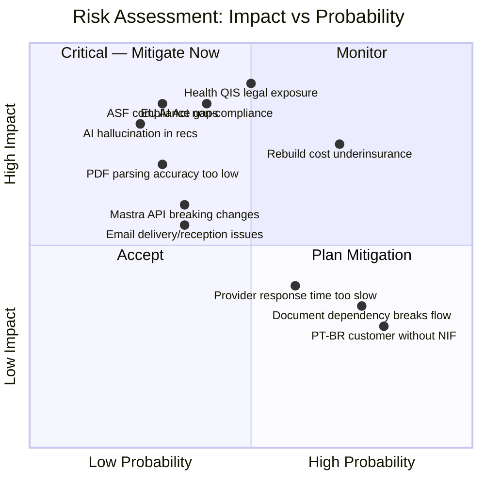

# Compliance & Risk

> **Version:** 1.0
> **Last updated:** March 2, 2026
> **Status:** Draft -- internal review

> **TL;DR:** Three regulatory frameworks apply: ASF (insurance regulator — audit trails, qualified director), GDPR (Article 9 for health data), and EU AI Act (likely high-risk classification pending formal assessment, Aug 2026 deadline). The technical architecture assumes high-risk and satisfies requirements through audit logging, human-review suspend points with RBAC-enforced approval, and explicit consent tracking. DORA adds ICT risk management requirements.

## Regulatory Framework

### ASF (Autoridade de Supervisao de Seguros e Fundos de Pensoes)

Portugal's insurance and pension funds supervisor. The MVP operates as broker co-pilot software used by already-licensed brokers -- no own ASF license required at this stage. Own ASF license becomes necessary if/when agent-resolv operates as a broker directly (D2C channels, Phase 4+). The broker using agent-resolv is responsible for regulatory compliance of their mediation activity; agent-resolv must ensure its tooling supports that compliance (audit trails, qualified director review, etc.).

| Requirement                 | How We Satisfy It                                                                                                                                                                                                                                                                                                                                                                                                                                                                                                                                                                             |
| --------------------------- | --------------------------------------------------------------------------------------------------------------------------------------------------------------------------------------------------------------------------------------------------------------------------------------------------------------------------------------------------------------------------------------------------------------------------------------------------------------------------------------------------------------------------------------------------------------------------------------------- |
| **Qualified Director**      | Rolando is named qualified director. All AI recommendations require his review before delivery to customers (human-review suspend point in workflow). Approval actions are restricted to users with the `qualified_director` role, enforced via Better Auth RBAC — preventing unauthorized approval even if other users have system access.                                                                                                                                                                                                                                                   |
| **Audit Trail**             | Dual-layer audit: (1) `auditLogTool` logs every significant action with timestamp, agent ID, customer ID, and action details in the `audit_logs` Postgres table. (2) Inngest Cloud dashboard provides a tamper-evident, step-level execution history for every workflow run -- inputs, outputs, timing, retry history. Together these satisfy ASF record-keeping requirements. Actions logged: `customer_intake_started`, `quote_requested`, `quote_received`, `comparison_generated`, `recommendation_made`, `human_review_requested`, `human_review_completed`, `policy_binding_initiated`. |
| **Record Retention**        | All customer profiles, quote requests, normalized quotes, comparisons, reviews, and audit logs are persisted. Retention period to be confirmed with legal counsel (minimum 5 years expected).                                                                                                                                                                                                                                                                                                                                                                                                 |
| **Customer Identification** | NIF (tax number) validation at intake. 9-digit format validation in schema.                                                                                                                                                                                                                                                                                                                                                                                                                                                                                                                   |
| **Disclosure**              | Intake agent identifies itself as an AI assistant working for a licensed insurance broker. Never promises pricing. Notes that quotes come from providers and recommendations require qualified director review.                                                                                                                                                                                                                                                                                                                                                                               |

### GDPR (General Data Protection Regulation)

| Requirement                           | How We Satisfy It                                                                                                                                                                                                                                                                                                                                                                                                                                                                                                        |
| ------------------------------------- | ------------------------------------------------------------------------------------------------------------------------------------------------------------------------------------------------------------------------------------------------------------------------------------------------------------------------------------------------------------------------------------------------------------------------------------------------------------------------------------------------------------------------ |
| **Lawful Basis**                      | Candidate basis: legitimate interest for insurance mediation (Art. 6(1)(f)) for non-health products; explicit consent for health data (Art. 9). Final legal basis and broker consent coverage for sub-processing are pending legal counsel confirmation before Phase 2 pilot.                                                                                                                                                                                                                                            |
| **Article 9 — Special Category Data** | Health insurance QIS responses are special category data. HealthProfile schema includes `gdprConsent` object with: `explicitHealthDataConsent` (boolean), `consentTimestamp`, `consentMethod`. Consent must be collected before any health questions are asked.                                                                                                                                                                                                                                                          |
| **Data Minimization**                 | Intake agent collects only fields required for the requested product type. Schema validation enforces required vs optional fields per product.                                                                                                                                                                                                                                                                                                                                                                           |
| **Right to Access / Erasure**         | Customer data is structured and identifiable by customer ID. FK cascade behavior ensures deletion propagates through profiles, quotes, and comparisons. Audit logs are retained separately with customer ID set to null (legal obligation overrides erasure right per Art. 17(3)(b)). **Note:** Deletion strategy (hard delete with cascades vs. pseudonymization/soft-delete) requires legal counsel input before launch — regulated flows may require pseudonymization to preserve audit integrity while removing PII. |
| **Transparency**                      | AI-generated recommendations are labeled as such. Comparison reasoning is provided in Portuguese. Human review step is disclosed to customers.                                                                                                                                                                                                                                                                                                                                                                           |
| **Data Processing Records**           | Audit log serves as processing activity record per Art. 30.                                                                                                                                                                                                                                                                                                                                                                                                                                                              |

### EU AI Act

Insurance recommendation engines likely fall under **high-risk classification** (Annex III) — formal classification assessment pending legal counsel. Architecture assumes high-risk to build compliance mechanisms from day one. Compliance deadline: **August 2026**.

> **Timeline note:** The EU AI Act high-risk compliance deadline is August 2026. If MVP launches Q3 2026 as planned, there is minimal margin for compliance work. The architecture assumes high-risk classification from day one to avoid retroactive compliance work. However, if the launch timeline slips to Q4 2026, the August deadline becomes a hard constraint that may require parallel compliance workstreams. Formal classification assessment with legal counsel should be completed before Phase 1 build begins.

| Requirement         | Article | How We Satisfy It                                                                                                                                                                                                                                                                                                                                                                                                                                                                                                                                         |
| ------------------- | ------- | --------------------------------------------------------------------------------------------------------------------------------------------------------------------------------------------------------------------------------------------------------------------------------------------------------------------------------------------------------------------------------------------------------------------------------------------------------------------------------------------------------------------------------------------------------- |
| **Human Oversight** | Art. 14 | The human-review suspend point (workflow step 5) is the primary compliance mechanism. Implemented via `@mastra/inngest` -- the workflow durably suspends, and Inngest records the full review lifecycle (request, wait duration, approval/rejection, reviewer identity). Phase 2: brokers review AI reasoning via email notifications and approve/reject via authenticated action links (opaque tokens, consumed on POST). Phase 3: broker dashboard adds visual overview and audit trail browsing. Both channels feed the same Inngest-backed audit log. |
| **Transparency**    | Art. 13 | Customers are informed they're interacting with AI. Comparison results include reasoning. Confidence scores on parsed quotes flag uncertainty.                                                                                                                                                                                                                                                                                                                                                                                                            |
| **Risk Management** | Art. 9  | Identified risks documented in risk matrix below. Mitigation strategies per risk. Ongoing monitoring via PostHog metrics.                                                                                                                                                                                                                                                                                                                                                                                                                                 |
| **Data Governance** | Art. 10 | Training data is customer-provided. No model fine-tuning on customer data in MVP. LLM calls use structured output with Zod validation — hallucination risk is bounded by schema.                                                                                                                                                                                                                                                                                                                                                                          |
| **Record Keeping**  | Art. 12 | Dual-layer: `audit_logs` Postgres table for business events + Inngest Cloud run history for step-level execution records. All workflow runs persisted with full state in Postgres via `@mastra/pg` PostgresStore.                                                                                                                                                                                                                                                                                                                                         |
| **Accuracy**        | Art. 15 | PDF parsing confidence scores. Human review catches errors. Evaluation loop planned (Phase 3) with golden dataset per provider.                                                                                                                                                                                                                                                                                                                                                                                                                           |
| **Robustness**      | Art. 15 | Zod schema validation at every boundary. Structured output prevents freeform hallucination. Workflow suspend points prevent autonomous action on critical decisions.                                                                                                                                                                                                                                                                                                                                                                                      |

**Health insurance AI** has additional classification under Annex III, 5(b): "AI systems intended to be used to evaluate the creditworthiness of natural persons or establish their credit score" — extends to life and health insurance risk assessment. This means the health QIS intake and any health-related recommendation carry the highest regulatory burden.

### DORA (Digital Operational Resilience Act)

Applied January 17, 2025. Relevant for insurance intermediaries using ICT systems.

| Requirement                        | How We Satisfy It                                                                                                                                                                                                                                                                      |
| ---------------------------------- | -------------------------------------------------------------------------------------------------------------------------------------------------------------------------------------------------------------------------------------------------------------------------------------- |
| **ICT Risk Management**            | Architecture uses managed services (Vercel, Neon, Inngest Cloud, Resend) with defined SLAs. No self-hosted infrastructure in MVP.                                                                                                                                                      |
| **Incident Reporting**             | PostHog alerting for anomalies. Inngest dashboard provides step-level execution history for incident investigation. Audit log provides business-level trail.                                                                                                                           |
| **Operational Resilience Testing** | POC test suite covers end-to-end workflow, suspend/resume (via Inngest), crash recovery, and edge cases. Inngest's automatic retries provide resilience against transient failures.                                                                                                    |
| **Third-Party Risk**               | LLM provider (Anthropic) dependency documented. Mastra framework dependency mitigated by schema decoupling and version pinning. Inngest dependency mitigated by `@mastra/inngest` abstraction -- Inngest can be replaced by swapping the execution engine without rewriting workflows. |

## Risk Matrix

## Risk Mitigation Strategies

| Risk                                       | Impact | Probability | Mitigation                                                                                                                                                                                                                                                                                                                                                                                                                                                                                                                  |
| ------------------------------------------ | ------ | ----------- | --------------------------------------------------------------------------------------------------------------------------------------------------------------------------------------------------------------------------------------------------------------------------------------------------------------------------------------------------------------------------------------------------------------------------------------------------------------------------------------------------------------------------- |
| **Health QIS legal exposure**              | High   | Medium      | Defer health product to post-MVP. When implemented: explicit GDPR Art. 9 consent, human review for all health recommendations, QIS responses are legal declarations — always offer phone alternative for complex cases.                                                                                                                                                                                                                                                                                                     |
| **EU AI Act non-compliance**               | High   | Medium      | Human-review suspend point satisfies Art. 14. Audit trail satisfies Art. 12. Confidence scoring satisfies Art. 15. Timeline: compliance mechanisms are built into MVP architecture, not bolted on later. Aug 2026 deadline aligns with launch timeline.                                                                                                                                                                                                                                                                     |
| **ASF compliance gaps**                    | High   | Low         | Rolando reviews every recommendation. Full audit trail from day one. Over-document everything. Legal counsel review before launch.                                                                                                                                                                                                                                                                                                                                                                                          |
| **Rebuild cost underinsurance**            | High   | High        | INE construction cost lookup table as proxy for MVP. All estimates flagged for human review. Caderneta predial photo extraction as secondary signal.                                                                                                                                                                                                                                                                                                                                                                        |
| **AI hallucination in recommendations**    | High   | Low         | Structured output with Zod validation. Comparison agent works only from NormalizedQuote data (not freeform). Human review layer catches errors.                                                                                                                                                                                                                                                                                                                                                                             |
| **PDF parsing accuracy too low**           | High   | Low         | Start with structured email templates. Provider-specific parsing prompts. Human review catches errors. Phase 3: evaluation loop with golden dataset per provider.                                                                                                                                                                                                                                                                                                                                                           |
| **Mastra API velocity / breaking changes** | Medium | Low-Medium  | Mastra v1.6.0 is production-deployed at enterprise scale (Replit, SoftBank, Marsh McLennan) with $13M in funding. Primary risk is API surface churn, not framework viability. Pin exact versions (`save-exact=true`). Keep schemas in `packages/contracts/` and tool logic decoupled from Mastra internals. Standard Zod schemas make migration feasible. `@mastra/inngest` provides durable workflow execution independent of Mastra's native engine stability. Automated codemods provided for major version transitions. |
| **Email delivery/reception issues**        | Medium | Low         | Use Resend (reliable deliverability). Implement delivery tracking. Fallback to manual email forwarding.                                                                                                                                                                                                                                                                                                                                                                                                                     |
| **Provider response time too slow**        | Medium | Medium      | Set customer expectations. Allow partial comparisons (note pending providers). Timeout threshold triggers comparison with available quotes.                                                                                                                                                                                                                                                                                                                                                                                 |
| **PT-BR customer without NIF**             | Low    | High        | Detect PT-BR patterns in intake. Explain NIF requirement. Guide to NIF application process. Don't block intake — collect available data, flag NIF as pending.                                                                                                                                                                                                                                                                                                                                                               |
| **Document dependency breaks flow**        | Low    | High        | Maintain "partial profile" state. Allow "continuar mais tarde" with session save. Offer photo-of-document extraction. Never force completion in single session.                                                                                                                                                                                                                                                                                                                                                             |
| **Rolando single-person dependency**       | High   | Medium      | Rolando is the sole qualified director, sole source of domain validation data (shadow sessions), and sole reviewer for MVP. If unavailable, all decision gates and human review steps are blocked. Mitigation: document all domain knowledge from shadow sessions, onboard 1-2 additional reviewers as beta testers in Phase 2, cross-train Goncalo on review workflow.                                                                                                                                                     |

### External Dependency Risks

| Risk                                    | Impact                                                     | Likelihood | Mitigation                                                                                                                                                     |
| --------------------------------------- | ---------------------------------------------------------- | ---------- | -------------------------------------------------------------------------------------------------------------------------------------------------------------- |
| Rolando unavailable beyond end of March | MVP scope cannot be finalized, Phase 1 delayed             | Medium     | Prepare synthetic test data and insurer email templates as fallback. Begin Phase 1 foundation work (monorepo, auth, schemas) before sessions.                  |
| Legal counsel slow to respond           | Phase 2 start blocked (legal basis, DPA, retention policy) | Medium     | Engage counsel early (March). Send specific questions, not open-ended requests. Have backup counsel identified.                                                |
| Insurer email cooperation issues        | Quote request emails ignored or formatted unexpectedly     | Medium     | Email-first strategy is designed to work without insurer cooperation (we use the same channel brokers use today). Correlation tokens mitigate matching issues. |
| EU AI Act classification uncertainty    | May require architectural changes late in development      | Low        | Architecture assumes high-risk from day one. Formal assessment is a confirmation, not a redesign trigger.                                                      |

## Compliance Architecture

How the technical design maps to regulatory requirements:

```mermaid
graph TB
    subgraph "ASF Requirements"
        ASF1[Qualified Director Review]
        ASF2[Audit Trail]
        ASF3[Record Retention]
        ASF4[Customer ID / NIF]
        ASF5[AI Disclosure]
    end

    subgraph "GDPR Requirements"
        GDPR1[Art. 9 Health Consent]
        GDPR2[Data Minimization]
        GDPR3[Right to Erasure]
        GDPR4[Transparency]
    end

    subgraph "EU AI Act Requirements"
        EUAI1[Art. 14 Human Oversight]
        EUAI2[Art. 13 Transparency]
        EUAI3[Art. 9 Risk Management]
        EUAI4[Art. 12 Record Keeping]
        EUAI5[Art. 15 Accuracy]
    end

    subgraph "Technical Mechanisms"
        T1[Durable Suspend Point<br/>@mastra/inngest<br/>Workflow Step 5]
        T2[Dual-Layer Audit Trail<br/>auditLogTool + audit_logs table<br/>+ Inngest Cloud run history]
        T3[Database persistence<br/>Postgres/Neon + retention policy]
        T4[NIF validation in<br/>BaseProfile schema]
        T5[Intake agent system prompt<br/>compliance instructions]
        T6[gdprConsent in<br/>HealthProfile schema]
        T7[Per-product required<br/>field validation]
        T8[Customer ID cascade<br/>deletion capability]
        T9[Confidence scores<br/>+ parsingNotes]
        T10[Risk matrix +<br/>PostHog monitoring]
    end

    ASF1 --> T1
    ASF2 --> T2
    ASF3 --> T3
    ASF4 --> T4
    ASF5 --> T5
    GDPR1 --> T6
    GDPR2 --> T7
    GDPR3 --> T8
    GDPR4 --> T5
    EUAI1 --> T1
    EUAI2 --> T5
    EUAI2 --> T9
    EUAI3 --> T10
    EUAI4 --> T2
    EUAI5 --> T9

    style T1 fill:#fff3e0
    style T2 fill:#e8f5e9
    style T6 fill:#fff3e0
```

## Open Questions for Legal Counsel

**Pre-Phase 1 (resolve before build starts):**
1. **AI Act classification** — Is our specific use case definitively high-risk under Annex III? Do we need formal classification assessment? (Architecture assumes high-risk; need confirmation.)
2. **Cross-border data transfers** — Anthropic (US-based LLM provider) processes customer data. Is Standard Contractual Clauses sufficient? Do we need DPIA? (Blocks LLM provider selection.)
3. **Deletion strategy** — Hard delete with FK cascades, pseudonymization, or soft-delete? ASF record retention vs. GDPR erasure right — what takes precedence and for how long?

**Pre-launch (resolve before go-live):**
4. **Record retention period** — ASF minimum? Does GDPR right to erasure conflict with ASF record retention obligations?
5. **Health data processing** — Is legitimate interest sufficient for non-health products, or should we use consent as lawful basis across the board?
6. **QIS legal declarations** — If AI captures QIS responses and a declaration is later found inaccurate, what is the broker's liability?
7. **DORA scope** — Does DORA apply to insurance intermediaries of our size? What are the proportionality thresholds?
