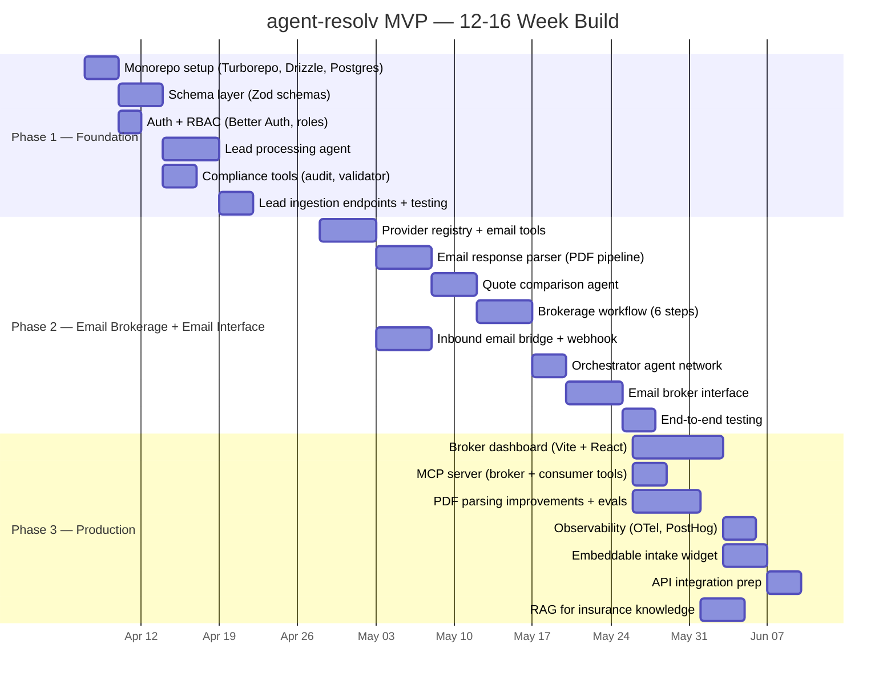

# Implementation Roadmap

> **Version:** 1.0
> **Last updated:** March 2, 2026
> **Status:** Draft -- internal review

> **TL;DR:** Three-phase MVP build (12-16 weeks). Phase 1: Turborepo monorepo, Postgres + Drizzle database, Zod schema layer, auth + RBAC, lead processing agent, compliance tools. Phase 2: durable brokerage workflow (`@mastra/inngest`), email integration, quote comparison, email broker interface (the first interface for brokers). Phase 3: broker dashboard (Vite + React), MCP server (demos + AI-native consumers), PDF parsing improvements, embeddable intake widget. MVP product types selected post-Rolando sessions — architecture is product-type-agnostic (see [Executive Summary — MVP Scope Note](./00-executive-summary.md)). Post-MVP: WhatsApp, credit intermediary, B2B2C platform.

## Timeline Assumptions & Flexibility

**Realistic range: 12-16 weeks.** The 12-week target assumes ideal conditions; 16 weeks accounts for likely delays in legal counsel, insurer data variability, and real-world integration surprises.

The 12-week baseline assumes:
- Rolando shadow sessions complete by end of March 2026
- Legal counsel responds within expected timeframes (key decisions by April 7-28)
- No major technical surprises emerge from real-world insurer data (PDF formats, email patterns)
- AI model performance on real-world data matches feasibility spike results

**Realistic range: 12-16 weeks.** The phased structure with decision gates is specifically designed to absorb delays:
- If Phase 1 takes 4 weeks instead of 3, Phase 3 scope compresses
- If legal blockers slip by 2 weeks, Phase 2 starts later but scope is preserved
- If PDF parsing accuracy on real data is below threshold, additional parsing spike added, Phase 3 features deprioritized

**The minimum viable launch** is the email broker interface + durable workflow + 3 working providers. Everything beyond that (dashboard, MCP, widget, RAG) is additive and can be deferred without invalidating the core product.

The team should maintain the ability to pivot and iterate throughout development. Decision gates exist to force explicit go/no-go decisions rather than letting scope creep accumulate.

## MVP Roadmap

## Phase 1 — Foundation (Weeks 1-3)

**Goal:** Lead processing agent that can extract structured customer profiles from diverse broker inputs (forwarded emails, contact form submissions, pasted phone notes) for the selected MVP product types. Auth + RBAC foundation. No provider integrations yet.

### Deliverables

| Deliverable              | Description                                                                                                                                                                                              | Success Criteria                                                                                 |
| ------------------------ | -------------------------------------------------------------------------------------------------------------------------------------------------------------------------------------------------------- | ------------------------------------------------------------------------------------------------ |
| Monorepo structure       | Turborepo monorepo (BuL venture-studio-template), `packages/agents/` with Mastra, `packages/contracts/` with Zod schemas, `packages/db/` with Drizzle + Postgres, `apps/api/` with Hono + `@mastra/hono` | `pnpm --filter agents dev` starts Mastra playground. `pnpm --filter api dev` starts Hono server. |
| Schema layer             | Zod schemas in `packages/contracts/` for CustomerProfile (4 product types), NormalizedQuote, QuoteRequest, ComparisonResult                                                                              | All schemas pass validation with valid/invalid test data                                         |
| Database schema          | Drizzle ORM tables in `packages/db/`, Postgres (Neon), Mastra PostgresStore in `mastra` schema. FK cascades for customer data deletion.                                                                  | `drizzle-kit push` applies schema. Insert/query operations work. FK cascade behavior verified.   |
| Auth + RBAC              | Better Auth with roles (`qualified_director`, `broker`, `viewer`). Organization plugin for multi-user.                                                                                                   | Role assignment works. `qualified_director` role gates approval actions.                         |
| Lead processing agent    | Extracts customer profiles from unstructured broker input for the selected MVP product types                                                                                                             | 90%+ field extraction accuracy from email forwards and contact form data                         |
| Compliance tools         | auditLogTool, profileValidatorTool                                                                                                                                                                       | Every lead logged, invalid profiles rejected with specific missing fields                        |
| Lead ingestion endpoints | Hono API routes for email forward webhook, contact form webhook, manual paste                                                                                                                            | All 3 input methods produce valid lead records                                                   |

### POC Tests

1. **Lead extraction from email:** 10 forwarded customer emails in Portuguese. Measure field extraction accuracy, schema validation pass rate.
2. **Lead extraction from contact form:** 5 structured form submissions with varying completeness. Verify profile extraction and missing field identification.
3. **Lead extraction from pasted notes:** 5 free-text phone call summaries. Measure extraction accuracy from unstructured text.
4. **Edge cases:** Incomplete leads, mixed product signals, PT-BR language, missing NIF.

### Decision Gate

Proceed to Phase 2 if: lead processing agent produces valid LeadProcessingResult from 90%+ of test inputs for the selected MVP product types — including partial profiles with correct missing field identification for incomplete leads. Auth + RBAC foundation verified (user creation, role assignment, session management work correctly).

## Phase 2 — Email-Based Brokerage Pipeline + Email Broker Interface (Weeks 4-7)

**Goal:** End-to-end brokerage workflow using email as the provider integration channel. Two suspend points (email wait, human review). Broker receives AI-generated comparison to review, adjust, and deliver to their customer. Email broker interface lets the broker interact with the pipeline via email and authenticated action links.

### Deliverables

| Deliverable                | Description                                                                                                                                                                                                     | Success Criteria                                                                                                                                                                                                                                                                    |
| -------------------------- | --------------------------------------------------------------------------------------------------------------------------------------------------------------------------------------------------------------- | ----------------------------------------------------------------------------------------------------------------------------------------------------------------------------------------------------------------------------------------------------------------------------------- |
| Provider registry          | Static registry for insurers (minimum 3, up to 7)                                                                                                                                                               | Minimum 3 providers have valid email templates, quote email addresses, and product mappings. Remaining providers added as email addresses are obtained from Rolando sessions.                                                                                                       |
| Email tools                | emailQuoteRequestTool, emailResponseParserTool                                                                                                                                                                  | Professional Portuguese emails sent, PDF responses parsed to NormalizedQuote                                                                                                                                                                                                        |
| Quote comparison agent     | Generates ComparisonResult from multiple NormalizedQuotes                                                                                                                                                       | Valid structured output with Portuguese reasoning for all test scenarios                                                                                                                                                                                                            |
| Brokerage workflow         | 6-step durable workflow via `@mastra/inngest` with 2 suspend points                                                                                                                                             | Full suspend/resume cycle completes via Inngest events. Crash recovery verified. Partial comparison supported.                                                                                                                                                                      |
| Inbound email bridge       | Webhook handler matching responses to requests, with inbound trust controls (signature verification, sender allowlist, quarantine for unknown/failed authentication, manual review queue for uncertain matches) | Correctly matches **>99%** of test inbound emails to pending requests. Uncertain matches are never auto-routed (quarantine + manual review).                                                                                                                                        |
| Orchestrator               | Agent network routing to sub-agents/workflows                                                                                                                                                                   | Correct routing for all test message types                                                                                                                                                                                                                                          |
| **Email broker interface** | Outbound notification emails, authenticated action links (profile confirmation, comparison trigger, cancellation, approval), reply-based edits/questions, high-entropy per-request reply-to alias matching      | Rolando completes 5 end-to-end cases. Reply parsing accuracy >80% (Phase 2 gate; >95% is Phase 3 target). All state-changing actions via authenticated links. Opaque server-side tokens with 24h TTL, GET non-destructive, POST consumes token, basic reissue flow with rate limit. |

> **Scope trap warning:** The email broker interface is five distinct subsystems behind one deliverable name: (1) outbound notification emails with templating and localization, (2) authenticated action link infrastructure (token generation, storage, expiry, consumption, RBAC verification), (3) reply-to alias routing (high-entropy alias generation, inbound matching, sender verification), (4) reply parsing via LLM (intent classification, field-level edit extraction, clarification loops), (5) token lifecycle management (24h TTL, expiry recovery UX, rate-limited reissue). Each subsystem has its own failure modes and edge cases. If Phase 2 starts slipping, **cut reply parsing to Phase 3** — it's the highest-complexity, lowest-urgency component. Action links alone (confirm, approve, cancel) are sufficient for MVP if brokers can't edit profiles via email reply. The Gantt allocates 5 days; realistic estimate is 5-8 days depending on how many edge cases surface in Rolando testing.

**Why email in Phase 2:** Brokers work in email. The email interface requires no broker-side tooling installation — onboarding is a one-time Better Auth account setup, then forward leads and click approval links. Validates the full pipeline end-to-end. MCP moves to Phase 3 alongside the dashboard.

### POC Tests

5. **Email composition:** 5 quote request emails per product type. Validate tone/content with Goncalo/Rolando.
6. **PDF parsing accuracy:** 10 real provider quote PDFs. Measure field extraction accuracy vs manual extraction.
7. **Workflow end-to-end:** Mock provider responses. Verify suspend/resume works. Measure execution time.
8. **Comparison quality:** 3 real quotes for same profile. Rolando evaluates recommendation quality and reasoning.
9. **Email broker flow:** Rolando completes 5 end-to-end cases via email (forward lead, confirm profile via action link, receive comparison, approve via action link). Reply parsing accuracy >80%.
10. **Reply parsing accuracy:** 10 broker email replies (edits + questions). Measure correct parse rate. Target: >80% at Phase 2 launch.
11. **Inbound trust controls:** verify webhook signature checks, sender allowlist enforcement, and quarantine/manual review path for unknown or uncertain matches.

### Decision Gate

Proceed to Phase 3 if: workflow completes end-to-end with mock data, PDF parsing >90% accuracy on test corpus, Rolando rates recommendation quality as "acceptable" or better, email broker interface completes 5 end-to-end cases with Rolando, inbound request matching reaches >99% with uncertain matches quarantined (never auto-routed), and all GDPR legal gates are met (legal basis for processing confirmed, DPA signed with Rolando's brokerage, sub-processor register complete, retention policy defined, PII minimization verified, encryption at rest verified, encryption in transit enforced — see [email-first-interface.md Section 9](../research/email-first-interface.md#9-gdpr-and-legal-launch-gates)). Also confirm shadow-session adoption constraints for email-first operation: adoption willingness is positive and concurrent case volume is manageable (<30) or dashboard acceleration is explicitly pulled into scope.

## Phase 3 — Production Hardening & Widget (Weeks 8-12)

**Goal:** Broker dashboard for Rolando/Goncalo. MCP server for demos and AI-native consumers. Improved PDF parsing with evaluation loop. Observability. Embeddable intake widget for broker websites.

### Deliverables

| Deliverable              | Description                                                                                                                              | Success Criteria                                                                                       |
| ------------------------ | ---------------------------------------------------------------------------------------------------------------------------------------- | ------------------------------------------------------------------------------------------------------ |
| Broker dashboard         | Vite + React SPA: incoming leads, pending requests, suspended workflows, AI comparison review, approve/reject, audit trail               | Rolando completes 5 reviews in <3 min each                                                             |
| PDF parsing improvements | Confidence scores per field, low-confidence flagging, human correction logging                                                           | Per-field confidence available, golden dataset per provider started                                    |
| Observability            | OpenTelemetry tracing, PostHog product analytics                                                                                         | Key metrics tracked: extraction accuracy, parsing accuracy, review approval rate, e2e time, token cost |
| Embeddable intake widget | Conversational widget brokers can embed on their website. Customer-facing Portuguese conversation that feeds directly into agent-resolv. | Widget collects valid insurance profile for selected MVP product types in <14 turns                    |
| RAG                      | Indexed ASF regulations, provider docs, PT insurance terms                                                                               | Agent answers regulatory and product questions accurately                                              |
| MCP server               | Broker + consumer tools wrapping the pipeline. Demo-ready for investors.                                                                 | Broker can process a lead from Claude Desktop. Consumer can request a quote end-to-end.                |
| API prep                 | Architecture ready for direct API integrations                                                                                           | Tool interface documented, swap path clear                                                             |

### POC Tests

12. **Dashboard usability:** Rolando performs 5 full reviews. Measure time per review, error rate, feedback.
13. **Widget intake test:** 10 customer conversations through widget. Verify extracted profiles match manual extraction.
14. **MCP broker flow:** Rolando processes 5 leads through Claude Desktop with agent-resolv MCP tools. Measure time vs email workflow.
15. **MCP consumer flow:** End-to-end auto insurance quote request through Claude Desktop. Verify profile extraction, quote collection, comparison delivery.

## Scope-Cut Protocol

If decision gates slip or timelines compress, features drop in this order (last item drops first):

| Priority          | What Stays                                                                                                           | What Drops First                             |
| ----------------- | -------------------------------------------------------------------------------------------------------------------- | -------------------------------------------- |
| P0 (must ship)    | Lead processing + email brokerage workflow + **email broker interface** (action links, notifications, alias routing) | Reply parsing (defer to Phase 3 if slipping) |
| P1 (should ship)  | PDF parsing improvements, **broker dashboard (basic)**, reply parsing                                                | RAG, embeddable intake widget                |
| P2 (nice to have) | **MCP server** (demos + AI-native consumers), observability                                                          | MCP consumer tools, API integration prep     |

**Rule:** If Phase 2 slips, Phase 3 scope is reduced, not deferred entirely. The minimum viable launch is the email broker interface + the durable workflow + 3 working providers. Everything else is additive.

## Why Broker-First, Not Consumer-First

The long-term vision is a fully autonomous AI broker that handles end customers directly — intake, quoting, comparison, recommendation, and post-purchase. But starting there is the wrong move for three reasons:

**1. Customer acquisition is expensive and slow.** MUDEY (Portugal's first digital insurance mediator) spent 3+ years and significant capital building a D2C brand. They reached 20K users, then pivoted to MudeyPRO — B2B2C tooling for small mediators. The lesson: building the consumer brand is the hardest, most capital-intensive part. The technology is the easier problem to solve.

**2. The technology needs real-world validation first.** Our AI spikes show strong results (95%+ PDF parsing, 90%+ email parsing), but these are tested on sample data. Before putting AI in front of end customers, we need to validate on Rolando's real workflow — real insurer email formats, real PDF variations, real edge cases. The broker co-pilot model lets us iterate on accuracy with a human in the loop who catches errors before they reach customers.

**3. Zero-friction adoption.** Brokers already have customers, websites, and phone numbers. They don't need to change how they acquire customers — they just need help processing leads faster. Selling "you can handle 3x more customers" is easier than convincing consumers to trust a new brand. We get real usage data immediately.

**The progression is deliberate:**

| Phase                | Model                           | Customer Interaction                                                                                                                   | Risk                                                       |
| -------------------- | ------------------------------- | -------------------------------------------------------------------------------------------------------------------------------------- | ---------------------------------------------------------- |
| **MVP (Phases 1-2)** | Broker co-pilot + email         | Broker forwards leads and reviews comparisons via email. AI pipeline handles the back-office.                                          | Lowest — broker catches errors; email is familiar workflow |
| **Phase 3**          | Broker dashboard + MCP + widget | Web dashboard for less technical brokers. MCP for demos and AI-native consumers. Widget for customer self-service. Broker reviews all. | Low — broker still reviews everything                      |
| **Phase 4**          | Direct customer channels        | Customer interacts via WhatsApp/web. AI handles autonomously with human oversight on exceptions.                                       | Medium — AI errors can reach customers                     |
| **Phase 6**          | Full platform                   | End-to-end autonomous AI broker. Human oversight only for regulatory requirements and edge cases.                                      | Highest — requires proven accuracy                         |

Each phase expands the AI's autonomy only after the previous phase has proven accuracy and reliability. The broker co-pilot MVP is not a compromise — it's the fastest path to the full vision because it generates real-world training data and validates the pipeline before we put it in front of consumers.

## Strategic Roadmap

### Unified Integration Layer

agent-resolv's schema layer (CustomerProfile, NormalizedQuote, ComparisonResult) normalizes data across all insurers regardless of integration method. The near-term product is a broker co-pilot that generates this normalized data as a byproduct of real transactions. Over years and at scale, the corpus becomes a **unified integration layer for Portuguese insurance data** — but that is the long-term outcome, not the near-term positioning.

```mermaid
graph TB
    subgraph "MVP: Broker Co-Pilot + Email"
        C1[Customers] --> BR1b[Broker<br/>existing channels]
        BR1b --> EM1[Broker forwards lead<br/>to agent-resolv via email]
        EM1 --> AR1[agent-resolv<br/>AI back-office]
        AR1 --> EM2[Email notifications<br/>+ action links to broker]
        AR1 --> I1[Insurers via email/API]
    end

    subgraph "Phase 3: Dashboard + MCP + Widget"
        BR2[Broker<br/>web dashboard] --> AR2[agent-resolv<br/>AI back-office]
        MCP3[MCP Server<br/>demos + AI-native consumers] --> AR2
        C2[Customers] --> W[Intake Widget<br/>on broker's website]
        W --> AR2
        AR2 --> I2[Insurers]
    end

    subgraph "Phase 4: Direct Customer Channels"
        C3[Customers] --> WA[WhatsApp / Web]
        WA --> AR3[agent-resolv<br/>autonomous with oversight]
        AR3 --> I3[Insurers]
    end

    subgraph "Phase 6: Platform"
        C4[Customers] --> OB[Other Brokers /<br/>Banks / Fintech]
        OB --> AR4[agent-resolv API<br/>Normalization Layer]
        AR4 --> I4[Insurers via<br/>standardized integration]
    end

    style AR1 fill:#e8f5e9
    style EM1 fill:#e1f5fe
    style MCP3 fill:#e1f5fe
    style W fill:#e1f5fe
    style WA fill:#fff3e0
    style AR4 fill:#f3e5f5
```

This is validated by MUDEY's pivot to MudeyPRO (B2B2C for small mediators) — the market needs broker infrastructure, not just another consumer brand. We start where MUDEY ended up, then expand from a position of proven technology. Email as the MVP interface validates the pipeline with Rolando before investing in dashboard or MCP.

### Email-First -> Dashboard + MCP -> Customer Channels -> Platform

1. **B2B + email (broker co-pilot):** Brokers forward leads to agent-resolv via email, receive comparisons via email, and approve recommendations via authenticated action links. Zero tooling installation for brokers. **This is the MVP.**
2. **Dashboard + MCP + widget (Phase 3):** Web dashboard for brokers who want a visual overview. MCP server for investor demos and AI-native consumers. Embeddable intake widget on broker websites. Broker still reviews all recommendations.
3. **Direct customer channels (Phase 4):** Customers interact via WhatsApp, web. AI handles the full flow with human oversight on exceptions. Requires proven accuracy from phases 1-3.
4. **Platform / B2B2C (Phase 6):** Other brokers, banks, and fintech partners use agent-resolv's infrastructure via API. Multi-tenant. Full autonomous operation with regulatory-mandated human oversight only.

## Dependencies and Decision Gates

| Decision                                                   | When                                     | Blocker For                                                                                                                                                                                     |
| ---------------------------------------------------------- | ---------------------------------------- | ----------------------------------------------------------------------------------------------------------------------------------------------------------------------------------------------- |
| Rolando shadow sessions complete                           | End of March 2026                        | MVP scope finalization, product type selection                                                                                                                                                  |
| MVP product types selected                                 | Early April 2026 (post-Rolando sessions) | Phase 1 start                                                                                                                                                                                   |
| MVP scope defined                                          | Early April 2026                         | Phase 1 start                                                                                                                                                                                   |
| AI Act classification + DPIA scoping                       | Pre-Phase 1 (legal counsel)              | Architecture assumptions, LLM provider selection                                                                                                                                                |
| Deletion strategy (hard delete vs pseudonymization)        | Pre-Phase 1 (legal counsel)              | Database schema design                                                                                                                                                                          |
| Sample PDFs for selected MVP product types obtained        | Rolando sessions                         | PDF parsing validation                                                                                                                                                                          |
| Insurer email format characterized                         | Rolando sessions                         | Email matching strategy validation                                                                                                                                                              |
| Full legal counsel review                                  | Before launch                            | Compliance sign-off                                                                                                                                                                             |
| Operating entity decision                                  | Pre-Phase 1                              | Entity structure TBD (new company vs existing). No own ASF/BdP license needed for MVP -- broker co-pilot software is used by already-licensed brokers.                                          |
| ASF license application                                    | Before Phase 4 (D2C)                     | Required only if/when agent-resolv operates as a broker directly. Not a blocker for MVP broker tooling. ASF licensing can take months -- start early if D2C is on the roadmap.                  |
| BdP license application                                    | Before Phase 5                           | Required for credit intermediary operations (post-MVP).                                                                                                                                         |
| Legal basis for processing confirmed                       | April 7 (pre-Phase 2)                    | Phase 2 start. Hard blocker -- legal basis (incl. broker consent coverage for sub-processing) must be confirmed before customer PII flows.                                                      |
| DPA template + sub-processor register complete             | April 14 (pre-Phase 2)                   | Phase 2 start. Customer PII cannot flow through the system without DPAs in place. See [email-first-interface.md Section 9](../research/email-first-interface.md#9-gdpr-and-legal-launch-gates). |
| DPA signed with Rolando's brokerage                        | April 28 (Phase 2 start)                 | Phase 2 start. Hard blocker -- no exceptions.                                                                                                                                                   |
| Retention policy defined                                   | April 21 (pre-Phase 2)                   | Phase 2 start. Required before customer data enters the system.                                                                                                                                 |
| PII minimization verified                                  | Phase 2, week 2                          | First broker pilot. Must complete before Rolando sends real customer data.                                                                                                                      |
| Encryption at rest verified (Neon AES-256, Resend storage) | Phase 2, week 1                          | First broker pilot. Must complete before Rolando sends real customer data.                                                                                                                      |
| Encryption in transit enforced (TLS on all endpoints)      | Phase 2, week 1                          | First broker pilot. Must complete before Rolando sends real customer data.                                                                                                                      |
| DSAR workflow documented                                   | Phase 2, week 3                          | First broker pilot. Manual runbook sufficient for MVP.                                                                                                                                          |
| Fidelidade commercial contact                              | Phase 2-3                                | Direct API integration                                                                                                                                                                          |
| Caravela tech assessment                                   | Phase 2                                  | Direct integration priority                                                                                                                                                                     |

## Non-PRD Deliverables (Tracked)

These artifacts live outside the PRD but are required before launch. Tracked here to prevent drift.

| Deliverable                                                | Owner              | When                            | Status                   |
| ---------------------------------------------------------- | ------------------ | ------------------------------- | ------------------------ |
| GTM one-pager (ICP, pricing hypothesis, channel plan)      | Goncalo            | Pre-Phase 2                     | Not started              |
| Data retention / deletion policy                           | Legal counsel + JP | Pre-Phase 2 (April 21)          | Blocked on legal counsel |
| Email matching validation protocol (acceptance thresholds) | JP                 | Phase 2 (post-Rolando sessions) | Not started              |
| AI Act / DORA operational control matrix                   | Legal counsel + JP | Pre-launch                      | Not started              |

> **Session preparation:** See the separate [Rolando Session Prep Kit](../research/stakeholder-docs/d-rolando-session-prep-kit.md) for a structured session plan, materials checklist, and context explanations for each question group. Send this to Goncalo to share with Rolando at least 1 week before the first session.

## Consolidated Open Questions for Rolando Shadow Sessions

**From integration research:**
1. What does your current workflow look like with insurer portals?
2. How fragmented are insurer quote/policy data formats in practice?
3. Caravela Seguros — tech stack and appetite for direct integration?
4. Which insurers respond fastest to email quote requests?
5. What does Fidelidade's commercial onboarding look like?

**From PDF parsing research:**
6. What other document types do you receive beyond quote PDFs?
7. Are any quotes scanned PDFs (vs digital-native)?
8. How many distinct insurer PDF formats do you encounter regularly?
9. Password-protected PDFs — common?
10. Renewal vs new business quote format differences?
11. Do insurers ever respond with structured data (Excel, CSV) instead of PDF?

**From email parsing research:**
12. How do you track which insurers have responded to a quote request?
13. What does a typical insurer email response look like?
14. How many concurrent client threads do you manage?
15. What's your email folder/label system?
16. How do claims email threads differ from quoting threads?

**From WhatsApp intake research:**
17. What percentage of customers know their bonus-malus class?
18. How often do customers have their caderneta predial (property registry) handy?
19. What's the typical turnaround for a complete auto insurance quote cycle?
20. Which questions do customers find most confusing or refuse to answer?
21. How do you currently handle the rebuild cost estimation problem?

## Recommended Next Spikes

| Spike                                              | Priority | Dependency                                                                                                     |
| -------------------------------------------------- | -------- | -------------------------------------------------------------------------------------------------------------- |
| Insurer email matching                             | P0       | Rolando shadow sessions (need real insurer response emails)                                                    |
| PDF parsing for selected MVP product types         | P0       | Rolando shadow sessions (need real quote PDFs for selected product types)                                      |
| Health insurance PDF parsing                       | P2       | Post-MVP (unless health is selected as MVP product)                                                            |
| Scanned PDF / OCR pathway                          | P1       | Rolando sessions (need to know if scanned PDFs exist)                                                          |
| Mastra `@mastra/inngest` suspend/resume durability | P1       | Run a test workflow, suspend, wait 48+ hours, resume, confirm state integrity. Validate before Phase 2 commit. |
| VIS/DUA matricula lookup API                       | P1       | Phase 1 (auto-fills 6 fields from license plate — relevant if auto is MVP product)                             |

---

## Appendix: Vision Roadmap -- Post-MVP

> The following phases represent the long-term product vision. They are not in scope for the current funding round and are included to show the strategic direction. Timing and scope will be defined based on MVP results, market feedback, and subsequent funding.

### Phase 4 -- Direct Customer Channels

Once the broker co-pilot is proven (PDF parsing accuracy validated, email matching reliable, comparison quality approved by Rolando), we expand to direct customer interaction:

- WhatsApp Business API — customers interact with the broker's AI assistant directly. The conversational intake research (10-14 turns for auto) was designed for this phase.
- Widget expansion: multi-product support (home, life), multi-language
- Voice channel (exploratory)
- Proactive renewal reminders
- **Key gate:** AI accuracy must be validated on 100+ real broker cases before customers interact directly

### Phase 5 -- Credit Intermediary (BdP License)
- Credit product schemas (mortgage, personal loan, credit card)
- Bank integration tools
- Credit-specific compliance workflows
- Cross-sell: insurance <-> credit

### Phase 6 -- Full Autonomous Broker & Platform
- Self-service customer portal — end-to-end without broker in the loop (human oversight only for regulatory requirements)
- B2B partner API (other brokers use our infrastructure)
- Provider MCP servers
- A2A (Agent-to-Agent) protocol for insurer interaction
- Multi-tenant / white-label capability
- AI claims assistance

---

*Source research:*
- *[../research/mastra/agent-resolv-technical-roadmap.md](../research/mastra/agent-resolv-technical-roadmap.md)*
- *[../research/integrations.md](../research/integrations.md)*
- *[../research/ai-spikes/pdf-parsing.md](../research/ai-spikes/pdf-parsing.md)*
- *[../research/ai-spikes/email-parsing.md](../research/ai-spikes/email-parsing.md)*
- *[../research/ai-spikes/whatsapp-intake.md](../research/ai-spikes/whatsapp-intake.md)*
