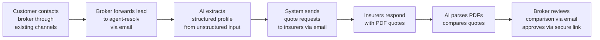

# Email-First Interface Strategy

> **TL;DR:** The current PRD positions the MCP server as agent-resolv's primary broker interface (Phase 2), with a web dashboard in Phase 3. This doesn't match the target user. Portuguese insurance brokers -- including Rolando -- work via email and browser-based portals, not MCP-compatible AI assistants. The fix: **email becomes the primary broker interface for MVP**, MCP moves to Phase 3 alongside the dashboard as a secondary/demo channel. The brokerage pipeline doesn't change -- only how brokers interact with it.

**Audience:** Goncalo, Rui, JP
**Status:** Proposal -- pending team alignment and Rolando session validation

---

## 1. The Problem with MCP-First

The PRD says:

> "The primary broker interface is an MCP server -- brokers interact with agent-resolv through any MCP-compatible AI assistant (Claude Desktop, Cursor, etc.)."

This assumes brokers will adopt an AI assistant as their daily work tool. That assumption doesn't hold for Portuguese insurance brokers in 2026.

**Who actually uses MCP today?** Developers and AI-forward knowledge workers who already have Claude Desktop or Cursor installed. We have no evidence that any Portuguese insurance broker uses an MCP-compatible AI assistant as a daily work tool. Rolando does not; neither do the brokers Goncalo has spoken with. Until we find evidence to the contrary, we should assume MCP adoption among PT brokers is negligible and design accordingly.

**Who is our first user?** Rolando. A 20+ year insurance agent who works via email, phone, and insurer web portals. He is not going to install Claude Desktop and learn MCP tool calling to process a lead. Neither will any other broker we target in the first 12 months.

**The MCP-first approach has three problems:**

1. **Adoption barrier.** Asking brokers to install an AI assistant and learn a new interaction model is a large behaviour change. We're supposed to slot into their existing workflow, not replace it.
2. **The "zero custom UI" argument is misleading.** MCP eliminates frontend work, but it introduces onboarding friction that is worse than a simple web form. "Download Claude Desktop, configure this MCP server, then type natural language commands" is harder for a non-technical broker than "reply to this email."
3. **It conflates demo value with product value.** MCP makes a great investor demo ("watch Claude talk to 5 insurers in 30 seconds"). But demo value and daily-use value are different things. Brokers don't need a demo -- they need their back-office to run faster.

**What MCP gets right:** the "zero UI" instinct is correct. We should minimize frontend work for MVP. But email is a better "zero UI" interface for brokers than MCP, because brokers already live in email.

---

## 2. Email-First Rationale

Email is the right MVP interface for three reasons:

### It's where brokers already are

Brokers spend their day in email. They receive customer leads via email, they request quotes from insurers via email (and sometimes via insurer web portals), they receive PDF quotes via email, they send recommendations to customers via email. The broker-facing workflow is email-native. The insurer-facing side is hybrid -- email is the primary channel, but some insurers require portal submissions. The architecture must support both; the email-first strategy refers to the **broker interface**, not a constraint on insurer integration channels.

agent-resolv's back-end pipeline already supports email-based insurer interaction (Resend for outbound quote requests, webhooks for inbound responses) and is designed to add portal automation (Playwright) and direct APIs as integration tiers. The missing piece is the broker-facing layer: instead of requiring brokers to use an MCP client, we send them the output via email and accept their input via email reply.

### Low onboarding friction

A broker using agent-resolv via email needs to learn two things: (1) forward customer leads to a specific email address, and (2) click an approval link and log in to approve recommendations. Everything else -- profile extraction, quote requests, comparison generation -- happens via emails that agent-resolv sends to the broker with clear calls to action. The one-time Better Auth account setup is handled during onboarding.

Compare this to MCP onboarding:
- Install Claude Desktop (or equivalent)
- Configure MCP server connection
- Learn available tools and their parameters
- Adopt a conversational interface for structured workflows

### It validates the pipeline without UI risk

The core IP is the brokerage pipeline: lead extraction, quote collection, PDF parsing, comparison generation. Email as an interface lets us validate this pipeline end-to-end without building a full dashboard -- the frontend is a minimal action UI set: a generic action page (confirm/cancel/compare/approve, routed by token), a Better Auth login flow, and a token-reissue page. This is significantly less than a dashboard but not zero frontend. If the pipeline works (quotes come back, comparisons are accurate, Rolando approves them), the interface layer is proven. Dashboard and MCP can layer on top later without changing the core.

---

## 3. End-to-End Email Flow

Here is how a broker uses agent-resolv with email as the primary interface.

### Authentication model

One rule governs the entire flow: **actions that change workflow state require authenticated links; email replies are limited to drafts and questions.**

| Action                                           | Channel            | Auth                                        | Rationale                                                              |
| ------------------------------------------------ | ------------------ | ------------------------------------------- | ---------------------------------------------------------------------- |
| Profile confirmation (triggers insurer outreach) | Authenticated link | Better Auth session                         | PII leaves system -- insurer emails sent                               |
| Comparison trigger                               | Authenticated link | Better Auth session                         | Triggers AI processing on customer data                                |
| Binding approval/rejection                       | Authenticated link | Better Auth session                         | Regulatory audit trail required                                        |
| Cancellation                                     | Authenticated link | Better Auth session                         | State change -- terminates pipeline, must be intentional and auditable |
| Profile edits                                    | Email reply        | Sender verification (From + reply-to alias) | Modifies internal draft only, no state change                          |
| Comments/questions                               | Email reply        | Sender verification                         | Logged, no state change                                                |

Email From headers can be spoofed, shared inboxes make identity ambiguous, and forwarded threads lose sender context. State-mutating actions must be tied to a verified, authenticated session -- not an email header. This is non-negotiable for regulatory compliance (ASF audit trail, EU AI Act Art. 14 human oversight) and data protection (PII flowing to insurers).

### Step 1: Lead Intake

Broker receives a customer inquiry through their existing channels (phone, email, website form, WhatsApp). They forward it to agent-resolv's intake address:

```
To: intake@agent-resolv.com
Subject: Fwd: Pedido de seguro auto - Joao Silva

[forwarded customer email or pasted phone notes]
```

agent-resolv's lead processing agent extracts a structured profile from the unstructured input.

### Step 2: Profile Confirmation

agent-resolv sends the broker a confirmation email with the extracted profile and a clear call to action:

```
From: agent-resolv <pipeline@agent-resolv.com>
To: rolando@broker.pt
Subject: [AR-2847] Perfil extraido - Joao Silva - Seguro Auto

Perfil do cliente:
- Nome: Joao Silva
- NIF: 123456789
- Veiculo: BMW Serie 3, 2019, 45-AB-67
- Cobertura: Todos os riscos
- [remaining fields...]

Campos em falta: nenhum

Seguradoras selecionadas (5):
Fidelidade, Tranquilidade, Ageas, Generali, Caravela

---
Para confirmar e enviar pedidos: clique aqui
https://app.agent-resolv.com/action?t=<opaque-token>

Para cancelar este pedido: clique aqui
https://app.agent-resolv.com/action?t=<opaque-token>

Para editar o perfil, responda a este email com as correcoes.
```

Profile confirmation and cancellation are state changes -- they use authenticated links per the authentication model above. Email replies to this step are treated as edit requests only.

### Step 3: Quote Collection (Automated)

On broker confirmation (via authenticated link), agent-resolv sends quote request emails to the selected insurers. This step is already designed in the PRD -- no change needed. The broker receives a status notification:

```
Subject: [AR-2847] Pedidos enviados - Joao Silva - 5 seguradoras

Pedidos de cotacao enviados a:
- Fidelidade (enviado)
- Tranquilidade (enviado)
- Ageas (enviado)
- Generali (enviado)
- Caravela (enviado)

Receberá uma notificacao quando as respostas chegarem.
Tempo medio de resposta: 1-3 dias uteis.
```

### Step 4: Response Tracking

As insurer responses arrive, agent-resolv parses the PDF quotes and sends progress updates:

```
Subject: [AR-2847] 3/5 respostas recebidas - Joao Silva

Respostas recebidas:
- Fidelidade: 487.20 EUR/ano (confianca: 97%)
- Ageas: 512.40 EUR/ano (confianca: 95%)
- Caravela: 463.80 EUR/ano (confianca: 93%)

Aguardando:
- Tranquilidade (enviado ha 2 dias)
- Generali (enviado ha 2 dias)

---
Para gerar comparacao com as respostas disponiveis: clique aqui
https://app.agent-resolv.com/action?t=<opaque-token>

Para aguardar mais respostas, nao e necessaria nenhuma acao.
```

### Step 5: Comparison Delivery

When the broker triggers comparison (or all responses arrive), agent-resolv generates and sends the structured comparison:

```
Subject: [AR-2847] Comparacao - Joao Silva - Seguro Auto

RESUMO
Melhor preco: Caravela (463.80 EUR/ano)
Melhor cobertura: Fidelidade (487.20 EUR/ano)
Melhor relacao qualidade-preco: Fidelidade

RECOMENDACAO
A Fidelidade oferece a melhor relacao qualidade-preco: cobertura
de vidros incluida, assistencia em viagem 24h, e franquia mais
baixa (150 EUR vs 250 EUR da Caravela). A diferenca de 23.40 EUR/ano
justifica-se pela cobertura adicional.

TABELA COMPARATIVA
[structured comparison table]

PDFs originais em anexo.

---
Para aprovar ou rejeitar, clique no link abaixo:
https://app.agent-resolv.com/action?t=<opaque-token>

(Tambem pode responder com comentarios ou duvidas a este email.)
```

### Step 6: Director Approval

Rolando (qualified director) reviews the comparison. Every comparison email includes an **action link** -- a single-purpose authenticated page requiring Better Auth login:

```
https://app.agent-resolv.com/action?t=<opaque-token>
```

**Token design:** Action URLs use a single generic path (`/action?t=<token>`) with an opaque token (not a JWT or signed payload), stored server-side with a 24-hour TTL. The token maps to the quoteRequestId and action type server-side. No request ID, action type, or other metadata appears in the URL.

**Link scanner safety (hard requirement):** Enterprise email security scanners (O365 Safe Links, Google Workspace, Barracuda, etc.) prefetch and click links before the broker sees the email. To prevent scanners from consuming tokens:
- **GET is non-destructive.** Clicking the link (GET request) loads the action page and validates the token, but does not consume it. The page requires Better Auth login, then shows the action form (approve/reject, confirm/cancel, etc.).
- **POST consumes the token.** The token is consumed only when the broker submits the action form (authenticated POST). This is the state-changing event.
- **Token remains valid for multiple GETs** within its 24h TTL. Only a single POST is accepted; subsequent POSTs with the same token are rejected.

This means scanner prefetches (which are GET-only) do not affect token validity.

**Expired token recovery:** If a broker clicks an expired link or a token that has already been consumed via POST, the page shows a clear message ("Este link expirou ou ja foi utilizado") and a "Reenviar link" button. Clicking it sends a new email with a fresh token to the broker's registered address (not to whoever is viewing the page -- prevents forwarded-link abuse). New token is issued within 60 seconds. The reissue is rate-limited (max 3 per request per hour) and logged.

The approval page shows the comparison summary and provides approve/reject buttons with an optional notes field. This is the **only path for binding approvals** -- it provides authenticated identity and tamper-evident logging, designed to satisfy ASF audit and EU AI Act Art. 14 requirements (pending legal counsel validation of specific format and retention obligations).

Email replies to comparison emails are treated as **comments or questions**, not approval actions. Any reply to a comparison email is logged and forwarded to the case thread, but does not change the workflow state.

### Step 7: Customer Delivery

agent-resolv sends the broker a ready-to-forward recommendation email (or sends directly to the customer if configured):

```
Subject: [AR-2847] Recomendacao pronta para envio - Joao Silva

Email preparado para o cliente (copie ou reencaminhe):

---
Caro Joao Silva,

Apos analise de 5 seguradoras, recomendamos o seguro auto
da Fidelidade pelos seguintes motivos:
[customer-facing recommendation in Portuguese]

Em anexo: comparativo detalhado e proposta da Fidelidade.

Com os melhores cumprimentos,
[Broker name]
```

---

## 4. MCP's New Role

MCP is not dead -- it moves from "primary broker interface" to two specific roles:

### Investor and partner demos

"Watch me ask Claude for auto insurance and it talks to 5 insurers" remains the most powerful 30-second demo we have. MCP is the demo interface. It shows the vision of agent-to-agent insurance brokerage. This is valuable for investor conversations, partner discussions, and press.

### AI-native consumer channel (future)

The D2C MCP channel (AI-native consumers requesting quotes via Claude Desktop) is still a valid future play. But it's a small, self-selecting audience that doesn't justify Phase 2 prioritization. It belongs alongside the dashboard in Phase 3, when we have a proven pipeline and can afford to serve multiple interfaces.

### What changes for MCP technically

Nothing in the core pipeline changes. The MCP server still wraps the same agents, workflows, and tools. The only change is timing: MCP moves from Phase 2 to Phase 3. The 2-3 days of MCP work the PRD estimated is the same -- it just happens later.

---

## 5. Updated Interface Progression

### Current PRD

| Phase                | Interface     | Audience                      |
| -------------------- | ------------- | ----------------------------- |
| Phase 2 (Weeks 4-7)  | MCP server    | Brokers + AI-native consumers |
| Phase 3 (Weeks 8-12) | Web dashboard | Less technical brokers        |

### Proposed

| Phase                | Interface                  | Audience                                                                        |
| -------------------- | -------------------------- | ------------------------------------------------------------------------------- |
| Phase 2 (Weeks 4-7)  | **Email interface**        | All brokers (Rolando first)                                                     |
| Phase 3 (Weeks 8-12) | Web dashboard + MCP server | Dashboard: brokers who want a visual overview. MCP: demos, AI-native consumers. |
| Phase 4+             | Customer channels          | WhatsApp, embeddable widget, direct email                                       |

**Key difference:** Phase 2 ships a product that Rolando can use on day one without installing anything new. Phase 3 adds interfaces for broader audiences and demo purposes.

### 5.1 Phase 2 Scope Cutline (MVP vs Hardening)

Phase 2 goal is a working broker pilot (Rolando) with safe defaults, not full enterprise hardening. If a hardening item threatens the Phase 2 timeline, ship the MVP path and move hardening to Phase 3.

| Area             | Phase 2 MVP (must ship)                                                                         | Hardening (Phase 3+)                                                                  |
| ---------------- | ----------------------------------------------------------------------------------------------- | ------------------------------------------------------------------------------------- |
| Action links     | Opaque server-side token, 24h TTL, GET non-destructive, POST consumes token, basic reissue flow | Risk-adaptive token policies, richer anti-abuse heuristics, self-serve token history  |
| Inbound trust    | Webhook signature verification, sender allowlist, quarantine unknown/failed cases               | Automated anomaly scoring, richer sender reputation signals, policy tuning per broker |
| Request matching | Reply-to alias + threading headers + subject fallback + manual review on uncertain matches      | Dashboard triage tools, partial automation for low-risk ambiguous matches             |
| Compliance       | DPA + sub-processor register + retention policy + audit logs for state changes                  | DSAR automation, expanded compliance reporting, retention policy tooling              |
| Broker UX        | Email notifications + authenticated action page + reply-based draft edits                       | Dashboard workflow management, bulk actions, richer case timeline                     |

### 5.2 Architecture Constraint: Interface-Adaptive, Pipeline-Stable

This strategy only works if interface channels stay decoupled from the brokerage core.

- Intake, workflow orchestration, quote parsing, comparison, and approval state machine must be interface-agnostic domain services.
- Email, MCP, and dashboard are adapters over the same domain actions and event model.
- No interface-specific logic can be the source of truth for workflow state.

---

## 6. Validation Plan

### Rolando Shadow Sessions (end of March 2026)

The following must be confirmed during Rolando's shadow sessions:

#### Must validate (blocks email interface design)

- [ ] **Current email workflow:** How does Rolando receive leads today? How does he send recommendations? What email client does he use?
- [ ] **Reply patterns:** When Rolando approves a quote recommendation today, what does that email look like? Free-text? Structured?
- [ ] **Volume:** How many concurrent cases does Rolando manage? (Determines if email threading is sufficient or overwhelming)
- [ ] **Forwarding comfort:** Is Rolando comfortable forwarding customer emails to a third-party address? How does he handle this with existing tools?
- [ ] **Response expectations:** When Rolando sends a quote request to an insurer, what does the response email typically look like? Subject line patterns, attachment formats, reply-to behavior.

#### Should validate (informs Phase 2 scope)

- [ ] **Comparison format:** Show Rolando a mock comparison email. Is this format useful? What's missing?
- [ ] **Edit language:** When Rolando wants to correct a profile, how does he phrase it? (Informs LLM parsing of email-reply edits.)
- [ ] **Mobile usage:** Does Rolando check/reply to work emails on mobile? (Affects email formatting decisions)
- [ ] **Multi-party threads:** Does Rolando CC other team members on quote workflows? (Affects email addressing logic)

#### Nice to validate (informs future phases)

- [ ] **Dashboard appetite:** Would Rolando use a web dashboard for reviewing comparisons, or is email sufficient?
- [ ] **WhatsApp:** Does Rolando use WhatsApp for customer communication? Would he forward WhatsApp messages to agent-resolv?

### Broker Archetypes to Validate

Rolando is archetype #1, but the email interface must work for at least three broker profiles. Validate with Rolando first; seek the other two through Goncalo's network by Phase 3.

| Archetype                             | Profile                                                                      | Key validation questions                                                                                              |
| ------------------------------------- | ---------------------------------------------------------------------------- | --------------------------------------------------------------------------------------------------------------------- |
| **Solo experienced broker** (Rolando) | 20+ years, works alone, email + phone + portals, low tech adoption           | Does the email flow match his habits? Is the link-based approval acceptable?                                          |
| **Small brokerage with assistant**    | 2-5 person office, admin handles intake and filing, broker handles approvals | Can the assistant forward leads while the broker approves? Does the per-broker auth model work with delegated intake? |
| **Digital-native younger broker**     | <5 years experience, comfortable with SaaS tools, higher volume              | Is email sufficient or does this profile need the dashboard sooner? Would they use MCP directly?                      |

### Go/no-go gates from shadow sessions

The first five gates below are blockers for Phase 2 implementation. The external-broker signal is a Phase 3 readiness gate.

| Gate                                           | Threshold                                                                                                                                                                                | Fallback if failed                                                                                      |
| ---------------------------------------------- | ---------------------------------------------------------------------------------------------------------------------------------------------------------------------------------------- | ------------------------------------------------------------------------------------------------------- |
| **Adoption willingness**                       | Rolando confirms he would forward leads to an intake address and use authenticated links for confirmations/approvals. No fundamental objection to the workflow.                          | Redesign interface model before Phase 2 (e.g., portal-first, WhatsApp-first).                           |
| **Reply ambiguity**                            | Rolando's observed reply patterns during shadow sessions are parseable by LLM in >80% of a simulated test set. (This is the pilot gate; production KPI target is >95% -- see Section 7.) | Add structured reply templates (numbered options) or shift more actions to authenticated links.         |
| **Volume/threading**                           | Rolando manages <30 concurrent cases. If >30, email threading is likely insufficient as sole interface.                                                                                  | Accelerate dashboard to Phase 2; email becomes notification layer only.                                 |
| **Forwarding comfort**                         | Rolando has no fundamental objection to forwarding customer emails to a third-party address. Compliance concerns (if any) are addressable via DPA.                                       | Investigate alternative intake methods (BCC, IMAP integration, manual paste via web form).              |
| **Insurer response format**                    | At least 3 insurers respond via email with parseable PDF attachments.                                                                                                                    | Adjust provider registry to target portal-responsive insurers; add portal scraping to Phase 2 scope.    |
| **External broker signal (Phase 3 readiness)** | At least 1 non-Rolando broker (assistant-led or digital-native archetype) runs 1 shadow case before Phase 3 interface commitments.                                                       | Freeze Phase 3 interface commitments; run targeted discovery sprint before locking dashboard/MCP scope. |

---

## 7. Success Criteria and KPIs

The Phase 2 success criteria in the PRD change proposals (Section 10.2) focus on functional completeness. These additional KPIs measure whether the email-first interface actually works as a product.

### Pipeline KPIs (measure during Rolando pilot, Phase 2)

| KPI                                               | Target                                                                                                                    | Measurement                                                                                                                                                                                          |
| ------------------------------------------------- | ------------------------------------------------------------------------------------------------------------------------- | ---------------------------------------------------------------------------------------------------------------------------------------------------------------------------------------------------- |
| **Median internal processing time**               | <4 hours of agent-resolv processing time (lead intake to comparison delivered, excluding insurer response wait)           | Inngest workflow timestamps: sum of active step durations (exclude suspend points)                                                                                                                   |
| **Median wall-clock time-to-first-decision**      | Track (no target for Phase 2 -- depends on insurer response speed)                                                        | Wall-clock time from lead intake to comparison email delivered. Includes insurer wait. Establishes baseline for future optimization.                                                                 |
| **% cases completed without manual intervention** | >70% of cases from intake to comparison require zero manual correction by broker                                          | Cases where broker clicks confirmation link without sending edits first, and receives comparison without requesting changes                                                                          |
| **Unactioned-email rate**                         | <2% of actionable agent-resolv emails receive no broker response (email reply or approval-link click) within 24 hours     | Track: email sent timestamp vs. next broker action timestamp (reply webhook or approval page visit). Flag cases with no action after 24h.                                                            |
| **Reply processing SLA**                          | >90% of email replies (edits, questions) parsed and acknowledged within 5 minutes                                         | Time from inbound email webhook to acknowledgement email sent                                                                                                                                        |
| **Action-link SLA**                               | >90% of authenticated-link actions (confirmation, comparison trigger, cancellation, approval) processed within 30 seconds | Time from page form submit to workflow state change                                                                                                                                                  |
| **Reply parsing accuracy**                        | >80% at Phase 2 launch (go/no-go gate, Section 6); >95% is a Phase 3 production target                                    | Track clarification emails sent (indicates parse failure) as % of total broker replies. Phase 2 allows iteration on prompts; Phase 3 requires matured accuracy before scaling to additional brokers. |
| **Request matching accuracy**                     | >99% of inbound emails correctly matched to requests                                                                      | Track unmatched emails and mismatches detected during review                                                                                                                                         |

### Business KPIs (measure during Rolando pilot, Phase 2-3)

| KPI                            | Target                                                   | Measurement                                                    |
| ------------------------------ | -------------------------------------------------------- | -------------------------------------------------------------- |
| **Cases per week**             | Rolando processes >2x his manual baseline                | Count completed cases per week. Baseline from shadow sessions. |
| **Broker satisfaction**        | Rolando rates the email workflow as "faster than manual" | Qualitative feedback after 2 weeks of use                      |
| **Comparison acceptance rate** | >80% of AI comparisons approved without rejection        | Track approve vs reject at the approval step                   |

### Adoption and Retention KPIs (measure Phase 2-3)

| KPI                             | Target                                                               | Measurement                                                                                   |
| ------------------------------- | -------------------------------------------------------------------- | --------------------------------------------------------------------------------------------- |
| **Weekly active usage (WAU)**   | Rolando submits at least 1 case per week during pilot                | Count weeks with at least one lead forwarded to intake address                                |
| **Repeat case submission rate** | >80% of brokers who complete one case submit a second within 14 days | Track time between first completed case and second lead submission                            |
| **Drop-off after first case**   | <30% of onboarded brokers abandon after their first case             | Track brokers who complete onboarding and first case but submit no second lead within 30 days |

---

## 8. Risks and Mitigations

### Email deliverability

**Risk:** agent-resolv emails land in spam or promotions tab. Broker misses a comparison email.

**Mitigation:**
- Dedicated sending domain with proper SPF/DKIM/DMARC (Resend handles this)
- Transactional email patterns (no marketing content, consistent sender, low volume)
- Broker whitelists agent-resolv address during onboarding (one-time step)
- Fallback: if no reply within X hours, send a follow-up or SMS nudge

### Reply parsing reliability

**Risk:** Broker replies with edits or questions in unexpected formats. Inline replies mixed with quoted text confuse parsing.

**Mitigation:**
- LLM-based reply parsing (not regex). The same AI that parses insurer emails can parse broker replies.
- Per the authentication model (Section 3), email replies handle only draft-level edits and questions. A misparse is low-severity -- it results in a clarification email, not an unintended workflow state change.
- If parsing fails, send a clarification email: "Nao consegui interpretar a sua resposta. Pode reformular?"
- Track parsing success rate with phased thresholds.
- Phase 2 pilot threshold: if trailing reply parsing accuracy drops below 80%, route broker replies to manual review until prompts recover.
- Phase 3 scale threshold: do not onboard additional brokers until reply parsing accuracy is back above 95%.

### Approval workflow limitations

**Risk:** The single-purpose approval page is less rich than a full dashboard review UI (no case history, no side-by-side PDF viewer, no bulk actions).

**Mitigation:**
- Per the authentication model (Section 3), binding approvals require authenticated action links. Email replies are comments/questions only.
- The approval page is a single-purpose authenticated form (approve/reject + notes + provider selection). Minimal frontend work -- one page, not a full dashboard.
- The dashboard (Phase 3) absorbs this approval page into a broader review UI.

### Audit trail from email

**Risk:** ASF requires audit trails. Email replies are less structured than API calls.

**Mitigation:**
- Every inbound email is stored with full headers, timestamp, and parsed intent.
- All state-changing actions go through authenticated links, producing structured audit records: authenticated user ID (Better Auth session), timestamp, action taken, and action-specific metadata (e.g., selected provider, reviewer notes). Inngest captures the full step history for each workflow run.
- Email replies (edits, questions) are logged with email metadata but do not produce audit-grade records since they don't change workflow state.
- This audit model is designed to satisfy ASF audit and EU AI Act Art. 14 requirements -- pending legal counsel validation of the specific format and retention obligations.

### Request matching reliability

**Risk:** Subject-line tokens (`[AR-XXXX]`) are brittle. Subjects get edited on forwards, stripped by mobile clients, or lost when brokers start new threads instead of replying.

**Mitigation (layered matching, not subject-only):**
- **Primary: per-request reply-to alias.** Each quote request gets one unique high-entropy reply-to address: `c9f3a7x2k@reply.agent-resolv.com` (random alphanumeric, not sequential ID). Multiple emails for the same request (reminder, comparison) reuse the same alias. Broker replies are routed by recipient address, not subject parsing. This survives subject edits, forwards, and mobile clients. High-entropy aliases prevent enumeration attacks and accidental cross-request routing.
- **Secondary: Message-ID / In-Reply-To / References headers.** Standard email threading headers provide deterministic correlation when the broker replies to the correct thread.
- **Tertiary: subject token.** `[AR-XXXX]` in the subject line is a human-readable reference and a fallback signal, not the primary matching key.
- **Fallback: LLM extraction (always human-reviewed).** If all deterministic signals fail, extract request context from the email body (customer name, product type, reference numbers) and attempt fuzzy-match to open requests. Fuzzy matches are **never auto-routed** -- they are sent to a quarantine queue for human review. The reviewer (JP in Phase 2, broker via dashboard in Phase 3) either confirms the match or manually assigns the email. This prevents cross-request PII contamination from a misrouted email. Unresolvable emails are flagged to the broker with a request to re-send via the correct thread.

### Inbound email trust and spoofing

**Risk:** Unauthenticated inbound emails to the intake address or reply-to aliases could be spoofed, injecting fake leads or malicious edits into the pipeline.

**Controls:**
- **Webhook signature verification:** All inbound email webhooks (Resend) are verified via HMAC signature before processing. Unsigned or invalid-signature payloads are rejected.
- **Sender allowlist per broker:** During onboarding, each broker registers their authorized sending addresses (e.g., `rolando@broker.pt`, `assistant@broker.pt`).
- **SPF/DKIM/DMARC validation:** Inbound emails are checked for SPF/DKIM alignment. Resend's inbound webhooks include authentication results.
- **Disposition matrices (split by address type):**

**Reply-to aliases** (`<random>@reply.agent-resolv.com`) -- these are request-specific, so the expected sender is known. Forwarding and aliasing are common (brokers may reply from different addresses), so DMARC policy is relaxed:

| Sender allowlist | DMARC | Disposition                          | Notification                          |
| ---------------- | ----- | ------------------------------------ | ------------------------------------- |
| Pass             | Pass  | Process normally                     | None                                  |
| Pass             | Fail  | Process normally (log DMARC failure) | None (legitimate forwarding/aliasing) |
| Fail             | Pass  | Quarantine                           | None (unknown sender)                 |
| Fail             | Fail  | Drop silently                        | None (no error feedback to attacker)  |

**Intake address** (`intake@agent-resolv.com`) -- open-ended, higher-risk. DMARC failures from registered senders are quarantined:

| Sender allowlist | DMARC | Disposition      | Notification                                                                       |
| ---------------- | ----- | ---------------- | ---------------------------------------------------------------------------------- |
| Pass             | Pass  | Process normally | None                                                                               |
| Pass             | Fail  | Quarantine       | Broker notified ("email from your address failed authentication -- please verify") |
| Fail             | Pass  | Quarantine       | None (unknown sender)                                                              |
| Fail             | Fail  | Drop silently    | None                                                                               |

Quarantined emails are reviewable by JP manually (Phase 2) or via the dashboard (Phase 3). Quarantine retention: 30 days, then auto-deleted.
- **Rate limiting:** Inbound processing is rate-limited per reply-to alias (max 10 emails/hour per request) to prevent abuse of the intake address.

### Human-in-the-loop operations (must-have)

| Queue                       | Owner                                                | SLA                                               | Fallback if SLA missed                                              |
| --------------------------- | ---------------------------------------------------- | ------------------------------------------------- | ------------------------------------------------------------------- |
| Quarantined inbound emails  | JP (Phase 2), broker ops user (Phase 3)              | Initial triage <4 business hours                  | Auto-send holding email to broker and escalate to manual assignment |
| Uncertain case matches      | JP (Phase 2), broker reviewer in dashboard (Phase 3) | Resolve/assign <2 business hours                  | Keep case blocked; request broker resend on canonical thread        |
| Parsing clarification loops | System auto-ack + JP daily review                    | Acknowledge <5 minutes, resolve same business day | Force structured reply template for that case                       |

### Thread management at scale

**Risk:** With multiple concurrent cases, broker's inbox becomes cluttered with agent-resolv emails.

**Mitigation:**
- Every email includes a unique request reference (`[AR-XXXX]`) in the subject line for easy filtering.
- Broker can create an email filter/rule to sort agent-resolv emails into a dedicated folder.
- Email volume per request is bounded: ~4-5 emails per request (confirmation, sent notification, progress update, comparison, delivery-ready).
- The dashboard (Phase 3) provides the consolidated view for brokers managing many requests.

---

## 9. GDPR and Legal Launch Gates

Email-first means customer PII flows through agent-resolv's email infrastructure from day one. This is not a "nice to validate" item -- it is a **launch blocker**. The following must be in place before any broker sends customer data to agent-resolv.

### Phase gate: Phase 2 cannot start unless

These items are hard blockers. Phase 2 build begins week of April 28, 2026 (per roadmap). Legal workstreams must start immediately (March 2026) to land by that date.

| Requirement                                                                                                 | Target date              | Owner                   | Status      |
| ----------------------------------------------------------------------------------------------------------- | ------------------------ | ----------------------- | ----------- |
| **Legal basis for processing confirmed**                                                                    | April 7                  | Legal counsel           | Not started |
| **DPA template drafted**                                                                                    | April 14                 | Legal counsel + Goncalo | Not started |
| **Sub-processor register complete** (DPAs or equivalent terms reviewed for Resend, Neon, Vercel, Anthropic) | April 14                 | Legal counsel + JP      | Not started |
| **Retention policy defined**                                                                                | April 21                 | Legal counsel + JP      | Not started |
| **DPA signed with Rolando's brokerage**                                                                     | April 28 (Phase 2 start) | Goncalo                 | Not started |

If any of the above are not complete by Phase 2 start, Phase 2 is delayed until they are. No exceptions -- customer PII cannot flow through the system without these in place.

### Phase gate: must complete before first broker pilot

These can be completed during Phase 2 build but must be done before Rolando sends real customer data.

| Requirement                                                    | Target date     | Owner              | Status      |
| -------------------------------------------------------------- | --------------- | ------------------ | ----------- |
| **PII minimization**                                           | Phase 2, week 2 | JP                 | Not started |
| **Encryption at rest verified** (Neon AES-256, Resend storage) | Phase 2, week 1 | JP                 | Not started |
| **Encryption in transit enforced** (TLS on all endpoints)      | Phase 2, week 1 | JP                 | Not started |
| **DSAR workflow documented** (manual runbook for MVP)          | Phase 2, week 3 | JP + Legal counsel | Not started |

### Full requirement details

| Requirement                    | Description                                                                                                                                                                                                                                                                       |
| ------------------------------ | --------------------------------------------------------------------------------------------------------------------------------------------------------------------------------------------------------------------------------------------------------------------------------- |
| **DPA with broker**            | Data Processing Agreement between agent-resolv and each broker. agent-resolv is data processor; broker is data controller. Must specify processing purposes, data categories, retention, sub-processors.                                                                          |
| **Retention policy**           | Define retention windows for customer PII, email content, PDF quotes, audit logs. Audit logs may have longer retention (ASF requirement). Customer data retention must be justified and minimized.                                                                                |
| **PII minimization**           | The lead processing agent must extract only fields required for quote requests. No speculative extraction. CustomerProfile schema already defines the boundary -- enforce it. Email bodies are stored for audit but not indexed or used beyond case correlation.                  |
| **DSAR workflow**              | Data Subject Access Request process. A customer (via their broker) can request export or deletion of their data. MVP: manual process documented in a runbook. Phase 3: automated via dashboard. Must handle: export, rectification, erasure (with audit log retention exception). |
| **Encryption at rest**         | Neon Postgres encrypts at rest by default (AES-256). Verify Resend's email storage encryption. Document the encryption chain for the DPA.                                                                                                                                         |
| **Encryption in transit**      | TLS for all connections (API, database, email sending via Resend API, webhook endpoints). Enforce HTTPS on all endpoints. Resend uses TLS for SMTP delivery (opportunistic, not guaranteed -- document this limitation).                                                          |
| **Sub-processor register**     | List all third parties that touch customer data: Resend (email), Neon (database), Vercel (hosting), Anthropic (LLM -- customer data in prompts). Each needs a DPA or equivalent terms. Anthropic's data handling policy for API usage must be reviewed.                           |
| **Legal basis for processing** | Legitimate interest (broker's contractual obligation to obtain quotes for their customer) or explicit consent. Legal counsel must confirm which basis applies and whether the broker's existing customer consent covers forwarding to agent-resolv as a sub-processor.            |

### Relationship to Rolando sessions

The GDPR requirements above are **not gated on Rolando sessions**. Legal workstreams start in March 2026; sessions (end of March) will surface additional context (e.g., what consent brokers currently obtain), but the core legal framework must be complete before Phase 2 begins.

---

## 10. Proposed PRD Changes

These are specific edits to execute after team alignment. Each references the current PRD text and the proposed replacement.

### 10.1 Executive Summary (`00-executive-summary.md`)

**Current:**
> The primary broker interface is an MCP server -- brokers (and AI-native consumers) interact with agent-resolv through any MCP-compatible AI assistant (Claude Desktop, Cursor, etc.). This means zero custom UI needed for the initial launch. A web dashboard follows in Phase 3.

**Proposed:**
> The primary broker interface is **email** -- brokers forward customer leads to agent-resolv, receive extracted profiles and comparisons via email, and approve recommendations via a secure link. Low onboarding friction: forward leads and click approval links. A web dashboard and MCP server follow in Phase 3.

**Current flow diagram:** Replace the MCP-centric diagram with:



**Current:** Remove the paragraph about MCP D2C channel from the executive summary. Move to Phase 3 description.

### 10.2 Implementation Roadmap (`05-implementation-roadmap.md`)

**Scope-Cut Protocol:**

**Current:**

| Priority          | What Stays                                                             | What Drops First                              |
| ----------------- | ---------------------------------------------------------------------- | --------------------------------------------- |
| P0 (must ship)    | Lead processing + email brokerage workflow + MCP server (broker tools) | --                                            |
| P1 (should ship)  | MCP consumer tools, PDF parsing improvements                           | RAG, embeddable intake widget                 |
| P2 (nice to have) | Broker dashboard (basic), observability                                | Broker dashboard (full), API integration prep |

**Proposed:**

| Priority          | What Stays                                                              | What Drops First                         |
| ----------------- | ----------------------------------------------------------------------- | ---------------------------------------- |
| P0 (must ship)    | Lead processing + email brokerage workflow + **email broker interface** | --                                       |
| P1 (should ship)  | PDF parsing improvements, **broker dashboard (basic)**                  | RAG, embeddable intake widget            |
| P2 (nice to have) | **MCP server** (demos + AI-native consumers), observability             | MCP consumer tools, API integration prep |

**Phase 2 title and goal:**

**Current:** "Phase 2 -- Email-Based Brokerage Pipeline + MCP Server (Weeks 4-7)"

**Proposed:** "Phase 2 -- Email-Based Brokerage Pipeline + Email Broker Interface (Weeks 4-7)"

**Phase 2 deliverables:** Replace the MCP server deliverable with:

| Deliverable                | Description                                                                                                                                                                                                | Success Criteria                                                                                                                                              |
| -------------------------- | ---------------------------------------------------------------------------------------------------------------------------------------------------------------------------------------------------------- | ------------------------------------------------------------------------------------------------------------------------------------------------------------- |
| **Email broker interface** | Outbound notification emails, authenticated action links (profile confirmation, comparison trigger, cancellation, approval), reply-based edits/questions, high-entropy per-request reply-to alias matching | Rolando completes 5 end-to-end cases. Reply parsing accuracy >80% (Phase 2 gate; >95% is Phase 3 target). All state-changing actions via authenticated links. |

**Phase 2 "Why MCP in Phase 2" section:** Remove entirely. Replace with a brief note:

> **Why email in Phase 2:** Brokers work in email. The email interface requires no broker-side tooling installation -- onboarding is a one-time Better Auth account setup, then forward leads and click approval links. Validates the full pipeline end-to-end. MCP moves to Phase 3 alongside the dashboard.

**Phase 3 deliverables:** Add MCP server to Phase 3 deliverables:

| Deliverable | Description                                                              | Success Criteria                                                                        |
| ----------- | ------------------------------------------------------------------------ | --------------------------------------------------------------------------------------- |
| MCP server  | Broker + consumer tools wrapping the pipeline. Demo-ready for investors. | Broker can process a lead from Claude Desktop. Consumer can request a quote end-to-end. |

**Phase progression table:** Update Phase MVP row:

**Current:**
> MVP (Phases 1-2) | Broker co-pilot + MCP | Broker uses AI assistant with MCP tools. AI-native consumers can also request quotes via MCP.

**Proposed:**
> MVP (Phases 1-2) | Broker co-pilot + email | Broker forwards leads and reviews comparisons via email. AI pipeline handles the back-office.

**Phase 3 row:** Add MCP alongside dashboard.

**Strategic roadmap heading:**

**Current:** "MCP-First -> Dashboard -> Customer Channels -> Platform"

**Proposed:** "Email-First -> Dashboard + MCP -> Customer Channels -> Platform"

### 10.3 Technical Architecture (`03-technical-architecture.md`)

**TL;DR:** Replace "Brokers interact via MCP server; dashboard follows in Phase 3" with "Brokers interact via email interface; dashboard and MCP server follow in Phase 3."

**System architecture diagram:** Rename the "MCP Server -- Primary Interface" subgraph to "Email Interface -- Primary (MVP)" and add an email-specific flow. Move MCP to a "Phase 3 Interfaces" subgraph.

**"MCP Server -- Primary Interface" section:** Reframe as secondary interface. Add a new section before it:

> ### Email Interface -- Primary (MVP)
>
> The email interface is agent-resolv's primary broker-facing channel. Brokers forward leads to an intake address, receive extracted profiles and comparisons via email, and take all state-changing actions (profile confirmation, comparison trigger, cancellation, approval) via authenticated action links embedded in those emails (opaque token, consumed on POST only). Email replies handle edits and questions only.
>
> **Components:**
> - **Inbound processing:** Dedicated intake address (`intake@agent-resolv.com`) receives forwarded leads. The lead processing agent extracts a structured profile.
> - **Outbound comparison emails:** Profile confirmations, progress updates, and comparison results sent to the broker via Resend.
> - **Email replies (draft-level only):** Broker replies are parsed by LLM for profile edits and questions. Email replies never change workflow state.
> - **Authenticated action links (all state changes):** Profile confirmation, comparison trigger, cancellation, and binding approval all require opaque-token links with Better Auth session verification. Tokens are server-side, 24h TTL. GET is non-destructive (safe from email scanner prefetch); token is consumed on authenticated POST only.
> - **Request matching:** Primary: high-entropy per-request reply-to alias (`<random>@reply.agent-resolv.com`). Secondary: Message-ID/In-Reply-To headers. Tertiary: subject token `[AR-XXXX]`.
> - **Token design:** Opaque tokens, server-side storage, 24h TTL, consumed on authenticated POST (not GET -- safe from link scanner prefetch). Generic URL path (`/action?t=<token>`), no request metadata in URL.

**MCP section:** Keep the existing content but change the heading to "MCP Server -- Secondary Interface (Phase 3)" and update the opening paragraph to reflect its demo/AI-native consumer role.

### 10.4 Market & Integrations (`01-market-and-integrations.md`)

**No changes needed.** The integration strategy already describes email as the day-1 insurer integration path, with portal automation and direct APIs as higher tiers. The email-first interface strategy is about the **broker-facing** layer, not the insurer-facing layer. Insurer channels remain hybrid (email + portal + API) as described in `01`.

---

## Summary

| Aspect                   | Current PRD                           | Proposed                                                              |
| ------------------------ | ------------------------------------- | --------------------------------------------------------------------- |
| Phase 2 broker interface | MCP server                            | Email                                                                 |
| Phase 3 interfaces       | Dashboard                             | Dashboard + MCP server                                                |
| Broker onboarding        | Install Claude Desktop, configure MCP | One-time Better Auth setup, then forward leads + click approval links |
| MCP role                 | Primary broker + consumer interface   | Demo channel + AI-native consumer (Phase 3)                           |
| Pipeline changes         | None                                  | None -- only the interface layer changes                              |
| Minimum viable launch    | MCP server + workflow + 3 providers   | Email interface + workflow + 3 providers                              |

The brokerage pipeline (lead processing, quote collection, PDF parsing, comparison, approval) is unchanged. The only change is how brokers interact with it: email instead of MCP for Phase 2, with MCP joining the dashboard in Phase 3.
